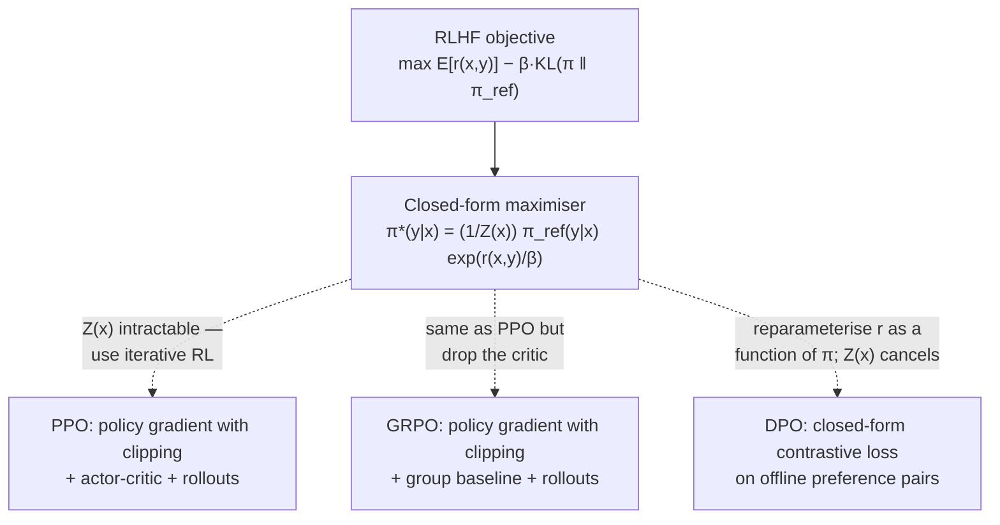
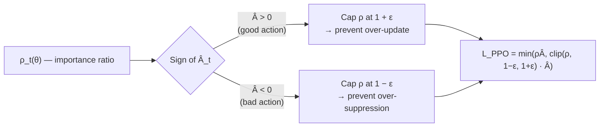
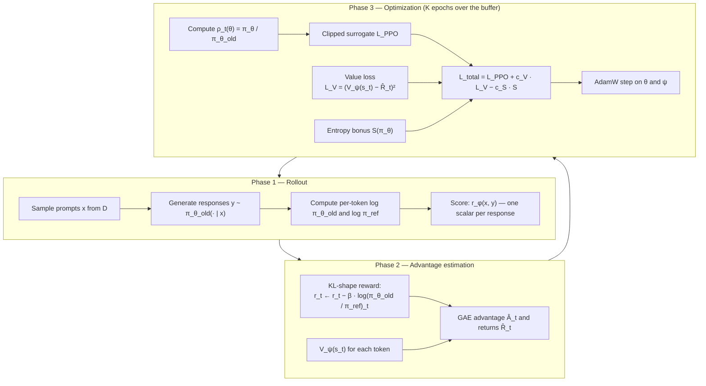
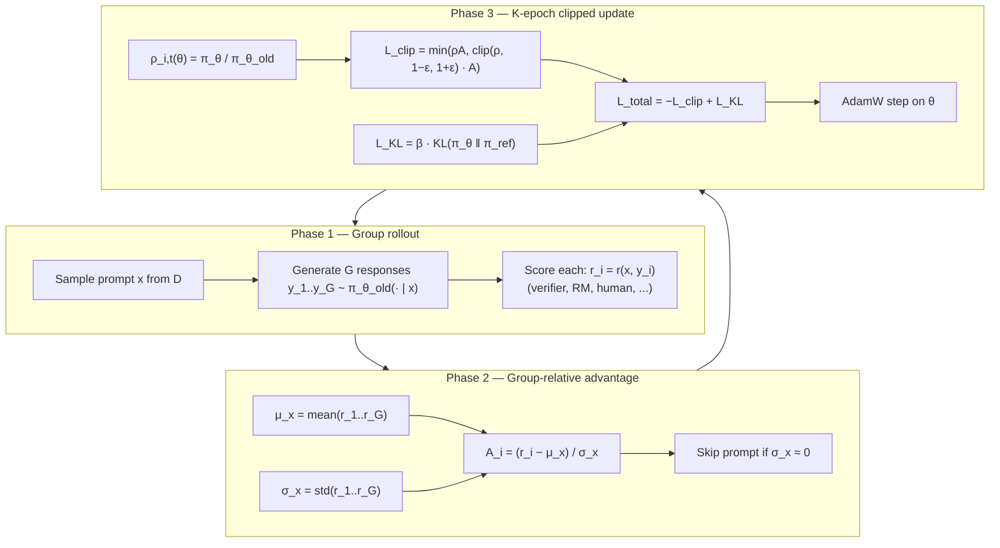
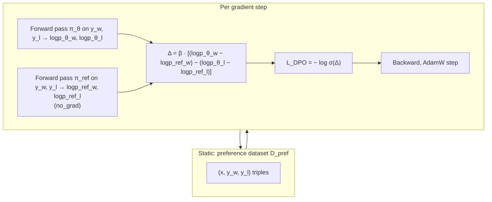
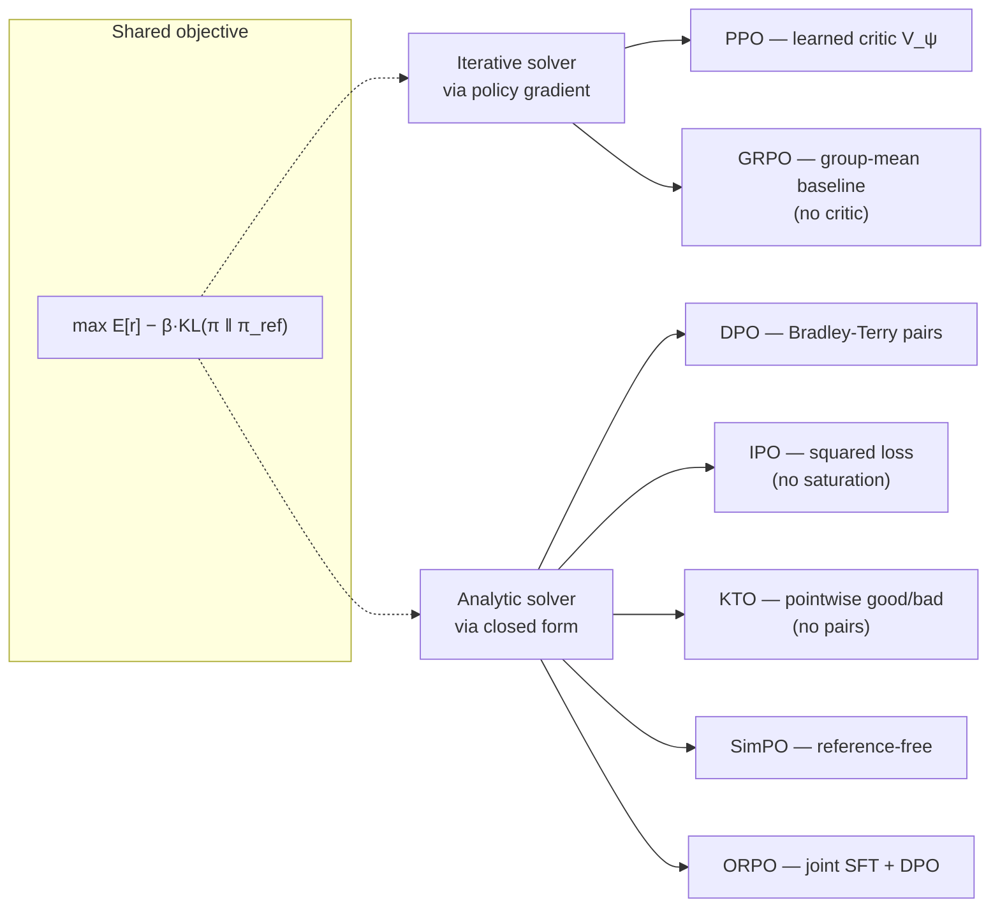
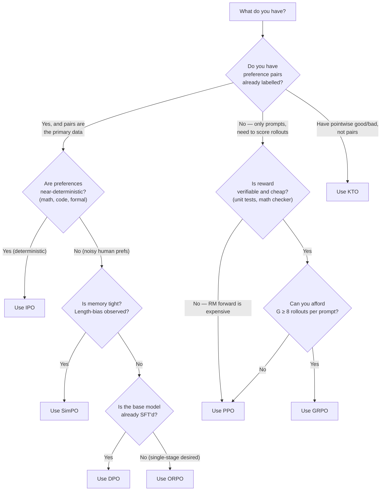

# PPO, GRPO, and DPO — A Deep Dive

### The three solvers of the KL-constrained preference-optimization objective

*Technical Report — Version 1.0 — July 7, 2026*

---

## Abstract

PPO, GRPO, and DPO are the three algorithmic families most practitioners currently reach for when they want to align a language model with a preference signal — pairwise human judgements, verifiable correctness of a math proof, agreement with a rubric. Superficially they look very different: PPO ships a full actor-critic stack with a reward model, a value function, and rollout sampling; GRPO removes the value function and computes advantages from a group baseline; DPO removes the rollout, the reward model, and the value function entirely and reduces to a single supervised contrastive loss. This document argues — and derives from first principles — that all three optimize *the same objective*, namely the KL-constrained reward maximization problem

$$
\max_{\pi}\ \mathbb{E}_{x \sim \mathcal{D},\ y \sim \pi(\cdot \mid x)}\left[r(x, y)\right] - \beta \mathrm{KL}\left(\pi(\cdot \mid x) \| \pi_{\mathrm{ref}}(\cdot \mid x)\right),
$$

and differ only in *how* they solve it. PPO solves it iteratively via policy gradient; GRPO solves the same iteration with a cheaper advantage estimator; DPO exploits the fact that the objective has a closed-form maximizer that is expressible directly in terms of the policy log-ratio, sidestepping the outer RL loop altogether. Reading the three methods as three solvers of one problem — rather than three unrelated recipes — is the fastest route to knowing which one to reach for and why.

The reader is assumed comfortable with the standard machinery of reinforcement learning: MDPs, the Bellman equations, value functions, policy gradients, and the basic idea of importance sampling. No prior familiarity with RLHF or preference learning is assumed. Where relevant, the document cross-references the applied `prompt_optimization` treatment in [`deep_dive_into_LoRA_adapters.md`](./deep_dive_into_LoRA_adapters.md), the training-instability taxonomy in [`fine-tuning_LLM-as-judge_using_prompt_optimization.md`](./fine-tuning_LLM-as-judge_using_prompt_optimization.md), and the gradient-mechanics story in [`../../transformer_examples/docs/PyTorch_Autograd_Engine_Deep_Dive.md`](../../transformer_examples/docs/PyTorch_Autograd_Engine_Deep_Dive.md).

---

## Contents

- [1. Scope, prerequisites, and how to read this document](#1-scope-prerequisites-and-how-to-read-this-document)
- [2. The MDP behind autoregressive LLM generation](#2-the-mdp-behind-autoregressive-llm-generation)
- [3. The unified RLHF objective](#3-the-unified-rlhf-objective)
- [4. The closed-form optimal policy — and why we cannot sample it](#4-the-closed-form-optimal-policy--and-why-we-cannot-sample-it)
- [5. Policy gradient theorem — a working recap](#5-policy-gradient-theorem--a-working-recap)
- [6. From TRPO to PPO — trust regions and the clipped surrogate](#6-from-trpo-to-ppo--trust-regions-and-the-clipped-surrogate)
- [7. Advantage estimation and GAE](#7-advantage-estimation-and-gae)
- [8. RLHF-PPO — the four models](#8-rlhf-ppo--the-four-models)
- [9. The RLHF-PPO training loop](#9-the-rlhf-ppo-training-loop)
- [10. PPO failure modes and remediation](#10-ppo-failure-modes-and-remediation)
- [11. GRPO — removing the value function](#11-grpo--removing-the-value-function)
- [12. Group-relative advantage estimation](#12-group-relative-advantage-estimation)
- [13. The GRPO objective and training loop](#13-the-grpo-objective-and-training-loop)
- [14. GRPO vs. PPO — where each wins](#14-grpo-vs-ppo--where-each-wins)
- [15. DPO — solving RLHF in closed form](#15-dpo--solving-rlhf-in-closed-form)
- [16. Bradley-Terry preferences and the DPO loss](#16-bradley-terry-preferences-and-the-dpo-loss)
- [17. DPO training loop and the implicit-reward view](#17-dpo-training-loop-and-the-implicit-reward-view)
- [18. DPO failure modes](#18-dpo-failure-modes)
- [19. DPO variants — IPO, KTO, SimPO, ORPO](#19-dpo-variants--ipo-kto-simpo-orpo)
- [20. Comparative analysis — same objective, three solvers](#20-comparative-analysis--same-objective-three-solvers)
- [21. Choosing between PPO, GRPO, and DPO](#21-choosing-between-ppo-grpo-and-dpo)
- [22. Practical recipes for common workloads](#22-practical-recipes-for-common-workloads)
- [23. Cross-references](#23-cross-references)
- [24. References](#24-references)

---

## 1. Scope, prerequisites, and how to read this document

The document treats three algorithms:

- **PPO** (Schulman et al., 2017) — a first-order trust-region policy-gradient method, adapted to language modelling by the original RLHF papers (Christiano et al., 2017; Ziegler et al., 2019; Ouyang et al., 2022).
- **GRPO** (Shao et al., 2024) — a variant of PPO used at scale in DeepSeek's R1 and Math models that removes the value-function critic and estimates advantages from a group of same-prompt rollouts.
- **DPO** (Rafailov et al., 2023) — a preference-learning method that derives directly from the closed-form solution of the KL-constrained RL objective and reduces the RL loop to a single supervised loss over preference pairs.

**What you should know coming in.** The Markov Decision Process (MDP) formulation ($\mathcal{S}, \mathcal{A}, \mathcal{T}, r, \gamma$), the Bellman optimality equations for $V^\ast$ and $Q^\ast$, the policy gradient theorem (REINFORCE), and the basic mechanics of importance sampling. Familiarity with the vanilla softmax cross-entropy loss and standard mini-batch training is assumed throughout.

**What you will get out of it.** A precise mental model of what each algorithm optimizes, the mathematical derivation of each loss from the shared RLHF objective, the training-loop mechanics as Mermaid diagrams, the specific failure modes and their remediation, and a decision procedure for choosing between them on your own workload.

**Notation.** Throughout,

- $x$ is a *prompt* (or state or context; used interchangeably),
- $y$ is a *response* (a full generated sequence $y = (y^{(1)}, \ldots, y^{(T)})$ of tokens),
- $\pi\_\theta$ is the learnable *policy* parameterised by $\theta$ (an LLM),
- $\pi\_{\mathrm{ref}}$ is a frozen *reference policy* (typically the SFT checkpoint we started fine-tuning from),
- $r(x, y)$ is a scalar *reward* — a real number scoring the response,
- $\beta > 0$ is the *KL coefficient* controlling how tightly $\pi\_\theta$ is anchored to $\pi\_{\mathrm{ref}}$,
- $\mathcal{D}$ is a *prompt distribution* (the training corpus of prompts).

Bold lowercase letters denote vectors; capital letters denote matrices where the shape matters. All logarithms are natural.

**How to read it.** Sections 2–4 establish the shared foundation. Sections 5–10 develop PPO end-to-end. Sections 11–14 develop GRPO as a modification of PPO. Sections 15–19 develop DPO from the closed-form solution derived in §4. Sections 20–22 do the comparative work — this is where the payoff sits. If you already know classical PPO, skip to §11. If you already know RLHF and want the derivation of DPO from the shared objective, skip to §15.

---

## 2. The MDP behind autoregressive LLM generation

An autoregressive language model that generates tokens $y^{(1)}, y^{(2)}, \ldots$ conditioned on a prompt $x$ can be cast as an MDP in two useful ways: the *token-level* MDP and the *bandit* MDP. Which formulation you pick changes what "reward" and "value function" mean concretely, and each of PPO/GRPO/DPO makes a specific choice.

### 2.1 Token-level MDP

- **State** $s\_t$ = the prompt plus the tokens generated so far: $s\_t = (x, y^{(1)}, \ldots, y^{(t-1)})$.
- **Action** $a\_t \in \mathcal{V}$ = the next token chosen from the vocabulary $\mathcal{V}$.
- **Transition** $\mathcal{T}(s\_{t+1} \mid s\_t, a\_t)$ = deterministic: append $a\_t$ to $s\_t$.
- **Reward** $r\_t = r(s\_t, a\_t)$ = typically 0 for intermediate tokens and a terminal reward $r(x, y)$ at the end-of-sequence token.
- **Policy** $\pi\_\theta(a\_t \mid s\_t)$ = the softmax over vocabulary logits produced by the LLM.
- **Discount** $\gamma = 1$ (standard for language tasks).

The trajectory-level probability under the policy is

$$
\pi_\theta(y \mid x) = \prod_{t=1}^{T} \pi_\theta\left(y^{(t)} \mid x, y^{(\lt t)}\right),
$$

and the trajectory-level log-probability is a sum:

$$
\log \pi_\theta(y \mid x) = \sum_{t=1}^{T} \log \pi_\theta\left(y^{(t)} \mid x, y^{(\lt t)}\right).
$$

### 2.2 Bandit MDP

If the reward is only ever known at the end of a trajectory — the typical case for preference-based rewards, where a human or a reward model scores the *entire* response — the token-level MDP degenerates to a contextual bandit: single-shot decision per prompt, where the "action" is the whole response $y$ and the reward is $r(x, y)$.

The trajectory-level policy is then

$$
\pi_\theta(y \mid x) = \prod_{t=1}^{T} \pi_\theta\left(y^{(t)} \mid x, y^{(\lt t)}\right),
$$

exactly as before, and the value function collapses:

$$
V^{\pi_\theta}(x) = \mathbb{E}_{y \sim \pi_\theta(\cdot \mid x)}[r(x, y)].
$$

There is no bootstrapping across time-steps, no need for a per-token value function, no need for GAE — a *sequence-level* critic (which is what most modern RLHF-PPO stacks actually use) is a scalar value per prompt-response pair, not per token.

### 2.3 Which formulation each method uses

| Method | MDP formulation | Reward granularity | Critic granularity |
|---|---|---|---|
| PPO (canonical) | Token-level MDP | Per-token OR terminal | Per-token value $V\_\psi(s\_t)$ |
| PPO (LLM RLHF) | Bandit or token-level | Terminal (from RM) | Sequence-level $V\_\psi(x, y)$ or per-token |
| GRPO | Bandit | Terminal | *No critic* — group baseline |
| DPO | N/A (offline) | Pairwise preference | N/A |

Two takeaways: (1) DPO doesn't operate on an MDP at all in the training loop — it works directly on the preference-labelled dataset. (2) The choice of per-token vs. sequence-level critic in PPO is an implementation decision, not a fundamental one; both are used in production and the papers describe both.

---

## 3. The unified RLHF objective

All three methods target the same optimization problem:

$$
\max_{\pi}\ J(\pi) := \mathbb{E}_{x \sim \mathcal{D},\ y \sim \pi(\cdot \mid x)}\left[r(x, y)\right] - \beta \mathbb{E}_{x \sim \mathcal{D}}\left[\mathrm{KL}\left(\pi(\cdot \mid x) \| \pi_{\mathrm{ref}}(\cdot \mid x)\right)\right].
$$

The two terms are in tension. The first term wants $\pi$ to concentrate all mass on the highest-reward response. The second term — the KL to the reference policy — wants $\pi$ to stay close to $\pi\_{\mathrm{ref}}$.

**Why the KL term.** Without KL regularization, three things go wrong:

1. **Reward hacking.** If $r$ is a learned reward model, $\pi$ finds high-reward regions that are actually out-of-distribution artefacts — degenerate outputs the reward model over-scores because it was never trained on them.
2. **Capability loss.** The reference policy $\pi\_{\mathrm{ref}}$ has been through pre-training and (usually) SFT. Drifting far away destroys its acquired capabilities on tasks not covered by $r$.
3. **Mode collapse.** Unregularized maximization of a scalar $r$ collapses the policy onto whichever response has the highest reward, forfeiting the diversity that makes the model useful across a distribution of prompts.

**Interpretation as constrained optimization.** The KL-regularized objective is the Lagrangian relaxation of

$$
\max_\pi\ \mathbb{E}[r(x, y)] \quad \text{s.t.}\quad \mathrm{KL}(\pi \| \pi_{\mathrm{ref}}) \leq \delta,
$$

with $\beta$ playing the role of the Lagrange multiplier for the KL constraint. Fixing $\beta$ corresponds to trading off reward gain against KL cost linearly, which is what all three methods do in practice.

**The RLHF pipeline that produces $r$.** In the canonical setting, the reward $r$ is itself learned from preference data:

$$
r_\phi(x, y) = \mathrm{scalar\ head}\left(\mathrm{transformer}(x, y)\right),
$$

trained on pairwise preferences $(x, y\_w, y\_l)$ under the Bradley-Terry model (Bradley & Terry, 1952):

$$
P(y_w \succ y_l \mid x) = \sigma\left(r_\phi(x, y_w) - r_\phi(x, y_l)\right).
$$

The reward model $r\_\phi$ trained this way is then used inside PPO or GRPO's objective. DPO's crucial move is showing that we can skip the reward-model training step entirely and go directly from preference pairs to a policy update — we'll get to why in §15.

For workloads with a *verifiable* reward — code that compiles and passes unit tests, math that is checkable by a formal proof engine, a game with a known win condition — there is no learned reward model; $r$ is just the ground-truth verifier. This is the setting GRPO was designed for and where it currently dominates.

---

## 4. The closed-form optimal policy — and why we cannot sample it

The RLHF objective of §3 has a closed-form maximizer. This is the single most important fact in the entire document — every one of PPO, GRPO, and DPO can be understood as a specific way of approximating or exploiting it.

**Derivation.** Fix a prompt $x$ and consider the per-prompt objective

$$
J_x(\pi) = \mathbb{E}_{y \sim \pi(\cdot \mid x)}[r(x, y)] - \beta \mathrm{KL}\left(\pi(\cdot \mid x) \| \pi_{\mathrm{ref}}(\cdot \mid x)\right).
$$

Writing the KL out and using $\sum\_y \pi(y \mid x) = 1$ as a constraint (Lagrangian $\lambda$), the Lagrangian is

$$
\mathcal{L}(\pi, \lambda) = \sum_y \pi(y \mid x) r(x, y) - \beta \sum_y \pi(y \mid x) \log \frac{\pi(y \mid x)}{\pi_{\mathrm{ref}}(y \mid x)} - \lambda \left( \sum_y \pi(y \mid x) - 1 \right).
$$

Differentiating with respect to $\pi(y \mid x)$ and setting to zero:

$$
r(x, y) - \beta \log \frac{\pi(y \mid x)}{\pi_{\mathrm{ref}}(y \mid x)} - \beta - \lambda = 0,
$$

which solves to

$$
\pi^*(y \mid x) = \frac{1}{Z(x)} \pi_{\mathrm{ref}}(y \mid x) \exp\left( \frac{1}{\beta} r(x, y) \right),
$$

where

$$
Z(x) = \sum_y \pi_{\mathrm{ref}}(y \mid x) \exp\left( \frac{1}{\beta} r(x, y) \right)
$$

is the partition function that makes $\pi^\ast(\cdot \mid x)$ sum to 1.

**Interpretation.** The optimal policy is the reference policy *reweighted* by the exponentiated reward, temperature $1/\beta$. High-reward responses get up-weighted; low-reward responses get down-weighted; and the reweighting is smooth in $\beta$ — as $\beta \to \infty$ we recover $\pi^\ast = \pi\_{\mathrm{ref}}$ (KL dominates), and as $\beta \to 0$ we recover $\pi^\ast$ = a delta on $\arg\max\_y r(x, y)$ (reward dominates).

**Why can't we just use $\pi^\ast$ directly?** Because $Z(x)$ is a sum over the entire response space $\mathcal{V}^\ast$, which for realistic sequence lengths and vocabulary sizes has cardinality $|\mathcal{V}|^T \approx 32000^{2048} \approx 10^{9200}$. Two consequences:

1. We cannot normalize $\pi^\ast$ exactly — evaluating $Z(x)$ is intractable.
2. We cannot sample from $\pi^\ast$ directly — importance sampling or rejection sampling from $\pi\_{\mathrm{ref}}$ works in principle but has astronomical variance.

This intractability is the reason RL is needed in the first place. All three methods work around it differently:

- **PPO and GRPO**: don't try to construct $\pi^\ast$; instead run gradient ascent on $J$ directly, using rollouts from the current policy. Never materialize $\pi^\ast$ or $Z(x)$.
- **DPO**: exploits the fact that although $\pi^\ast$ is intractable, the *log-ratio* $\log(\pi^\ast/\pi\_{\mathrm{ref}})$ contains the reward, and by writing the Bradley-Terry preference likelihood in terms of this ratio, $Z(x)$ **cancels**. This is the closed-form escape.

Diagrammatically, the three methods position themselves against the closed form as follows:



The rest of this document is a careful walk through the three arrows.

---

## 5. Policy gradient theorem — a working recap

Because PPO and GRPO are both policy-gradient methods, we recap the theorem in the specific form we need. Readers comfortable with the standard REINFORCE derivation can skim.

**Setup.** Let $\tau = (s\_0, a\_0, s\_1, a\_1, \ldots, s\_T)$ be a trajectory under policy $\pi\_\theta$. Define the trajectory return $R(\tau) = \sum\_{t=0}^{T-1} r\_t$ and the objective $J(\theta) = \mathbb{E}\_{\tau \sim \pi\_\theta}[R(\tau)]$.

**Policy gradient theorem** (Sutton et al., 1999).

$$
\nabla_\theta J(\theta) = \mathbb{E}_{\tau \sim \pi_\theta}\left[ \sum_{t=0}^{T-1} \nabla_\theta \log \pi_\theta(a_t \mid s_t) A^{\pi_\theta}(s_t, a_t) \right],
$$

where $A^{\pi\_\theta}(s\_t, a\_t) = Q^{\pi\_\theta}(s\_t, a\_t) - V^{\pi\_\theta}(s\_t)$ is the advantage under $\pi\_\theta$.

The three practically important properties are:

1. **REINFORCE approximation.** Replacing $A$ by the empirical return-to-go $\hat R\_t = \sum\_{k=t}^{T-1} r\_k$ gives an unbiased but very high-variance estimator — this is REINFORCE, and it is the entry point every policy-gradient method builds from.
2. **Baseline subtraction.** Any function $b(s\_t)$ that depends only on the state can be subtracted from $\hat R\_t$ without introducing bias: $\mathbb{E}\_{a \sim \pi}[\nabla\_\theta \log \pi(a \mid s) b(s)] = 0$. The value function $V^{\pi\_\theta}(s\_t)$ is the choice that minimizes the resulting estimator variance — this is what motivates learning a critic.
3. **Advantage from GAE.** In the token-level MDP with a learned $V\_\psi$, the practical advantage estimator is *Generalized Advantage Estimation* (§7).

**Applied to LLM policies.** Since the LLM policy factorizes over tokens, $\log \pi\_\theta(y \mid x) = \sum\_t \log \pi\_\theta(y^{(t)} \mid x, y^{(\lt t)})$, and the per-trajectory gradient becomes

$$
\nabla_\theta \log \pi_\theta(y \mid x) = \sum_{t=1}^{T} \nabla_\theta \log \pi_\theta\left(y^{(t)} \mid x, y^{(\lt t)}\right).
$$

This is exactly the gradient of the per-token cross-entropy loss the model was trained with in the first place — RL fine-tuning is, mechanically, weighted next-token prediction where the "weights" are the advantages. Interpreting the RL loss as a per-token-weighted CE is one of the most useful implementation-level insights when debugging a training run; see [`PyTorch_Autograd_Engine_Deep_Dive.md §7`](../../transformer_examples/docs/PyTorch_Autograd_Engine_Deep_Dive.md#7-worked-example--softmax-and-cross-entropy) for the raw gradient mechanics.

---

## 6. From TRPO to PPO — trust regions and the clipped surrogate

The vanilla policy gradient is fragile: a single large gradient update can move $\pi\_\theta$ far enough from $\pi\_{\theta\_{\mathrm{old}}}$ that the sampled trajectories no longer represent the new policy, invalidating the estimator. Two related fixes emerged in the DRL literature.

### 6.1 TRPO — hard trust region

*Trust Region Policy Optimization* (Schulman et al., 2015) constrains each update to lie inside a KL trust region:

$$
\max_\theta\ \mathbb{E}_{s, a \sim \pi_{\theta_{\mathrm{old}}}}\left[ \frac{\pi_\theta(a \mid s)}{\pi_{\theta_{\mathrm{old}}}(a \mid s)} A^{\pi_{\theta_{\mathrm{old}}}}(s, a) \right] \quad \text{s.t.}\quad \mathrm{KL}\left(\pi_{\theta_{\mathrm{old}}} \| \pi_\theta\right) \leq \delta.
$$

Solving this exactly at each step requires a second-order optimizer (conjugate gradient plus a line search); the algorithm is monotone-improving under mild assumptions but expensive to run.

### 6.2 PPO-Clip — first-order surrogate

*Proximal Policy Optimization* (Schulman et al., 2017) replaces the hard KL constraint with a **clipped surrogate objective** that penalizes moves outside a soft trust region. Let

$$
\rho_t(\theta) := \frac{\pi_\theta(a_t \mid s_t)}{\pi_{\theta_{\mathrm{old}}}(a_t \mid s_t)}
$$

be the importance-sampling ratio between the current and old policies at $(s\_t, a\_t)$. The PPO-Clip objective is

$$
\mathcal{L}_{\mathrm{PPO}}(\theta) = \mathbb{E}_t\left[ \min\left(\rho_t(\theta) \hat A_t,\ \mathrm{clip}(\rho_t(\theta), 1 - \epsilon,\ 1 + \epsilon) \hat A_t\right) \right],
$$

where $\hat A\_t$ is the advantage estimate and $\epsilon \in [0.1, 0.3]$ is the clip range (0.2 is standard).

**How the clip works.** Consider a single $(s, a)$ pair:

- If $\hat A > 0$ (action was good), we want to *increase* $\pi\_\theta(a \mid s)$, i.e. $\rho > 1$. The clip caps this at $1 + \epsilon$: past that point, $\rho \hat A$ is replaced by $(1 + \epsilon) \hat A$ and the derivative wrt $\theta$ becomes zero. Overshooting is disabled.
- If $\hat A < 0$ (action was bad), we want to *decrease* $\pi\_\theta(a \mid s)$, i.e. $\rho < 1$. The clip caps this at $1 - \epsilon$: past that point, $\rho \hat A$ is replaced by $(1 - \epsilon) \hat A$ and the derivative wrt $\theta$ becomes zero. Overshooting is disabled again.
- The $\min$ ensures that if the *unclipped* value would decrease the objective (the update wasn't harmful enough to warrant clipping), the objective is not artificially propped up.

In practice this is equivalent to "the policy is allowed to change by at most a factor of $1 \pm \epsilon$ per token before gradients get zeroed out."



### 6.3 Why the clip is the workhorse of RLHF

- It is *first-order*: implementable in three lines of PyTorch with the usual `optim.AdamW`.
- It automatically enforces a soft trust region *without* computing a KL — the KL constraint is *implicit* in the clip.
- Empirically it is more sample-efficient and more stable than vanilla policy gradient at scale.

In RLHF pipelines you will frequently see *both* the clip and an explicit KL penalty to $\pi\_{\mathrm{ref}}$ — the clip guards against big steps in a single update; the KL penalty is a *long-range* anchor to the SFT policy that prevents cumulative drift over many updates. These are complementary and both are typically used.

---

## 7. Advantage estimation and GAE

The advantage $\hat A\_t$ that goes into the PPO objective must be estimated from rollout data. Two extremes exist:

1. **Monte-Carlo return-to-go**: $\hat A\_t = \hat R\_t - V\_\psi(s\_t)$ where $\hat R\_t = \sum\_{k \geq t} \gamma^{k-t} r\_k$. Unbiased but high-variance.
2. **TD residual**: $\hat A\_t = r\_t + \gamma V\_\psi(s\_{t+1}) - V\_\psi(s\_t)$. Low variance but biased by the accuracy of $V\_\psi$.

**Generalized Advantage Estimation** (Schulman et al., 2015b) interpolates:

$$
\hat A_t^{\mathrm{GAE}(\gamma, \lambda)} = \sum_{k=0}^{\infty} (\gamma \lambda)^k \delta_{t+k}, \qquad \delta_k := r_k + \gamma V_\psi(s_{k+1}) - V_\psi(s_k),
$$

with $\lambda \in [0, 1]$ setting the bias-variance trade-off ($\lambda = 0$ recovers TD; $\lambda = 1$ recovers Monte Carlo, up to the value baseline). Standard RLHF configurations use $\gamma \in \{0.99, 1.0\}$ and $\lambda \in \{0.95, 1.0\}$.

**Sequence-level shortcut.** When the reward is terminal (typical RLHF-PPO), the TD residuals for $t < T$ are just $\delta\_t = \gamma V\_\psi(s\_{t+1}) - V\_\psi(s\_t)$ and only $\delta\_{T-1} = r\_{T-1} - V\_\psi(s\_{T-1})$ carries reward information; the resulting per-token advantage is dominated by a single terminal term propagated backward. Many implementations therefore replace the token-level GAE by a *whitened* trajectory-level advantage:

$$
\hat A(x, y) = \frac{r(x, y) - \mu}{\sigma},
$$

where $\mu, \sigma$ are the empirical mean and std of $r$ over the current rollout batch. This is much simpler and, for terminal-reward LLM tasks, often works better.

Foreshadowing §12: GRPO takes this simplification further — it computes the mean and std *within a per-prompt group* rather than across the whole batch. This is the entire algorithmic delta from PPO.

---

## 8. RLHF-PPO — the four models

A production RLHF-PPO stack keeps four language models alive simultaneously on the training node. Understanding what each is for is essential to reading a training log.

| Model | Symbol | Trainable? | Purpose |
|---|---|---|---|
| **Policy (actor)** | $\pi\_\theta$ | Yes | The LLM being fine-tuned; produces the rollouts and receives the policy-gradient update |
| **Reference** | $\pi\_{\mathrm{ref}}$ | No (frozen) | The SFT checkpoint we started from; used for KL anchor |
| **Reward model** | $r\_\phi$ | No (frozen) | Scalar reward from preference data; scores each rollout |
| **Value function (critic)** | $V\_\psi$ | Yes | Predicts expected return; provides baseline for advantage |

A few implementation notes.

**Where the value function lives.** $V\_\psi$ is usually a linear (scalar) head on top of the *policy's* transformer backbone, sharing all layers except the last. This means $V\_\psi$ and $\pi\_\theta$ update jointly under the combined loss. Some implementations use a completely separate critic model — expensive, but cleanly separates the two learning problems and prevents the value loss from perturbing the policy features.

**GPU-memory footprint.** For a 7B-parameter base model at bf16, the four models occupy approximately:

- $\pi\_\theta$: 14 GB parameters + 28 GB Adam state (fp32) + activations $\approx$ 40–60 GB total.
- $\pi\_{\mathrm{ref}}$: 14 GB parameters, no optimizer state — but resident in memory for KL evaluation.
- $r\_\phi$: 14 GB (typically another 7B model) — resident for scoring.
- $V\_\psi$: shares backbone with $\pi\_\theta$ if that's the design; otherwise +14 GB.

So a 7B RLHF-PPO run typically needs 4–8× A100 80GB nodes for training. LoRA (see [`deep_dive_into_LoRA_adapters.md`](./deep_dive_into_LoRA_adapters.md)) makes this dramatically cheaper because $\pi\_{\mathrm{ref}}$ can be recovered from $\pi\_\theta$ by disabling the LoRA adapters, eliminating one of the four model copies.

**Reference-KL as reward shaping.** In production it is common to *fold the KL into the reward*:

$$
r_t \leftarrow r_t - \beta \log \frac{\pi_\theta(y^{(t)} \mid x, y^{(\lt t)})}{\pi_{\mathrm{ref}}(y^{(t)} \mid x, y^{(\lt t)})}.
$$

The KL is applied per-token as a shaping term rather than as a separate loss. This has the pleasant property that the value function learns a KL-corrected value, and the clipped policy-gradient update automatically respects the KL constraint through the advantage. Both formulations (KL-as-reward-shaping vs. KL-as-explicit-loss) appear in real code; they are approximately equivalent up to gradient variance and coefficient tuning.

---

## 9. The RLHF-PPO training loop

Putting §5–§8 together, a single PPO iteration proceeds in three phases:



### 9.1 The composite loss

The scalar the optimizer actually descends is a linear combination:

$$
\mathcal{L}_{\mathrm{total}}(\theta, \psi) = -\mathcal{L}_{\mathrm{PPO}}(\theta) + c_V \mathcal{L}_V(\psi) - c_S \mathcal{S}(\pi_\theta),
$$

with

$$
\mathcal{L}_V(\psi) = \mathbb{E}_t\left[(V_\psi(s_t) - \hat R_t)^2\right],
$$

$$
\mathcal{S}(\pi_\theta) = -\mathbb{E}_t\left[\sum_{a} \pi_\theta(a \mid s_t) \log \pi_\theta(a \mid s_t)\right].
$$

Coefficients $c\_V \approx 0.5$ and $c\_S \approx 0.01$ are the OpenAI defaults; production RLHF frequently sets $c\_S = 0$ because entropy regularization on a large-vocabulary language model destabilizes generation quality.

### 9.2 The K-epoch inner loop

PPO reuses each rollout batch for $K$ epochs (typically $K = 4$) — this is the whole point of importance sampling. Each epoch shuffles minibatches within the buffer and applies one gradient step; the ratio $\rho\_t(\theta)$ tracks how far $\pi\_\theta$ has drifted from the $\pi\_{\theta\_{\mathrm{old}}}$ that produced the rollouts, and the clip prevents any single sample from doing too much damage.

A useful invariant: at the start of each rollout phase, $\rho\_t \equiv 1$ for every $t$ (because $\pi\_\theta = \pi\_{\theta\_{\mathrm{old}}}$). By the end of the $K$-th epoch, $\rho\_t$ has drifted; when a significant fraction of tokens have $\rho\_t$ outside $[1 - \epsilon, 1 + \epsilon]$ (say $>10\%$), the buffer should be refreshed by a new rollout phase. Monitoring the *clip fraction* is one of the most useful diagnostics in a PPO training log.

### 9.3 Pseudocode

```python
for iteration in range(N_iterations):
 # --- Phase 1: Rollout ---
 prompts = sample_prompts(D, batch_size)
 with torch.no_grad():
 responses = pi_theta.generate(prompts)
 logp_old = pi_theta.log_probs(prompts, responses)
 logp_ref = pi_ref.log_probs(prompts, responses)
 rewards = r_phi(prompts, responses) # scalar per sequence

 # --- Phase 2: Advantage estimation ---
 with torch.no_grad():
 kl_per_token = logp_old - logp_ref # (B, T)
 shaped_rewards = distribute_terminal_reward(rewards) - beta * kl_per_token
 values = V_psi(prompts, responses) # (B, T)
 advantages, returns = compute_gae(shaped_rewards, values, gamma, lam)
 advantages = whiten(advantages) # zero-mean, unit-std

 # --- Phase 3: K epochs of clipped update ---
 for epoch in range(K):
 for minibatch in shuffle_batches(prompts, responses, logp_old, advantages, returns):
 logp_new = pi_theta.log_probs(minibatch.prompts, minibatch.responses)
 ratio = torch.exp(logp_new - minibatch.logp_old)
 L_ppo = -torch.min(
 ratio * minibatch.advantages,
 torch.clamp(ratio, 1 - eps, 1 + eps) * minibatch.advantages,
 ).mean()
 L_v = ((V_psi(minibatch.prompts, minibatch.responses) - minibatch.returns) ** 2).mean()
 L_total = L_ppo + c_V * L_v
 optimizer.zero_grad()
 L_total.backward()
 torch.nn.utils.clip_grad_norm_(trainable_params, 1.0)
 optimizer.step()
```

The sole non-obvious PyTorch detail is `torch.no_grad()` around the rollout and advantage-estimation phases: $\pi\_{\theta\_{\mathrm{old}}}$, $\pi\_{\mathrm{ref}}$, $r\_\phi$, and the value targets are all treated as *data*, not as tensors on the autograd graph. See [`PyTorch_Autograd_Engine_Deep_Dive.md §10.3`](../../transformer_examples/docs/PyTorch_Autograd_Engine_Deep_Dive.md#103-optimizerstep-and-torchno_grad) for why this matters.

---

## 10. PPO failure modes and remediation

Every failure mode is a specific way the KL-constrained objective fails to be respected in practice. Six recur with regularity; see also [`fine-tuning_LLM-as-judge_using_prompt_optimization.md §Appendix A.4`](./fine-tuning_LLM-as-judge_using_prompt_optimization.md#a4-ppo--grpo--rloo-judge-fine-tuning-instabilities) for the applied version.

### 10.1 Reward hacking

**Symptom.** Reward climbs steadily; downstream metrics (agreement with humans, task success) plateau or regress.

**Cause.** The learned reward model $r\_\phi$ has out-of-distribution failure modes; $\pi\_\theta$ finds them.

**Remediation.** Larger and more diverse preference dataset for $r\_\phi$; ensembles of reward models (Coste et al., 2023); "constitutional" reward filters; early stopping on downstream metrics not on $r\_\phi$.

### 10.2 KL blow-up

**Symptom.** $\mathrm{KL}(\pi\_\theta \| \pi\_{\mathrm{ref}})$ grows without bound; generations become gibberish.

**Cause.** $\beta$ too small, or KL-in-reward not correctly balanced against the reward magnitude.

**Remediation.** Adaptive $\beta$ scheduling (Ziegler et al., 2019): increase $\beta$ when KL exceeds a target, decrease when below; target-KL early stopping.

### 10.3 Value function decoupling

**Symptom.** Value loss diverges even as policy loss trains normally.

**Cause.** If $V\_\psi$ shares the backbone with $\pi\_\theta$, sudden policy shifts change the state distribution and stale value estimates become badly biased. If $V\_\psi$ is separate, insufficient value updates per rollout.

**Remediation.** Longer value-only warmup at the start of RLHF; more value epochs per rollout; separate learning rate for the value head.

### 10.4 Clip-fraction pathology

**Symptom.** Clip fraction (percent of tokens with $\rho \notin [1 - \epsilon, 1 + \epsilon]$) very close to 0 or very close to 1.

**Cause.** Clip $\approx 0$ — learning rate too small or $K$ too small; barely any policy movement. Clip $\approx 1$ — learning rate too large or $K$ too large; policy has moved so far the buffer is stale.

**Remediation.** Target clip fraction $\approx 0.1$–$0.3$; tune LR and $K$ to hit it.

### 10.5 Reward variance across prompts

**Symptom.** Advantages have huge variance; policy oscillates.

**Cause.** Different prompts have very different reward scales — a coding prompt might have $r \in [0, 100]$, a chit-chat prompt $r \in [0, 1]$.

**Remediation.** Whiten advantages within-batch (division by std); per-prompt-normalize before whitening. This is one of the two motivations for GRPO's *group-relative* advantage.

### 10.6 Entropy collapse

**Symptom.** $\pi\_\theta$ becomes deterministic (entropy → 0); generations become identical.

**Cause.** Reward signal encourages a single output; no exploration.

**Remediation.** Reintroduce a small entropy bonus $c\_S$; sampling with temperature $>1$ during rollout; enforce a minimum-entropy penalty.

---

## 11. GRPO — removing the value function

*Group Relative Policy Optimization* (Shao et al., 2024, and applied at scale in DeepSeek's R1 and Math models) makes exactly one architectural change to PPO: it deletes the value function critic.

### 11.1 What GRPO keeps

- The **clipped importance-ratio objective** of PPO (§6.2), verbatim.
- The **explicit KL to reference** as a loss term (moved out of the reward, into the loss).
- The **rollout / update alternation** and the K-epoch inner loop.

### 11.2 What GRPO discards

- The **value function** $V\_\psi$ — deleted. No critic, no value loss, no GAE.
- The **KL-in-reward shaping** — the KL is now an explicit term in the loss, sitting alongside the clipped surrogate.

### 11.3 What replaces the value function

For each prompt $x$, GRPO samples a **group** of $G$ responses $\{y\_1, \ldots, y\_G\}$ from the policy, scores each with $r$, and computes advantages *relative to the group*:

$$
A_i = \frac{r(x, y_i) - \mathrm{mean}(r_1, \ldots, r_G)}{\mathrm{std}(r_1, \ldots, r_G)}.
$$

The group mean plays the role of the baseline that $V\_\psi$ played in PPO; the group standard deviation plays the role of the whitening step.

### 11.4 Why this works

Recall from §5 (property 2) that any function of state alone is an unbiased baseline. The empirical group mean is an *estimator* of $V^{\pi\_\theta}(x)$ — the true value function of the current policy — because $\mathbb{E}\_{y \sim \pi\_\theta}[r(x, y)] = V^{\pi\_\theta}(x)$. Using $G$ samples per prompt gives a Monte-Carlo estimate of that expectation, and subtracting it is exactly the baseline subtraction that reduces gradient variance.

The trade-off is compute: GRPO pays for the missing value function by generating $G$ times more tokens per prompt during rollout. In practice $G \in [4, 64]$; DeepSeek reports $G = 64$ for math reasoning.

**When it works well.** When rewards are *verifiable* and *cheap to compute* (math, code, formal proofs), the extra rollouts are cheap, and the group baseline is more sample-efficient than a learned $V\_\psi$ that has to be trained from scratch. When rewards come from an expensive learned model that needs a forward pass per response, the $G \times$ cost multiplier can be prohibitive.

**When PPO wins.** When each rollout is expensive (long context, big model, expensive RM), a learned $V\_\psi$ that generalizes across prompts amortizes the cost — you don't need $G$ rollouts to get a variance-reduced advantage; you get it from the critic that was already trained on the previous batches.

---

## 12. Group-relative advantage estimation

The group-relative advantage warrants its own section because two subtleties matter.

### 12.1 The estimator

Given a group of $G$ rewards $\{r\_1, \ldots, r\_G\}$ for the same prompt $x$:

$$
\mu_x = \frac{1}{G} \sum_{i=1}^G r_i, \qquad \sigma_x^2 = \frac{1}{G - 1} \sum_{i=1}^G (r_i - \mu_x)^2,
$$

$$
A_i = \frac{r_i - \mu_x}{\sigma_x + \varepsilon},
$$

with $\varepsilon > 0$ a small numerical stabilizer.

**Bias vs. unbiasedness.** The exact policy-gradient theorem uses the *true* baseline $V^{\pi\_\theta}(x)$. Using $\mu\_x$ instead is unbiased *only if* the baseline is not correlated with the score function $\nabla\_\theta \log \pi\_\theta(y \mid x)$. This is true when $\mu\_x$ is computed from an independent sample of responses, and approximately true when $\mu\_x$ is computed from the *same* group of $G$ responses — the mild leakage is empirically dominated by the variance reduction. This is analogous to leave-one-out estimators in classical stats.

### 12.2 Per-token attribution

The scalar $A\_i$ is a *sequence-level* advantage — one number per response. GRPO applies it to every token in the response:

$$
\hat A_{i, t} = A_i \quad \text{for all } t \in \{1, \ldots, T_i\}.
$$

This is coarser than GAE's per-token advantage. For terminal-reward tasks (which is the setting GRPO was designed for), it is arguably the *right* granularity — there is no per-token reward to attribute.

For dense-reward tasks (a per-token feedback signal from an evaluator), a hybrid advantage is possible: use the group baseline for the sequence-level term, use per-token TD residuals for the local term. Few production implementations do this; it is a research frontier.

### 12.3 Handling degenerate groups

Two failure modes for the estimator:

- **All rewards identical.** $\sigma\_x = 0$, division blows up. The $\varepsilon$ in the denominator saves the arithmetic but the resulting advantages are meaningless. In practice: skip such prompts entirely, or force diverse sampling (higher temperature) until the group has variance.
- **All rewards near-identical after clipping.** If a verifier returns only $\{0, 1\}$ and $G$ is small (say $G = 4$), you often get $(1, 1, 1, 1)$ or $(0, 0, 0, 0)$. Same story: skip, or increase $G$, or add auxiliary reward signals to break ties.

DeepSeek's Math paper documents that filtering degenerate groups is essential to stability; naively including them corrupts the Adam optimizer moments — the same class of instability as the pre-training Adam-state corruption in [`Training_Instabilities_in_Transformers.md §5.4`](../../transformer_examples/docs/Training_Instabilities_in_Transformers.md#54--adam-optimizer-state-corruption).

---

## 13. The GRPO objective and training loop

### 13.1 The GRPO objective

Combining the clipped surrogate from PPO (§6.2), the group-relative advantage (§12), and an explicit KL-to-reference term:

$$
\mathcal{L}_{\mathrm{GRPO}}(\theta) = \mathbb{E}_x \mathbb{E}_i\left[ \frac{1}{|y_i|} \sum_{t=1}^{|y_i|} \min\left( \rho_{i, t}(\theta) A_i,\ \mathrm{clip}(\rho_{i, t}(\theta), 1 - \epsilon,\ 1 + \epsilon) A_i \right) - \beta D_{\mathrm{KL}}\left[\pi_\theta \| \pi_{\mathrm{ref}}\right]_{i, t} \right],
$$

with

$$
\rho_{i, t}(\theta) = \frac{\pi_\theta(y_i^{(t)} \mid x, y_i^{(\lt t)})}{\pi_{\theta_{\mathrm{old}}}(y_i^{(t)} \mid x, y_i^{(\lt t)})}.
$$

The KL term is often written using the Schulman *unbiased* KL estimator (Schulman, 2020),

$$
D_{\mathrm{KL}}\left[\pi_\theta \| \pi_{\mathrm{ref}}\right]_{i, t} = \frac{\pi_{\mathrm{ref}}}{\pi_\theta} - \log \frac{\pi_{\mathrm{ref}}}{\pi_\theta} - 1,
$$

which is always non-negative and has lower variance than the standard $\log(\pi\_\theta / \pi\_{\mathrm{ref}})$ estimator.

### 13.2 Training loop



### 13.3 Pseudocode

```python
for iteration in range(N_iterations):
 prompt = sample_prompt(D) # per-prompt group
 with torch.no_grad():
 # G responses per prompt
 responses = [pi_theta.generate(prompt) for _ in range(G)]
 rewards = torch.tensor([r(prompt, y) for y in responses])
 logp_old = torch.stack([pi_theta.log_probs(prompt, y) for y in responses])
 logp_ref = torch.stack([pi_ref.log_probs(prompt, y) for y in responses])

 # Group-relative advantage
 mu, sigma = rewards.mean(), rewards.std()
 if sigma < 1e-4:
 continue # degenerate group, skip
 A = (rewards - mu) / (sigma + 1e-8) # shape (G,)

 for epoch in range(K):
 for batch in shuffle(responses): # minibatch inside the group
 logp_new = pi_theta.log_probs(prompt, batch.responses)
 ratio = torch.exp(logp_new - batch.logp_old) # per-token
 A_bcast = batch.A.unsqueeze(-1) # broadcast to per-token
 L_clip = -torch.min(
 ratio * A_bcast,
 torch.clamp(ratio, 1 - eps, 1 + eps) * A_bcast,
 ).mean()
 L_kl = beta * schulman_kl(logp_new, batch.logp_ref).mean()
 L_total = L_clip + L_kl
 optimizer.zero_grad(); L_total.backward()
 torch.nn.utils.clip_grad_norm_(pi_theta.parameters(), 1.0)
 optimizer.step()
```

Compared to the PPO pseudocode of §9.3, three things vanish: `V_psi`, `compute_gae`, and the value loss. What replaces them is the group-mean/std computation, which is arithmetic-cheap.

---

## 14. GRPO vs. PPO — where each wins

| Aspect | PPO | GRPO |
|---|---|---|
| Number of models to keep in memory | 4 ($\pi\_\theta$, $\pi\_{\mathrm{ref}}$, $r\_\phi$, $V\_\psi$) | 2–3 ($\pi\_\theta$, $\pi\_{\mathrm{ref}}$; RM if not verifiable) |
| Advantage estimator | GAE (per-token, from $V\_\psi$) | Group-relative (per-response, whitened) |
| Rollouts per prompt | 1 | $G \in [4, 64]$ |
| Compute per iteration | Lower (single rollout) | Higher ($G \times$ rollout) |
| Sample efficiency | Higher (critic amortizes across prompts) | Lower per rollout, comparable per gradient step |
| Best when | RM is cheap, rollouts are expensive | Reward is verifiable/cheap, rollouts are cheap |
| Best known applications | InstructGPT, GPT-4 RLHF, Claude | DeepSeekMath, DeepSeek-R1, tool-use reasoning |
| Handles per-token dense reward | Yes (via GAE) | No (sequence-level only) |
| Handles $\sigma\_x = 0$ groups | N/A | Requires skip-degenerate logic |

**Rule of thumb.** If your reward per rollout costs *more* than one forward pass through $\pi\_\theta$ (e.g., a 70B RM), PPO amortizes better via the critic. If your reward is cheap or verifiable, and if you can afford $G \geq 8$ rollouts per prompt, GRPO usually trains faster to a fixed quality bar because it doesn't need to learn a critic from scratch.

**Applied cross-reference.** The `prompt_optimization` project's Ext3 PPO recipe is discussed in [`deep_dive_into_LoRA_adapters.md §4`](./deep_dive_into_LoRA_adapters.md#4-path-b-reward-model-and-proximal-policy-optimization); the associated failure modes in [`fine-tuning_LLM-as-judge_using_prompt_optimization.md §A.4`](./fine-tuning_LLM-as-judge_using_prompt_optimization.md#a4-ppo--grpo--rloo-judge-fine-tuning-instabilities).

---

## 15. DPO — solving RLHF in closed form

DPO's central insight is that we do not need to run the outer RL loop at all — we can eliminate it algebraically. The derivation is short and worth doing in full.

### 15.1 Starting from the closed form

Recall from §4 that the optimal policy under the RLHF objective is

$$
\pi^*(y \mid x) = \frac{1}{Z(x)} \pi_{\mathrm{ref}}(y \mid x) \exp\left( \frac{r(x, y)}{\beta} \right).
$$

Rearranging to solve for $r$:

$$
r(x, y) = \beta \log \frac{\pi^*(y \mid x)}{\pi_{\mathrm{ref}}(y \mid x)} + \beta \log Z(x).
$$

This says something remarkable: **for any policy $\pi^\ast$, there exists a reward function $r$ under which $\pi^\ast$ is optimal, and that $r$ is expressible in closed form as a function of the log-ratio $\log(\pi^\ast / \pi\_{\mathrm{ref}})$ up to an $x$-dependent constant $\beta \log Z(x)$.**

Substituting this expression for $r$ back into any downstream computation that uses $r$ *and is invariant to constants that depend only on $x$* will cause $\log Z(x)$ to cancel. That is exactly what happens next.

### 15.2 Bradley-Terry preferences

Suppose we have a dataset of pairwise preferences $\mathcal{D}\_{\mathrm{pref}} = \{(x^{(i)}, y\_w^{(i)}, y\_l^{(i)})\}$ where $y\_w$ is preferred to $y\_l$ given $x$. Under the Bradley-Terry model (Bradley & Terry, 1952),

$$
P(y_w \succ y_l \mid x) = \sigma\left(r(x, y_w) - r(x, y_l)\right),
$$

where $\sigma$ is the logistic sigmoid.

**Notice.** The Bradley-Terry likelihood depends *only on the difference* $r(x, y\_w) - r(x, y\_l)$. Any $x$-only additive term in $r$ is invisible to this likelihood.

### 15.3 The cancellation

Substitute the expression for $r$ from §15.1 into the Bradley-Terry likelihood:

$$
r(x, y_w) - r(x, y_l) = \beta \log \frac{\pi^*(y_w \mid x)}{\pi_{\mathrm{ref}}(y_w \mid x)} + \beta \log Z(x) - \beta \log \frac{\pi^*(y_l \mid x)}{\pi_{\mathrm{ref}}(y_l \mid x)} - \beta \log Z(x).
$$

The $\beta \log Z(x)$ terms cancel. What remains is

$$
r(x, y_w) - r(x, y_l) = \beta \log \frac{\pi^*(y_w \mid x)}{\pi_{\mathrm{ref}}(y_w \mid x)} - \beta \log \frac{\pi^*(y_l \mid x)}{\pi_{\mathrm{ref}}(y_l \mid x)}.
$$

The partition function has vanished from the training objective. This is the cancellation that makes DPO tractable.

### 15.4 The DPO loss

Parameterize the policy by $\theta$ and treat $\pi^\ast$ as $\pi\_\theta$. The negative-log-likelihood of the preference dataset under Bradley-Terry becomes

$$
\mathcal{L}_{\mathrm{DPO}}(\theta) = -\mathbb{E}_{(x, y_w, y_l) \sim \mathcal{D}_{\mathrm{pref}}}\left[ \log \sigma\left( \beta \log \frac{\pi_\theta(y_w \mid x)}{\pi_{\mathrm{ref}}(y_w \mid x)} - \beta \log \frac{\pi_\theta(y_l \mid x)}{\pi_{\mathrm{ref}}(y_l \mid x)} \right) \right].
$$

This is the DPO loss. Two remarkable properties:

1. **It is an ordinary supervised loss.** No rollouts. No reward model. No value function. Just a forward pass through $\pi\_\theta$ and $\pi\_{\mathrm{ref}}$ on the preference dataset.
2. **It optimizes the same KL-constrained objective as RLHF-PPO** — because we derived the loss by substituting the closed-form solution of that objective into the preference likelihood. The methods differ in *how* they optimize, not in *what* they optimize.

The training loop is essentially:

```
for (x, y_w, y_l) in D_pref:
 logp_theta_w = pi_theta.log_prob(y_w | x)
 logp_theta_l = pi_theta.log_prob(y_l | x)
 logp_ref_w = pi_ref.log_prob(y_w | x) # no_grad
 logp_ref_l = pi_ref.log_prob(y_l | x) # no_grad
 Delta = beta * ((logp_theta_w - logp_ref_w) - (logp_theta_l - logp_ref_l))
 loss = -F.logsigmoid(Delta).mean()
 loss.backward(); optimizer.step()
```

Four forward passes per gradient step (two policies × two responses), one backward. No inner loop, no advantage buffer, no KL scheduler, no critic. That is DPO's charm.

---

## 16. Bradley-Terry preferences and the DPO loss

Two aspects of the DPO loss deserve unpacking.

### 16.1 The gradient — what DPO does to the policy

Taking the gradient of $\mathcal{L}\_{\mathrm{DPO}}$ with respect to $\theta$ gives (dropping the expectation for compactness):

$$
\nabla_\theta \mathcal{L}_{\mathrm{DPO}} = -\beta \cdot \sigma(-\Delta) \cdot \left[ \nabla_\theta \log \pi_\theta(y_w \mid x) - \nabla_\theta \log \pi_\theta(y_l \mid x) \right],
$$

where $\Delta$ is the log-ratio difference inside the sigmoid.

Interpretation:

- The bracketed term is the standard contrastive direction: *increase* the log-probability of $y\_w$ and *decrease* the log-probability of $y\_l$.
- The scalar $\sigma(-\Delta)$ is a *self-modulating weight* that shrinks the update when the model is already confident in the right direction ($\Delta \gg 0 \Rightarrow \sigma(-\Delta) \to 0$) and amplifies it when the model is wrong ($\Delta \ll 0 \Rightarrow \sigma(-\Delta) \to 1$).
- This is exactly the gradient of a logistic regression classifier with features $\nabla\_\theta [\log \pi\_\theta(y\_w \mid x) - \log \pi\_\theta(y\_l \mid x)]$ — DPO is *contrastive logistic regression on log-ratios*.

### 16.2 The implicit reward

Rearrangement of §15.1 gives a specific reward function under which $\pi\_\theta$ is optimal:

$$
\hat r_\theta(x, y) := \beta \log \frac{\pi_\theta(y \mid x)}{\pi_{\mathrm{ref}}(y \mid x)}.
$$

DPO can therefore be read as *"implicitly training a reward model $\hat r\_\theta$ from preferences, where the reward is defined by the policy log-ratio, and simultaneously constraining the policy to be optimal under that reward."* This is the elegant duality of DPO: the policy *is* the reward model.

Consequences:

- **You can evaluate $\hat r\_\theta$ at inference time** and get a preference score for any $(x, y)$ pair. Many DPO deployments do this to reuse the aligned model as a reranker.
- **The reward is bounded only through KL.** For $\beta = 0.1$ and a policy that shifts $\log \pi\_\theta$ by 10 relative to $\pi\_{\mathrm{ref}}$, the implicit reward is 1.0 — a large signal. This is why $\beta$ scheduling matters even though DPO has no explicit KL term.

### 16.3 The token-length problem

Because $\log \pi\_\theta(y \mid x) = \sum\_t \log \pi\_\theta(y^{(t)} \mid x, y^{(\lt t)})$, longer responses have larger log-probability magnitudes. If $|y\_w|$ and $|y\_l|$ differ substantially, the DPO loss becomes dominated by length rather than quality — this is the well-documented "length bias" of DPO (Meng et al., 2024). Two remediations:

- **Length-normalize** the log-probabilities: divide by $|y|$ before the DPO loss (this is what SimPO does; see §19).
- **Balance the dataset** so $|y\_w|$ and $|y\_l|$ are close in expectation.

---

## 17. DPO training loop and the implicit-reward view

Contrasting with PPO (§9) and GRPO (§13), the DPO loop is stripped down:



There is no rollout phase; the "buffer" is the static preference dataset. There is no reward-model training; the reward is implicit. There is no value function; there is no advantage estimation. Compared to Fig-9's PPO loop, DPO is a *supervised learning* pipeline sitting right on top of the SFT loop — you can literally reuse an SFT trainer with the DPO loss substituted for the standard NLL. This is precisely what the `trl` library's `DPOTrainer` does.

**Memory cost.** Two models resident: $\pi\_\theta$ (trainable) and $\pi\_{\mathrm{ref}}$ (frozen). With LoRA on $\pi\_\theta$, $\pi\_{\mathrm{ref}}$ can be recovered by disabling the adapter, so effectively *one* model is resident. This is the largest single reason DPO scales down to consumer GPUs while PPO does not.

**Speed relative to PPO.** For a fixed budget of preference pairs, DPO typically converges in 1–3 epochs (Rafailov et al., 2023), where PPO would require thousands of policy-gradient iterations. Wall-clock, DPO is 5–20× faster on the same data.

---

## 18. DPO failure modes

Because DPO looks so much like supervised learning, practitioners often forget that the failure modes are RLHF-flavoured. Four recur; the full mathematical treatment is in [`fine-tuning_LLM-as-judge_using_prompt_optimization.md §A.3`](./fine-tuning_LLM-as-judge_using_prompt_optimization.md#a3-dpo-judge-fine-tuning-instabilities); the summary is here.

### 18.1 Log-ratio blow-up

**Symptom.** $\Delta$ grows to $\pm 100$ over training; sigmoid saturates; aggregate gradient vanishes.

**Cause.** Long responses produce large $\log \pi\_\theta - \log \pi\_{\mathrm{ref}}$ per token; sums over thousands of tokens are astronomical.

**Remediation.** Clip $\Delta$ to a range like $[-20, 20]$; per-token importance clipping; monitor $\mathrm{KL}(\pi\_\theta \| \pi\_{\mathrm{ref}})$ explicitly.

### 18.2 Reference-model drift and $\beta$ collapse

**Symptom.** Lowering $\beta$ to control KL blow-up makes the gradient *larger*, not smaller.

**Cause.** Reducing $\beta$ shrinks $\Delta$ into the sigmoid's near-linear region, increasing $\sigma(-\Delta)$ dramatically. The net gradient magnitude does not shrink as expected.

**Remediation.** Do not treat $\beta$ as an adaptive lever. If drift is a problem, refresh $\pi\_{\mathrm{ref}} \leftarrow \pi\_\theta$ periodically (this is what iterative DPO does); or use KTO/IPO variants that reduce the reference dependency.

### 18.3 Verdict-token mode collapse

**Symptom.** The policy converges to always outputting one specific token (e.g., "A" or "yes") for all inputs.

**Cause.** DPO does not have an entropy bonus. If preferences systematically favour one verdict token, the loss drives $\pi\_\theta$ to place all its probability on that token.

**Remediation.** SFT-warmup on a diverse response set before DPO; auxiliary NLL loss on the "chosen" response to keep the model producing well-formed outputs; ORPO combines DPO and SFT losses to prevent this.

### 18.4 Preference-label noise

**Symptom.** Loss stalls at $\log 2 \approx 0.69$ (chance) and does not decrease.

**Cause.** The preference labels are 50/50 noisy — the pairs are indistinguishable from random.

**Remediation.** Filter pairs where the reward model disagrees with the human label; use a preference-model with a *confidence* signal and drop low-confidence pairs.

---

## 19. DPO variants — IPO, KTO, SimPO, ORPO

DPO's clean derivation invited a family of variants that fix specific deficiencies. Four are well-established.

### 19.1 IPO — Identity Preference Optimization

*Azar et al., 2024.* Replaces the sigmoid in the DPO loss with the identity, avoiding sigmoid saturation:

$$
\mathcal{L}_{\mathrm{IPO}}(\theta) = \mathbb{E}\left[ \left( \log \frac{\pi_\theta(y_w \mid x)}{\pi_{\mathrm{ref}}(y_w \mid x)} - \log \frac{\pi_\theta(y_l \mid x)}{\pi_{\mathrm{ref}}(y_l \mid x)} - \frac{1}{2\tau} \right)^2 \right].
$$

**When to prefer IPO.** When preferences are known to be near-deterministic (e.g., ground-truth math correctness). DPO's Bradley-Terry assumption of noisy preferences becomes maladaptive; IPO's squared loss does not saturate and continues to move the policy.

### 19.2 KTO — Kahneman-Tversky Optimization

*Ethayarajh et al., 2024.* Instead of requiring pairs, KTO uses *individual* labelled examples (each response is labelled "good" or "bad"), with a prospect-theoretic loss that is asymmetric in gains and losses. This is a strict generalization: any preference pair can be converted to two KTO-labelled points, but many datasets have *only* single-label data.

**When to prefer KTO.** When preference *pairs* are unavailable but pointwise labels are (e.g., unpaired feedback logs, thumbs-up/thumbs-down data). KTO does not require the reward-model-training preprocessing that Bradley-Terry-style preferences imply.

### 19.3 SimPO — Simple Preference Optimization

*Meng et al., 2024.* Removes the reference policy entirely, using a length-normalized log-probability as the reward and adding a target-margin term:

$$
\mathcal{L}_{\mathrm{SimPO}}(\theta) = -\mathbb{E}\left[ \log \sigma\left( \frac{\beta}{|y_w|} \log \pi_\theta(y_w \mid x) - \frac{\beta}{|y_l|} \log \pi_\theta(y_l \mid x) - \gamma \right) \right].
$$

**When to prefer SimPO.** When keeping $\pi\_{\mathrm{ref}}$ in memory is prohibitive; when length bias in DPO is a documented problem for the workload; when you want a hyperparameter you can tune ($\gamma$) that trades preference strength for KL implicitly.

### 19.4 ORPO — Odds Ratio Preference Optimization

*Hong et al., 2024.* Combines SFT and preference in a single loss, avoiding the two-stage (SFT then DPO) pipeline:

$$
\mathcal{L}_{\mathrm{ORPO}}(\theta) = -\mathbb{E}\left[ \log \pi_\theta(y_w \mid x) + \lambda \log \sigma\left(\log \mathrm{odds}(y_w) - \log \mathrm{odds}(y_l)\right) \right],
$$

where $\mathrm{odds}(y) = \pi\_\theta(y \mid x) / (1 - \pi\_\theta(y \mid x))$.

**When to prefer ORPO.** When wall-clock training time is critical (a single stage instead of two); when the base model is not already SFT'd on the target domain. ORPO simultaneously teaches the model to prefer $y\_w$ *and* to be good at generating $y\_w$-shaped outputs at all.

### 19.5 Comparison table

| Variant | Reference $\pi\_{\mathrm{ref}}$ needed? | Data granularity | Distinguishing feature | Best for |
|---|---|---|---|---|
| **DPO** | Yes | Pairs $(y\_w, y\_l)$ | Sigmoid on log-ratio | Baseline; most robust default |
| **IPO** | Yes | Pairs | Squared loss (no saturation) | Deterministic preferences (math, code) |
| **KTO** | Yes | Singletons (good/bad) | Prospect-theoretic asymmetric loss | Unpaired thumbs-up/down data |
| **SimPO** | No | Pairs | Length-normalized log-probs + margin | Memory-constrained; length-bias-critical |
| **ORPO** | No | Pairs | Combined SFT + preference loss | Single-stage training |

---

## 20. Comparative analysis — same objective, three solvers

We can now step back and read the three methods as three answers to the same question. The visual summary is Figure 1.

<p align="center">
 
</p>

*Figure 1 — All three methods optimize $\max \mathbb{E}[r(x,y)] - \beta \mathrm{KL}(\pi \| \pi\_{\mathrm{ref}})$; they differ only in how they cope with the intractability of the closed-form maximizer. PPO runs iterative policy gradient with a learned critic and reward model. GRPO runs the same iteration with a group-mean baseline in place of the critic, requiring $G$ rollouts per prompt but no value function. DPO exploits the fact that the closed-form maximizer eliminates the partition function inside the Bradley-Terry preference likelihood, reducing the entire pipeline to one supervised contrastive loss on offline preference pairs.*

### 20.1 The unified derivation, one page

Reading the three methods as three answers to the shared objective:

$$
\max_\pi\ \mathbb{E}_{x, y \sim \pi(\cdot \mid x)}[r(x, y)] - \beta \mathrm{KL}\left(\pi \| \pi_{\mathrm{ref}}\right).
$$

- **PPO** takes the gradient of $J$ with respect to $\theta$ (via policy gradient) and turns each update into a clipped importance-ratio move. The KL constraint is enforced explicitly (via the KL-in-reward or KL-in-loss) *and* implicitly (via the clip's local trust region). Requires: rollouts, reward model, critic.
- **GRPO** takes the same gradient but replaces the learned critic with an empirical group baseline. Every design choice around clipping and KL is inherited from PPO. Requires: rollouts, reward (verifier or RM), no critic.
- **DPO** solves for $\pi^\ast$ analytically, expresses the reward as $\beta \log(\pi^\ast/\pi\_{\mathrm{ref}}) + \beta \log Z(x)$, substitutes into the Bradley-Terry preference likelihood, watches $\log Z(x)$ cancel, and optimizes the resulting supervised loss. Requires: preference pairs, no rollouts, no reward model, no critic.

### 20.2 Comparison table

| Property | PPO | GRPO | DPO |
|---|---|---|---|
| Optimizes | KL-constrained reward max | KL-constrained reward max | KL-constrained reward max |
| Online (needs rollouts)? | Yes | Yes | No — offline |
| Needs learned reward model? | Yes (or verifier) | Yes (or verifier) | No — implicit |
| Needs value function critic? | Yes | No | No |
| Data required | Prompts + RM | Prompts + reward | Preference pairs |
| Reference model at training | Yes ($\pi\_{\mathrm{ref}}$) | Yes ($\pi\_{\mathrm{ref}}$) | Yes ($\pi\_{\mathrm{ref}}$) |
| Reference model at inference | No | No | No |
| Trust region | PPO clip + KL | PPO clip + KL | KL implicit via $\beta$ |
| Iterations to converge | $10^3$–$10^5$ | $10^3$–$10^5$ | $10^0$–$10^1$ epochs |
| Best-known scale in production | GPT-4, Claude | DeepSeek-R1, DeepSeekMath | Llama-2/3 chat, Zephyr, Tulu |
| Compute per gradient step | High (4 forward passes + backward) | High ($G$-fold rollouts + backward) | Low (2 forward + backward on pairs) |
| Sample efficiency (data $\to$ policy quality) | Moderate | Moderate–high (verifiable) | High (label-efficient) |
| Sensitivity to reward hacking | High | Low (if verifiable) | Low (no explicit reward model) |
| Cold-start requirement | SFT'd $\pi\_{\mathrm{ref}}$ | SFT'd $\pi\_{\mathrm{ref}}$ | SFT'd $\pi\_{\mathrm{ref}}$ or ORPO |

### 20.3 The design-space picture



---

## 21. Choosing between PPO, GRPO, and DPO

The decision tree in Figure 2 collapses the trade-offs into a workflow.



### 21.1 Cross-cutting practical notes

- **Prefer DPO first.** For 90% of typical fine-tuning workloads (chat alignment, instruction following, judge fine-tuning), DPO is faster, cheaper, more stable, and delivers competitive quality to PPO. Only if DPO plateaus below the quality bar should you escalate to PPO or GRPO.
- **DPO is the default first pass.** Its cost is comparable to SFT. Running DPO before PPO also gives you a strong warm start.
- **GRPO wins in verifiable-reward domains.** Math, code, tool use with unit tests, formal proofs — all domains where DeepSeek's R1 and MathShepherd have demonstrated GRPO's superiority to PPO.
- **PPO wins when learned rewards are expensive.** Large frontier reward models (70B+) or dense-reward tasks with per-token feedback (a code assistant that grades each token as syntactically valid) are cases where the critic's amortization is worth it.
- **Reference-model management.** For LoRA-based DPO/PPO/GRPO, always disable the adapter to recover $\pi\_{\mathrm{ref}}$ — never keep two copies of the base model in memory. See [`deep_dive_into_LoRA_adapters.md §5.3`](./deep_dive_into_LoRA_adapters.md#53-reference-policy-recovery-via-adapter-disable) for the mechanics.

---

## 22. Practical recipes for common workloads

The tables below map common LLM fine-tuning workloads to the recommended method, hyperparameters, and gotchas.

### 22.1 LLM-as-judge fine-tuning

| Aspect | Recommendation |
|---|---|
| Method | DPO first (§18); escalate to PPO with a small RM if DPO plateaus |
| Base | SFT'd on rubric + verdict format |
| $\beta$ | 0.1 (DPO) or 0.01 (KL-in-reward for PPO) |
| Data volume | 500–5000 preference pairs typically sufficient |
| LoRA rank | 8–16 |
| Watch out for | Verdict-token mode collapse (§18.3); log-ratio blow-up on long responses (§18.1) |
| Full applied guide | [`fine-tuning_LLM-as-judge_using_prompt_optimization.md`](./fine-tuning_LLM-as-judge_using_prompt_optimization.md) |

### 22.2 Math / code / verifiable-reward reasoning

| Aspect | Recommendation |
|---|---|
| Method | GRPO (§13); DeepSeek-R1 recipe is the reference |
| Base | SFT'd on chain-of-thought + final answer format |
| Reward | Binary correctness verifier |
| $G$ (group size) | 16–64 |
| $\beta$ | 0.001–0.01 (much lower than for RLHF from human preferences) |
| Data volume | $10^5$–$10^7$ prompts (verifier is cheap; scale is the point) |
| Watch out for | Degenerate all-correct or all-wrong groups (§12.3); KL-anchor collapse |

### 22.3 General instruction tuning / helpfulness

| Aspect | Recommendation |
|---|---|
| Method | DPO if you have pairs; ORPO for single-stage; PPO if you already have RM infrastructure |
| Base | Chat-templated SFT checkpoint |
| $\beta$ | 0.1 |
| Data volume | $10^4$–$10^5$ preference pairs |
| Watch out for | Length bias (§16.3) — length-normalize or use SimPO; refusal-behavior regression — mix in helpful-and-harmless refusal pairs |

### 22.4 RLAIF (AI-generated preferences)

| Aspect | Recommendation |
|---|---|
| Method | DPO or KTO on the AI-labelled data |
| Preference source | Constitutional AI-style critique (Anthropic, 2022) or GPT-4 preference labels |
| $\beta$ | 0.1 |
| Data volume | $10^4$+ AI-labelled pairs; check human agreement on a held-out slice |
| Watch out for | Systematic bias in the labeller ("AI verbosity bias" — Zheng et al., 2023); confirmatory feedback loops |

### 22.5 Tool use and agent training

| Aspect | Recommendation |
|---|---|
| Method | GRPO on trajectory success (task completed, tool call succeeded); or PPO if per-step reward available |
| Base | SFT'd on tool-use trace format |
| Reward | Terminal task-success signal, plus optional per-step tool-call validity |
| $G$ | 8–32 |
| $\beta$ | 0.01 |
| Watch out for | Reward hacking through tool-loop exploitation; response-length blow-up |

---

## 23. Cross-references

**Within this repository:**

- [`deep_dive_into_LoRA_adapters.md`](./deep_dive_into_LoRA_adapters.md) — LoRA mechanics and the two applied paths (DPO and PPO with RM) implemented in the `prompt_optimization` project.
- [`fine-tuning_LLM-as-judge_using_prompt_optimization.md`](./fine-tuning_LLM-as-judge_using_prompt_optimization.md) — applied use case; Appendix A therein enumerates SFT/DPO/PPO/GRPO training instabilities with the same mathematical framing as this deep dive.
- [`fine-tuning_sentence_transformers_for_custom_eval_metrics_impl.md`](./fine-tuning_sentence_transformers_for_custom_eval_metrics_impl.md) — contrastive/preference losses for encoder models. The InfoNCE gradient there is a close cousin of the DPO gradient (§16.1).
- [`self-hosting_fine_tuned_LLMs.md`](./self-hosting_fine_tuned_LLMs.md) — deployment of the fine-tuned artefacts produced by any of the methods above.

**Cross-repo dependencies:**

- [`../../transformer_examples/docs/Training_Instabilities_in_Transformers.md`](../../transformer_examples/docs/Training_Instabilities_in_Transformers.md) — pre-training instabilities that reappear (with modifications) in RLHF fine-tuning.
- [`../../transformer_examples/docs/PyTorch_Autograd_Engine_Deep_Dive.md`](../../transformer_examples/docs/PyTorch_Autograd_Engine_Deep_Dive.md) — the gradient-mechanics substrate under all three methods.
- [`../../transformer_examples/docs/Multi-Head_Attention_in_Transformer_Block.md`](../../transformer_examples/docs/Multi-Head_Attention_in_Transformer_Block.md) — the underlying transformer architecture whose parameters PPO/GRPO/DPO update.

---

## 24. References

1. Bradley, R. A. & Terry, M. E. *Rank Analysis of Incomplete Block Designs: I. The Method of Paired Comparisons*. Biometrika, 1952. (Bradley-Terry preference model.)
2. Sutton, R. S. et al. *Policy Gradient Methods for Reinforcement Learning with Function Approximation*. NeurIPS 1999. (Policy gradient theorem.)
3. Schulman, J. et al. *Trust Region Policy Optimization*. ICML 2015. (TRPO.)
4. Schulman, J. et al. *High-Dimensional Continuous Control Using Generalized Advantage Estimation*. ICLR 2016. (GAE.)
5. Schulman, J. et al. *Proximal Policy Optimization Algorithms*. arXiv:1707.06347, 2017. (PPO.)
6. Christiano, P. F. et al. *Deep Reinforcement Learning from Human Preferences*. NeurIPS 2017. (First RLHF.)
7. Ziegler, D. M. et al. *Fine-Tuning Language Models from Human Preferences*. arXiv:1909.08593, 2019. (RLHF for LMs.)
8. Schulman, J. *Approximating KL Divergence*. Blog post, 2020. (Unbiased KL estimators.)
9. Ouyang, L. et al. *Training language models to follow instructions with human feedback*. NeurIPS 2022. (InstructGPT.)
10. Bai, Y. et al. *Constitutional AI: Harmlessness from AI Feedback*. Anthropic, arXiv:2212.08073, 2022. (RLAIF, Constitutional AI.)
11. Rafailov, R. et al. *Direct Preference Optimization: Your Language Model is Secretly a Reward Model*. NeurIPS 2023. (DPO.)
12. Coste, T. et al. *Reward Model Ensembles Help Mitigate Overoptimization*. arXiv:2310.02743, 2023. (RM ensembles.)
13. Zheng, L. et al. *Judging LLM-as-a-Judge with MT-Bench and Chatbot Arena*. NeurIPS 2023. (AI-judge biases, verbosity.)
14. Azar, M. G. et al. *A General Theoretical Paradigm to Understand Learning from Human Preferences*. AISTATS 2024. (IPO.)
15. Ethayarajh, K. et al. *KTO: Model Alignment as Prospect Theoretic Optimization*. ICML 2024. (KTO.)
16. Shao, Z. et al. *DeepSeekMath: Pushing the Limits of Mathematical Reasoning in Open Language Models*. arXiv:2402.03300, 2024. (GRPO.)
17. Hong, J. et al. *ORPO: Monolithic Preference Optimization without Reference Model*. arXiv:2403.07691, 2024. (ORPO.)
18. Meng, Y. et al. *SimPO: Simple Preference Optimization with a Reference-Free Reward*. NeurIPS 2024. (SimPO.)
19. DeepSeek-AI. *DeepSeek-R1: Incentivizing Reasoning Capability in LLMs via Reinforcement Learning*. arXiv:2501.12948, 2025. (Applied GRPO at scale.)
20. Peters, J. & Schaal, S. *Reinforcement Learning of Motor Skills with Policy Gradients*. Neural Networks 2008. (Closed-form KL-regularized policy — earliest derivation of the pattern DPO exploits.)
