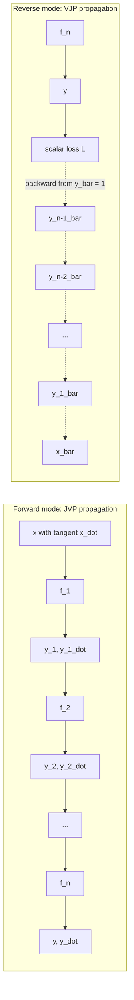
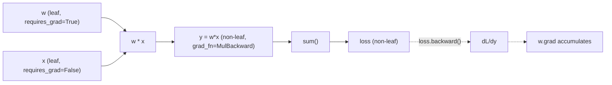
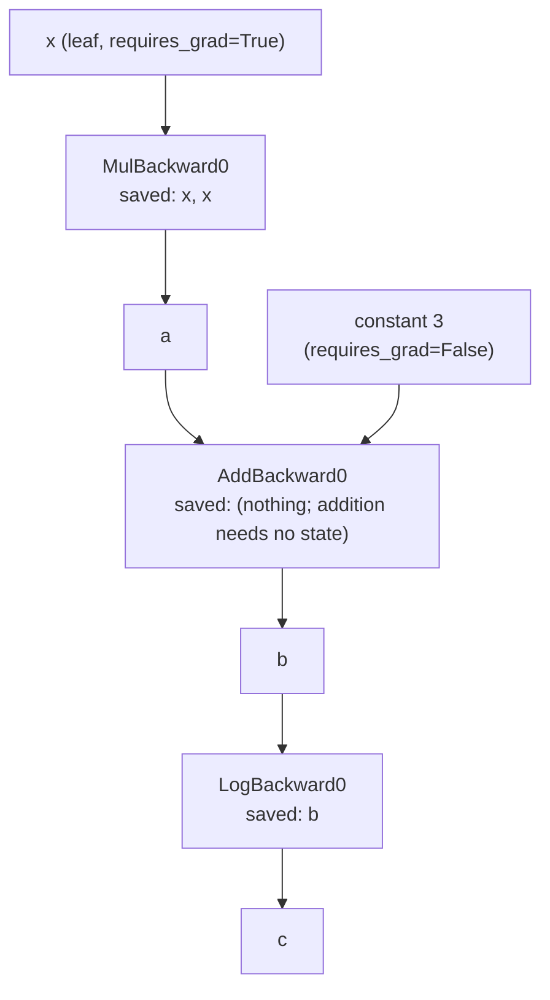
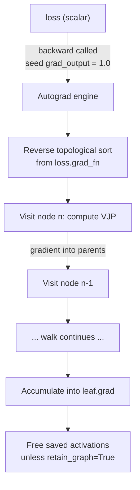
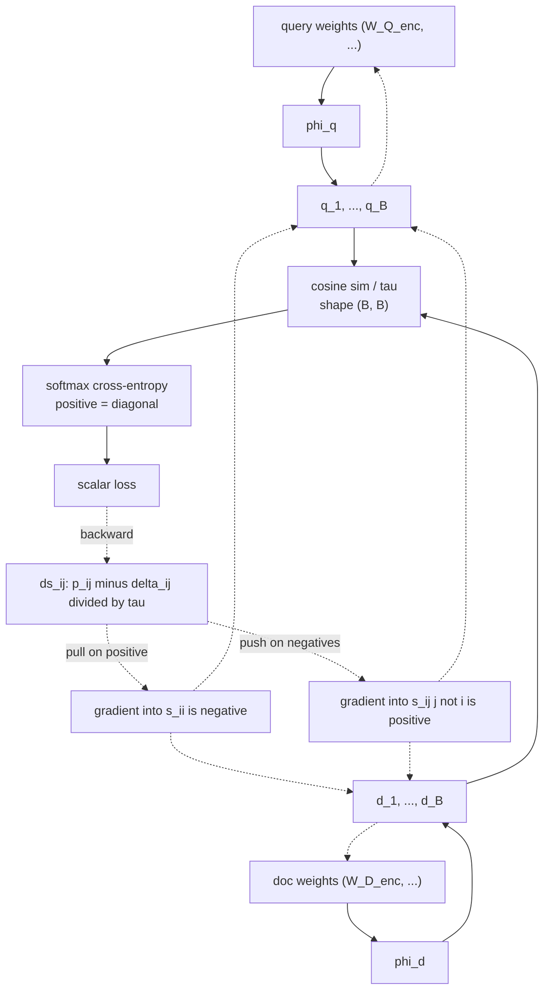
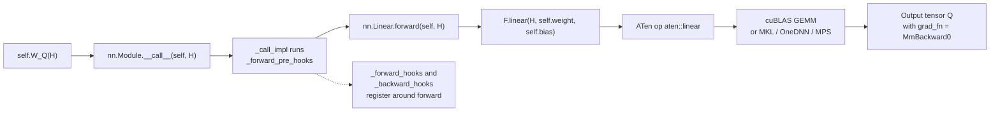
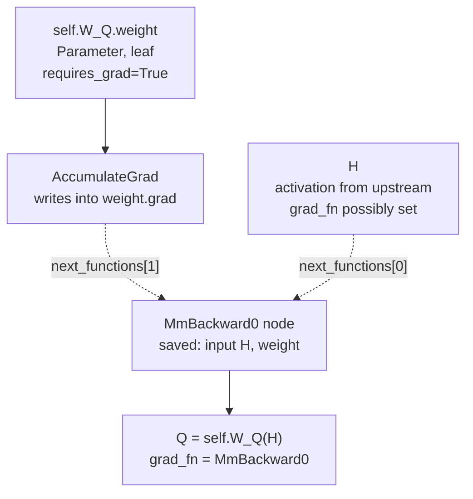
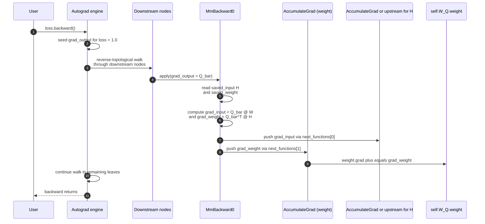

# The PyTorch Autograd Engine — A Deep Dive

*Compiled by D. Gueorguiev with Claude Opus 4.7 — July 6, 2026*

---

## Table of Contents

- [1. Scope and prerequisites](#1-scope-and-prerequisites)
- [2. What automatic differentiation is](#2-what-automatic-differentiation-is)
  - [2.1 Symbolic, numeric, and automatic differentiation](#21-symbolic-numeric-and-automatic-differentiation)
  - [2.2 Forward-mode vs. reverse-mode AD](#22-forward-mode-vs-reverse-mode-ad)
  - [2.3 Why reverse-mode dominates deep learning](#23-why-reverse-mode-dominates-deep-learning)
- [3. The Tensor and its autograd metadata](#3-the-tensor-and-its-autograd-metadata)
  - [3.1 The requires_grad flag](#31-the-requires_grad-flag)
  - [3.2 The grad_fn back-pointer](#32-the-grad_fn-back-pointer)
  - [3.3 The .grad accumulator](#33-the-grad-accumulator)
  - [3.4 Leaf tensors vs. non-leaf tensors](#34-leaf-tensors-vs-non-leaf-tensors)
  - [3.5 The version counter](#35-the-version-counter)
- [4. Building the graph during the forward pass](#4-building-the-graph-during-the-forward-pass)
  - [4.1 Every op is a Function](#41-every-op-is-a-function)
  - [4.2 Saved-for-backward context](#42-saved-for-backward-context)
  - [4.3 A concrete graph walkthrough](#43-a-concrete-graph-walkthrough)
  - [4.4 Multiple consumers and gradient accumulation](#44-multiple-consumers-and-gradient-accumulation)
- [5. The backward pass — reverse-mode AD in action](#5-the-backward-pass--reverse-mode-ad-in-action)
  - [5.1 Topological order and the engine's walk](#51-topological-order-and-the-engines-walk)
  - [5.2 The vector-Jacobian product (VJP)](#52-the-vector-jacobian-product-vjp)
  - [5.3 Broadcast semantics in backward](#53-broadcast-semantics-in-backward)
  - [5.4 Multiple output tensors and grad_outputs](#54-multiple-output-tensors-and-grad_outputs)
- [6. Worked example — gradient through a linear layer](#6-worked-example--gradient-through-a-linear-layer)
- [7. Worked example — softmax and cross-entropy](#7-worked-example--softmax-and-cross-entropy)
- [8. Case study I — gradient flow through Multi-Head Attention](#8-case-study-i--gradient-flow-through-multi-head-attention)
  - [8.1 The four matrices' gradients](#81-the-four-matrices-gradients)
  - [8.2 The softmax Jacobian and position coupling](#82-the-softmax-jacobian-and-position-coupling)
  - [8.3 Causal mask and gradient blocking](#83-causal-mask-and-gradient-blocking)
  - [8.4 A reference backward-by-hand implementation](#84-a-reference-backward-by-hand-implementation)
- [9. Case study II — gradient flow through the bi-encoder InfoNCE loss](#9-case-study-ii--gradient-flow-through-the-bi-encoder-infonce-loss)
  - [9.1 The cosine similarity Jacobian](#91-the-cosine-similarity-jacobian)
  - [9.2 InfoNCE as softmax cross-entropy](#92-infonce-as-softmax-cross-entropy)
  - [9.3 In-batch negatives and gradient distribution](#93-in-batch-negatives-and-gradient-distribution)
  - [9.4 Temperature as a gradient rescaler](#94-temperature-as-a-gradient-rescaler)
- [10. Optimizer integration](#10-optimizer-integration)
  - [10.1 The .grad buffer is a shared contract](#101-the-grad-buffer-is-a-shared-contract)
  - [10.2 zero_grad and set_to_none=True](#102-zero_grad-and-set_to_nonetrue)
  - [10.3 optimizer.step() and torch.no_grad()](#103-optimizerstep-and-torchno_grad)
- [11. Memory, checkpointing, and mixed precision](#11-memory-checkpointing-and-mixed-precision)
  - [11.1 What actually gets saved for backward](#111-what-actually-gets-saved-for-backward)
  - [11.2 Activation checkpointing](#112-activation-checkpointing)
  - [11.3 Mixed precision and GradScaler](#113-mixed-precision-and-gradscaler)
  - [11.4 Gradient accumulation](#114-gradient-accumulation)
- [12. Non-differentiable operations](#12-non-differentiable-operations)
  - [12.1 argmax, sort, boolean indexing](#121-argmax-sort-boolean-indexing)
  - [12.2 Straight-through estimator](#122-straight-through-estimator)
  - [12.3 Gumbel-softmax and REINFORCE](#123-gumbel-softmax-and-reinforce)
- [13. Custom autograd functions](#13-custom-autograd-functions)
- [14. Higher-order derivatives and the functional API](#14-higher-order-derivatives-and-the-functional-api)
  - [14.1 create_graph=True and second-order gradients](#141-create_graphtrue-and-second-order-gradients)
  - [14.2 torch.func.grad, jacrev, and vmap](#142-torchfuncgrad-jacrev-and-vmap)
- [15. Debugging and inspection](#15-debugging-and-inspection)
  - [15.1 torch.autograd.gradcheck](#151-torchautogradgradcheck)
  - [15.2 Anomaly detection](#152-anomaly-detection)
  - [15.3 Visualizing the graph](#153-visualizing-the-graph)
- [16. Common pitfalls](#16-common-pitfalls)
  - [16.1 Accidentally detaching](#161-accidentally-detaching)
  - [16.2 In-place ops and version counters](#162-in-place-ops-and-version-counters)
  - [16.3 Retaining tensors longer than needed](#163-retaining-tensors-longer-than-needed)
- [17. Distributed autograd (brief)](#17-distributed-autograd-brief)
- [18. torch.compile and the future of autograd](#18-torchcompile-and-the-future-of-autograd)
- [19. Summary](#19-summary)
- [Appendix A — Anatomy of `self.W_Q(H)` execution](#appendix-a--anatomy-of-selfw_qh-execution)
  - [A.1 What `self.W_Q` actually is — three tensors, two of them Parameters](#a1-what-selfw_q-actually-is--three-tensors-two-of-them-parameters)
  - [A.2 The forward dispatch chain](#a2-the-forward-dispatch-chain)
  - [A.3 What autograd metadata gets attached to `Q`](#a3-what-autograd-metadata-gets-attached-to-q)
  - [A.4 The backward pass — VJP math for the linear layer](#a4-the-backward-pass--vjp-math-for-the-linear-layer)
  - [A.5 Pseudocode of `MmBackward0` and `AccumulateGrad`](#a5-pseudocode-of-mmbackward0-and-accumulategrad)
  - [A.6 The full backward walk — end-to-end sequence](#a6-the-full-backward-walk--end-to-end-sequence)
  - [A.7 End-to-end verification](#a7-end-to-end-verification)
  - [A.8 Interaction with `optimizer.step()`](#a8-interaction-with-optimizerstep)
  - [A.9 What this line contributes to memory, compute, and the graph](#a9-what-this-line-contributes-to-memory-compute-and-the-graph)
  - [A.10 Cross-reference summary](#a10-cross-reference-summary)
- [20. References](#20-references)

---

## 1. Scope and prerequisites

This document is a deep dive into **PyTorch's autograd engine** — the machinery that makes `loss.backward()` compute gradients through arbitrarily complex neural networks with a single call. It is written as a companion to two sister documents in the same folder:

- [`Multi-Head_Attention_in_Transformer_Block.md`](./Multi-Head_Attention_in_Transformer_Block.md) — the static structure of a transformer block, its residual stream, and the unembedding readout. That document's §10 ("Training dynamics: the autograd view") introduces the training loop; this document zooms into the engine that makes the loop possible.
- [`../notebooks/sentence_transformers/bi_encoder_cross_encoder_architectures.md`](../notebooks/sentence_transformers/bi_encoder_cross_encoder_architectures.md) — bi-encoders, cross-encoders, and the InfoNCE contrastive loss. The InfoNCE gradient flow is one of the two extended case studies below.

Prerequisites: familiarity with basic linear algebra (matrix multiplication, Jacobians), calculus (chain rule), and enough PyTorch to have written a training loop. The document does not assume prior knowledge of automatic differentiation as a field.

Notation:

| Symbol | Meaning |
|---|---|
| $\theta$ | a scalar or tensor parameter |
| $\mathcal{L}$ | scalar loss |
| $\nabla\_\theta \mathcal{L} = \partial \mathcal{L} / \partial \theta$ | gradient of the loss with respect to $\theta$ |
| $J\_f(x) = \partial f / \partial x$ | Jacobian of a vector-valued function $f$ at input $x$ |
| $\bar{v} = \partial \mathcal{L} / \partial v$ | "cotangent" — the gradient flowing into $v$ during the backward pass |

---

## 2. What automatic differentiation is

### 2.1 Symbolic, numeric, and automatic differentiation

Three families of techniques compute derivatives, and it is easy to conflate them.

**Symbolic differentiation** manipulates mathematical expressions algebraically (e.g., Mathematica, SymPy). Given $f(x) = \sin(x^2)$, it returns the expression $2x \cos(x^2)$. It scales badly to compositions of thousands of operations because expression size can explode combinatorially.

**Numerical differentiation** approximates derivatives via finite differences:

$$
\frac{\partial f}{\partial x} \approx \frac{f(x + h) - f(x)}{h}
$$

Simple, but requires one forward pass per input coordinate (impractical when $x \in \mathbb{R}^{10^9}$) and suffers from truncation vs. round-off trade-offs.

**Automatic differentiation (AD)** — the technique underlying PyTorch autograd, JAX, and TensorFlow — computes exact derivatives by decomposing the program into a graph of elementary operations, each of which has a known derivative rule, and applying the chain rule mechanically. AD is neither an approximation (unlike numerical) nor a manipulation of symbolic expressions; it evaluates numerical derivatives step by step, at machine precision, in time proportional to the program itself.

### 2.2 Forward-mode vs. reverse-mode AD

Any composite function $f = f\_n \circ f\_{n-1} \circ \cdots \circ f\_1$ has a Jacobian that factors by chain rule:

$$
J_f(x) = J_{f_n}(y_{n-1}) \cdot J_{f_{n-1}}(y_{n-2}) \cdots J_{f_1}(x)
$$

where $y\_k = f\_k(y\_{k-1})$ are the intermediate activations. The two AD modes differ in the *order* they multiply this product.

**Forward mode** propagates a tangent vector $\dot{x}$ left-to-right:

$$
\dot{y}_1 = J_{f_1} \dot{x}, \quad \dot{y}_2 = J_{f_2} \dot{y}_1, \quad \ldots, \quad \dot{y}_n = J_{f_n} \dot{y}_{n-1}
$$

Each step is a Jacobian-vector product (JVP). Runs in one forward sweep, interleaved with the primal computation. Cost is $O(\text{one forward pass})$ per input coordinate.

**Reverse mode** propagates a cotangent vector $\bar{y}$ right-to-left:

$$
\bar{y}_{n-1} = J_{f_n}^\top \bar{y}_n, \quad \bar{y}_{n-2} = J_{f_{n-1}}^\top \bar{y}_{n-1}, \quad \ldots, \quad \bar{x} = J_{f_1}^\top \bar{y}_1
$$

Each step is a **vector-Jacobian product (VJP)**. Requires a forward pass to compute and cache the intermediate $y\_k$ values (needed by the transposed Jacobians), followed by a reverse traversal. Cost is $O(\text{one forward pass})$ per output coordinate.



### 2.3 Why reverse-mode dominates deep learning

Consider a neural network with $P \approx 10^8$ parameters producing a scalar loss $\mathcal{L}$. The Jacobian $\partial \mathcal{L} / \partial \theta$ has shape $(1, P)$: **one output, $P$ inputs**.

- **Forward mode** would need $P$ separate forward passes (one per input coordinate) to fill in all $P$ derivatives — computationally prohibitive.
- **Reverse mode** needs *one* forward pass to cache activations and *one* backward pass seeded with $\bar{\mathcal{L}} = 1$, producing all $P$ gradients in a single reverse traversal.

The general rule is: **reverse mode is cheap when outputs are few and inputs are many; forward mode is cheap when inputs are few and outputs are many.** Deep learning has the former shape (millions of parameters, one loss), so reverse mode wins by a factor of $P$.

PyTorch autograd is therefore a *reverse-mode AD* system with dynamic graph construction (the graph is rebuilt on every forward pass, unlike static-graph systems).

---

## 3. The Tensor and its autograd metadata

Every `torch.Tensor` carries autograd bookkeeping alongside its raw numeric data. Understanding the four fields below unlocks the mental model for the rest of this document.

### 3.1 The requires_grad flag

Every tensor has a boolean `requires_grad` attribute. If `True`, autograd tracks operations that consume this tensor and constructs graph nodes for them. If `False`, the tensor is a "constant" from autograd's perspective — no bookkeeping, no memory overhead for saved activations.

```python
import torch

x = torch.tensor([1.0, 2.0, 3.0])                    # requires_grad=False by default
w = torch.tensor([0.5, 0.5, 0.5], requires_grad=True)  # this one is tracked

y = (x * w).sum()   # y.requires_grad == True (propagated from w)

print(x.requires_grad, w.requires_grad, y.requires_grad)
# False True True
```

`requires_grad` propagates through operations: any op that consumes at least one tracked tensor produces a tracked output. This is why parameters need `requires_grad=True` only at the parameter (leaf) level — the flag flows to every downstream activation automatically.

`nn.Parameter` is a thin `Tensor` subclass that sets `requires_grad=True` by default and registers itself with the parent `nn.Module`.

### 3.2 The grad_fn back-pointer

Every *non-leaf* tensor has a `.grad_fn` attribute that points to the C++ `Node` object representing the operation that produced it. This is autograd's back-pointer into the graph:

```python
y = (x * w).sum()
print(y.grad_fn)                # <SumBackward0 object at 0x...>
print(y.grad_fn.next_functions)  # ((<MulBackward0 object>, 0),)
```

The `.next_functions` field is a tuple of `(parent_grad_fn, output_slot)` pairs describing which nodes fed into this one. Walking `.next_functions` recursively is how the backward engine traverses the graph.

Leaf tensors with `requires_grad=True` do not have a `grad_fn` (their `grad_fn` is `None`); they are terminals of the graph where gradients accumulate into `.grad`.

### 3.3 The .grad accumulator

Every leaf tensor with `requires_grad=True` has a `.grad` attribute — a tensor of the same shape as the parameter. After `loss.backward()`, `.grad` holds $\partial \mathcal{L} / \partial \theta$ for that leaf.

Two critical properties:

1. **Gradients accumulate.** Successive backward passes *add* to `.grad` rather than overwriting it. This is why training loops call `optimizer.zero_grad()` (or `.grad.zero_()`) at the top of every step — otherwise gradients from the previous step contaminate the current one.
2. **Only leaves have .grad by default.** Non-leaf tensors have `.grad = None` after `.backward()` unless you set `.retain_grad()` before backward. This is a memory optimization: PyTorch assumes you only care about parameters, not intermediate activations.

```python
w = torch.tensor([0.5], requires_grad=True)
y = w * 3
y.backward()
print(w.grad)   # tensor([3.])
y.backward()    # doesn't work — graph was freed. Redo forward + retain_graph.
```

### 3.4 Leaf tensors vs. non-leaf tensors

A **leaf tensor** is one that was created directly by the user rather than by an operation on other tensors. Its `grad_fn` is `None`. Leaves with `requires_grad=True` are the parameters against which gradients are computed and stored.

A **non-leaf tensor** is the output of an op. Its `grad_fn` is not `None`. Non-leaves do not accumulate gradients into `.grad` — the gradient flows *through* them to reach the leaves.

The distinction matters because:

- Optimizers iterate over leaves (via `model.parameters()`) and read their `.grad` fields.
- Detaching a non-leaf (`.detach()`) turns it back into a leaf, breaking the graph.
- Trying to backprop through a leaf that is not a graph output raises "cannot compute gradient of leaf" errors.



### 3.5 The version counter

Each tensor has a hidden `_version` counter that increments on every in-place mutation. Autograd captures this counter when a tensor is saved for backward. If the counter changes between save and backward, autograd raises:

```
RuntimeError: one of the variables needed for gradient computation
has been modified by an inplace operation
```

This is autograd's safety net against silent correctness bugs from in-place ops. The rule of thumb: if a tensor is on the autograd graph, do not modify it in place — instead reassign (`x = x + 1` rather than `x += 1`) or use `torch.no_grad()` for updates that autograd should ignore.

---

## 4. Building the graph during the forward pass

### 4.1 Every op is a Function

Every differentiable operation in PyTorch subclasses `torch.autograd.Function`. The class defines two static methods:

```python
class MyOp(torch.autograd.Function):
    @staticmethod
    def forward(ctx, *inputs):
        # Compute the output; save anything backward will need
        ctx.save_for_backward(...)
        return output

    @staticmethod
    def backward(ctx, *grad_outputs):
        # Given cotangents flowing into the output(s), compute
        # cotangents to propagate to the input(s)
        saved = ctx.saved_tensors
        return grad_input_1, grad_input_2, ...
```

`ctx` is a context object that persists between forward and backward — it stores whatever tensors, shapes, or metadata `backward` will need. The number of returned gradients in `backward` must equal the number of inputs to `forward`; return `None` for inputs that don't require gradient.

Every op you call — `torch.add`, `torch.matmul`, `F.softmax`, `nn.Linear.__call__` — dispatches through a corresponding `autograd.Function` under the hood.

### 4.2 Saved-for-backward context

The critical decision every `Function` makes: **what to save for backward.** Saved tensors sit in GPU memory until `backward()` runs (or the graph is freed). This is the largest memory user during training, because for a $T$-token, $L$-layer, $d$-dim transformer you may save $O(L \cdot T \cdot d)$ activations *per forward pass*.

For example, `matmul(A, B)` saves both `A` and `B` — because computing the gradient of the output with respect to `A` requires `B^T`, and vice versa. `ReLU` saves only the boolean mask `(x > 0)`, not `x` itself — because the gradient is either 1 (where the mask is true) or 0 (where it's false).

Choosing what to save is where AD frameworks earn their keep. A poorly written custom function that saves more than necessary can dominate memory.

### 4.3 A concrete graph walkthrough

Consider the tiny program:

```python
x = torch.tensor([2.0], requires_grad=True)
a = x * x       # a = x^2
b = a + 3       # b = x^2 + 3
c = b.log()     # c = log(x^2 + 3)
```

The graph autograd builds looks like:



At each node, `saved_tensors` lists what the backward pass needs. `AddBackward` saves nothing because $\partial (a + 3) / \partial a = 1$ requires no context. `LogBackward` saves `b` because $\partial \log(b) / \partial b = 1/b$ needs the value of $b$ at forward time.

### 4.4 Multiple consumers and gradient accumulation

If a tensor is consumed by multiple downstream operations, its cotangent is the **sum** of contributions from each consumer:

$$
\bar{x} = \sum_{k} J_{f_k}^\top \bar{y}_k
$$

Autograd implements this by accumulating gradients into a shared buffer as the reverse walk visits each consumer. No manual bookkeeping is required.

```python
x = torch.tensor([1.0], requires_grad=True)
y = x * 2       # consumer 1
z = x * 3       # consumer 2
loss = y + z    # loss = 5x, so dloss/dx = 5
loss.backward()
print(x.grad)   # tensor([5.])   (= 2 + 3)
```

This is exactly the situation in a transformer residual stream: the hidden state $H^{(\ell)}$ feeds *both* MHA and (via the residual connection) the next block. Its gradient is the sum of the contribution from MHA and the contribution from the residual path — which is what makes residual connections a *superhighway* for gradient flow.

---

## 5. The backward pass — reverse-mode AD in action

Calling `loss.backward()` triggers the following, all inside PyTorch's C++ engine.

### 5.1 Topological order and the engine's walk

1. Starting from `loss.grad_fn`, the engine performs a reverse topological traversal of the DAG.
2. Each visited node computes its VJP: given cotangents flowing in from consumers, produce cotangents to pass to parents.
3. When a leaf tensor with `requires_grad=True` is reached, the accumulated cotangent is added to `leaf.grad`.
4. Once all nodes are processed, activations saved for backward are freed (unless `retain_graph=True`).



The engine parallelizes independent branches via a thread pool (visible in `torch.autograd.set_num_threads`), but for most workloads the backward pass is dominated by matmul kernels on the GPU and CPU-side scheduling is not the bottleneck.

### 5.2 The vector-Jacobian product (VJP)

The VJP is the atomic operation of reverse-mode AD. For an operation $y = f(x\_1, \ldots, x\_k)$ with Jacobian $J\_f$, the VJP is:

$$
(\bar{x}_1, \ldots, \bar{x}_k) = J_f^\top \bar{y}
$$

Explicitly, for each input $i$:

$$
\bar{x}_i = \left(\frac{\partial y}{\partial x_i}\right)^\top \bar{y}
$$

Every backward rule in PyTorch is a VJP. Some examples:

| Operation $y$ | VJP for $\bar{y} \to \bar{x}$ |
|---|---|
| $y = x + c$ | $\bar{x} = \bar{y}$ |
| $y = c \cdot x$ | $\bar{x} = c \cdot \bar{y}$ |
| $y = x\_1 + x\_2$ | $\bar{x}\_1 = \bar{y}$ and $\bar{x}\_2 = \bar{y}$ |
| $y = x\_1 \cdot x\_2$ | $\bar{x}\_1 = x\_2 \cdot \bar{y}$ and $\bar{x}\_2 = x\_1 \cdot \bar{y}$ |
| $y = x^2$ | $\bar{x} = 2x \cdot \bar{y}$ |
| $y = \log x$ | $\bar{x} = \bar{y} / x$ |
| $y = e^x$ | $\bar{x} = e^x \cdot \bar{y} = y \cdot \bar{y}$ |
| $y = A B$ | $\bar{A} = \bar{y} B^\top$ and $\bar{B} = A^\top \bar{y}$ |
| $y = \mathrm{ReLU}(x)$ | $\bar{x} = \bar{y} \cdot [x > 0]$ |

The matmul rule ($y = AB$) is worth pausing on because it appears everywhere in transformers. If $A \in \mathbb{R}^{m \times k}$ and $B \in \mathbb{R}^{k \times n}$, then $y \in \mathbb{R}^{m \times n}$ and $\bar{y}$ has the same shape as $y$. The VJP produces $\bar{A} \in \mathbb{R}^{m \times k}$ (same shape as $A$) via $\bar{y} B^\top$, and $\bar{B} \in \mathbb{R}^{k \times n}$ via $A^\top \bar{y}$. Shape-checking the VJP is a good sanity test when deriving new backward rules.

### 5.3 Broadcast semantics in backward

Broadcasting in the forward direction becomes a **sum-reduction** in the backward direction. Consider:

```python
a = torch.randn(3, 1, requires_grad=True)  # shape (3, 1)
b = torch.randn(1, 4, requires_grad=True)  # shape (1, 4)
c = a + b                                  # shape (3, 4), broadcast to (3, 4)
loss = c.sum()
loss.backward()
print(a.grad.shape)  # (3, 1) — same as a
print(b.grad.shape)  # (1, 4) — same as b
```

The gradient $\bar{c}$ has shape $(3, 4)$, but $a$ has shape $(3, 1)$. Autograd sums $\bar{c}$ along the broadcast dimension (dim=1) to produce a $(3, 1)$ result. This is a general rule: **when a tensor was broadcast in the forward pass, the incoming gradient is reduced over the broadcast dimensions in the backward pass**. It is the mathematical consequence of Jacobian transposition — the forward broadcast is a `repeat`, whose transpose is a `sum`.

### 5.4 Multiple output tensors and grad_outputs

`.backward()` on a scalar seeds the reverse walk with $\bar{\mathcal{L}} = 1$. For non-scalar outputs, you must supply a "seed" cotangent vector via the `grad_tensors` argument:

```python
y = f(x)                  # y is a tensor, not a scalar
v = torch.ones_like(y)    # or any weighting vector
y.backward(gradient=v)    # equivalent to (y * v).sum().backward()
```

This computes the VJP $\bar{x} = J\_f^\top v$, which is why the mathematically canonical form of autograd is `torch.autograd.grad(outputs, inputs, grad_outputs=v)`: given a $v$, compute the VJP.

---

## 6. Worked example — gradient through a linear layer

The linear layer $y = xW^\top + b$ appears in every attention head, FFN, embedding, and unembedding. Its backward is fundamental.

**Forward.** Given $x \in \mathbb{R}^{B \times d\_{in}}$, $W \in \mathbb{R}^{d\_{out} \times d\_{in}}$, $b \in \mathbb{R}^{d\_{out}}$:

$$
y = x W^\top + b, \quad y \in \mathbb{R}^{B \times d_{out}}
$$

**Backward.** Suppose the incoming cotangent is $\bar{y} \in \mathbb{R}^{B \times d\_{out}}$. Then:

$$
\bar{x} = \bar{y} W, \quad \bar{W} = \bar{y}^\top x, \quad \bar{b} = \sum_{i=1}^{B} \bar{y}_{i, :}
$$

Two things worth noting:

1. **The gradient into $W$ is a sum over the batch.** Each sample in the batch contributes an outer product $\bar{y}\_i x\_i^\top$; autograd sums them via the matmul.
2. **The gradient into $b$ is a sum over the batch too**, since $b$ was broadcast across the batch dimension in the forward pass (§5.3).

Verified explicitly in PyTorch:

```python
import torch

B, d_in, d_out = 4, 3, 2
x = torch.randn(B, d_in, requires_grad=True)
W = torch.randn(d_out, d_in, requires_grad=True)
b = torch.randn(d_out, requires_grad=True)

y = x @ W.T + b
loss = y.sum()   # arbitrary scalar
loss.backward()

# The .sum() means y_bar = ones(B, d_out)
y_bar = torch.ones(B, d_out)

# Manually compute the VJPs
x_bar_manual = y_bar @ W
W_bar_manual = y_bar.T @ x
b_bar_manual = y_bar.sum(dim=0)

assert torch.allclose(x.grad, x_bar_manual)
assert torch.allclose(W.grad, W_bar_manual)
assert torch.allclose(b.grad, b_bar_manual)
```

This is exactly the computation the MHA sub-layer performs four times per head per layer (§8).

---

## 7. Worked example — softmax and cross-entropy

Softmax and its combination with cross-entropy loss form the second fundamental backward rule for transformers — attention uses softmax internally, and the final loss is typically softmax cross-entropy over the vocabulary.

**Softmax forward.** Given logits $z \in \mathbb{R}^V$:

$$
p_i = \frac{e^{z_i}}{\sum_{j=1}^{V} e^{z_j}}
$$

**Softmax Jacobian.** The Jacobian $J = \partial p / \partial z \in \mathbb{R}^{V \times V}$ has entries:

$$
J_{ij} = \frac{\partial p_i}{\partial z_j} = p_i (\delta_{ij} - p_j)
$$

In matrix form:

$$
J = \mathrm{diag}(p) - p p^\top
$$

The Jacobian is **not diagonal**: perturbing any single logit $z\_j$ changes every probability $p\_i$ (by softmax's normalization). This is the source of the "position coupling" during backward that appears repeatedly in transformer attention analysis.

**Softmax VJP.** Given $\bar{p}$, the gradient with respect to $z$ is:

$$
\bar{z} = J^\top \bar{p} = (\mathrm{diag}(p) - p p^\top) \bar{p} = p \odot \bar{p} - p \cdot (p^\top \bar{p})
$$

where $\odot$ is elementwise product. This form is efficient — no explicit $V \times V$ Jacobian is ever materialized.

**Cross-entropy loss.** For a one-hot target $y = e\_{y^\star}$ (where $y^\star$ is the correct class index):

$$
\mathcal{L} = -\log p_{y^\star} = -z_{y^\star} + \log \sum_{j} e^{z_j}
$$

**Cross-entropy + softmax VJP — the magic simplification.** When cross-entropy is composed with softmax, the derivative simplifies dramatically:

$$
\frac{\partial \mathcal{L}}{\partial z_i} = p_i - \mathbb{1}[i = y^\star]
$$

That is: the gradient of the loss with respect to the logits is just **(predicted probability) − (one-hot target)**. Every logit gets pushed down by its predicted probability, except the correct-class logit, which is also pushed up by 1. This clean form is why `F.cross_entropy(logits, target)` is used instead of `-F.log_softmax(logits).gather(...)` — it avoids ever materializing the full softmax Jacobian and combines the two ops into a single fused kernel.

```python
import torch.nn.functional as F

logits = torch.randn(3, 5, requires_grad=True)   # batch=3, classes=5
target = torch.tensor([1, 0, 4])

loss = F.cross_entropy(logits, target)
loss.backward()

# Manual: gradient should be (softmax(logits) - one_hot(target)) / batch
manual = F.softmax(logits, dim=-1).detach().clone()
for i, t in enumerate(target):
    manual[i, t] -= 1
manual /= 3   # cross_entropy defaults to mean reduction

# Verify
assert torch.allclose(logits.grad, manual)
```

This clean rule is what backpropagates from the loss into the residual stream in every next-token-prediction transformer.

---

## 8. Case study I — gradient flow through Multi-Head Attention

With the machinery of §5–7 in hand, we can now trace exactly how a loss at the output of a transformer becomes gradients on $W\_Q, W\_K, W\_V, W\_O$. This section is the promised deep dive into the backward pass that [§10.4 of `Multi-Head_Attention_in_Transformer_Block.md`](./Multi-Head_Attention_in_Transformer_Block.md#104-the-backward-pass-through-mha) alludes to.

### 8.1 The four matrices' gradients

Recall the MHA forward pass (per head $i$):

$$
Q^{(i)} = H W_Q^{(i)}, \quad K^{(i)} = H W_K^{(i)}, \quad V^{(i)} = H W_V^{(i)}
$$

$$
S^{(i)} = Q^{(i)} (K^{(i)})^\top / \sqrt{d_k}
$$

$$
A^{(i)} = \mathrm{softmax}_{\text{row}}(S^{(i)}), \quad O^{(i)} = A^{(i)} V^{(i)}
$$

$$
\mathrm{MHA}(H) = \mathrm{Concat}(O^{(1)}, \ldots, O^{(h)}) W_O
$$

Assuming autograd has propagated the loss backward through the residual and LayerNorm above MHA, we receive the cotangent $\overline{\mathrm{MHA}(H)} \in \mathbb{R}^{T \times d}$ at the output projection. We now walk backward.

**Step 1 — Output projection $W\_O$.** Let $C = \mathrm{Concat}(O^{(1)}, \ldots, O^{(h)}) \in \mathbb{R}^{T \times d}$. Then $\mathrm{MHA}(H) = C W\_O$, so:

$$
\bar{W}_O = C^\top \overline{\mathrm{MHA}(H)}, \quad \bar{C} = \overline{\mathrm{MHA}(H)} W_O^\top
$$

Split $\bar{C}$ back into per-head slices $\bar{O}^{(i)} \in \mathbb{R}^{T \times d\_k}$.

**Step 2 — Value weighting.** Since $O^{(i)} = A^{(i)} V^{(i)}$:

$$
\bar{A}^{(i)} = \bar{O}^{(i)} (V^{(i)})^\top, \quad \bar{V}^{(i)} = (A^{(i)})^\top \bar{O}^{(i)}
$$

**Step 3 — Softmax backward.** Applying the softmax VJP row-wise (§7) with cotangent $\bar{A}^{(i)}\_{t, :}$:

$$
\bar{S}^{(i)}_{t, :} = A^{(i)}_{t, :} \odot \bar{A}^{(i)}_{t, :} - A^{(i)}_{t, :} \cdot (A^{(i)}_{t, :} \cdot \bar{A}^{(i)}_{t, :})
$$

This is where the **row-wise coupling** enters: $\bar{S}^{(i)}\_{t, t'}$ depends on the *entire row* $A^{(i)}\_{t, :}$, not just entry $t'$.

**Step 4 — Scaled dot product.** Since $S^{(i)} = Q^{(i)} (K^{(i)})^\top / \sqrt{d\_k}$:

$$
\bar{Q}^{(i)} = \bar{S}^{(i)} K^{(i)} / \sqrt{d_k}, \quad \bar{K}^{(i)} = (\bar{S}^{(i)})^\top Q^{(i)} / \sqrt{d_k}
$$

**Step 5 — Input projections.** Finally:

$$
\bar{W}_Q^{(i)} = H^\top \bar{Q}^{(i)}, \quad \bar{W}_K^{(i)} = H^\top \bar{K}^{(i)}, \quad \bar{W}_V^{(i)} = H^\top \bar{V}^{(i)}
$$

$$
\bar{H} = \bar{Q}^{(i)} (W_Q^{(i)})^\top + \bar{K}^{(i)} (W_K^{(i)})^\top + \bar{V}^{(i)} (W_V^{(i)})^\top + (\text{residual contribution})
$$

The three contributions to $\bar{H}$ from a single head are summed (§4.4) — this is the "multiple consumers" pattern. Then the contributions across heads are also summed. Finally the residual pathway adds its own $\bar{H}$ from the upstream side.

### 8.2 The softmax Jacobian and position coupling

Look at Step 3 again. The softmax VJP for row $t$ mixes every key position $t' \in \{1, \ldots, T\}$ within that row:

$$
\bar{S}^{(i)}_{t, t'} = A^{(i)}_{t, t'} \left( \bar{A}^{(i)}_{t, t'} - \sum_{u=1}^{T} A^{(i)}_{t, u} \bar{A}^{(i)}_{t, u} \right)
$$

Two important consequences:

1. **Every position within a row participates in every other position's gradient.** The mask-out term $\sum\_u A\_{t,u} \bar{A}\_{t,u}$ is a row-wide inner product.
2. **Attention couples query position and key positions during backward.** A loss error at query position $t$ produces $\bar{Q}^{(i)}\_t$, which then produces $\bar{K}^{(i)}\_{t'}$ for every $t'$ that $t$ attended to. This is the mechanism by which the model learns long-range dependencies — the gradient of the loss at position $t$ flows to *every* key/value position that contributed to token $t$'s representation.

### 8.3 Causal mask and gradient blocking

Recall (from Multi-Head_Attention_in_Transformer_Block.md §3.3) that the causal mask sets $S^{(i)}\_{t, t'} = -\infty$ for $t' > t$ before the softmax. Consequently:

$$
A^{(i)}_{t, t'} = 0 \quad \text{for all } t' > t
$$

Because $A^{(i)}\_{t, t'}$ is zero, the softmax VJP formula (§8.2) gives $\bar{S}^{(i)}\_{t, t'} = 0$ for those positions. **No gradient flows from query position $t$ to key/value position $t' > t$.** The causal constraint is bidirectional: it prevents future tokens from being seen forward *and* prevents past losses from updating future-position weights backward.

This is essential for autoregressive training: if the mask leaked in either direction, the model would learn from information that would not be available at inference time.

### 8.4 A reference backward-by-hand implementation

To ground the derivations, here is a numerical verification. We implement the forward and hand-computed backward, then compare against PyTorch autograd:

```python
import torch
import torch.nn.functional as F

torch.manual_seed(0)
B, T, d, h = 2, 4, 8, 2
d_k = d // h

x = torch.randn(B, T, d, requires_grad=True)
W_q = torch.randn(d, d, requires_grad=True)
W_k = torch.randn(d, d, requires_grad=True)
W_v = torch.randn(d, d, requires_grad=True)
W_o = torch.randn(d, d, requires_grad=True)

def mha(x, W_q, W_k, W_v, W_o):
    B, T, d = x.shape
    q = (x @ W_q).view(B, T, h, d_k).transpose(1, 2)   # (B, h, T, d_k)
    k = (x @ W_k).view(B, T, h, d_k).transpose(1, 2)
    v = (x @ W_v).view(B, T, h, d_k).transpose(1, 2)
    s = (q @ k.transpose(-2, -1)) / (d_k ** 0.5)       # (B, h, T, T)
    a = F.softmax(s, dim=-1)                            # (B, h, T, T)
    o = a @ v                                           # (B, h, T, d_k)
    o = o.transpose(1, 2).contiguous().view(B, T, d)    # (B, T, d)
    return o @ W_o

y = mha(x, W_q, W_k, W_v, W_o)
loss = y.sum()
loss.backward()

# Now every W_*.grad and x.grad contains the reverse-mode gradient computed
# through the chain of matmuls, softmax, and concatenation described in
# steps 1-5 above. Verifying by hand is tedious but instructive.
print("dL/dW_q shape:", W_q.grad.shape)   # (d, d)
print("dL/dW_o shape:", W_o.grad.shape)   # (d, d)
```

Running `gradcheck` (§15.1) against a finite-difference reference would confirm that each of these tensors matches the hand-derived VJP to floating-point precision.

---

## 9. Case study II — gradient flow through the bi-encoder InfoNCE loss

The second case study traces gradients through the training objective for a bi-encoder retriever. This complements the [InfoNCE discussion in the bi-encoder document](../notebooks/sentence_transformers/bi_encoder_cross_encoder_architectures.md#14-training-contrastive-objectives) by tracing what autograd actually computes when `loss.backward()` is called on that loss.

### 9.1 The cosine similarity Jacobian

The bi-encoder computes $s\_{\mathrm{bi}}(q, d) = \cos(\phi\_q(q), \phi\_d(d))$. Let $u = \phi\_q(q)$ and $v = \phi\_d(d)$, both in $\mathbb{R}^{d}$. Then:

$$
s = \cos(u, v) = \frac{u \cdot v}{\|u\| \|v\|}
$$

Applying quotient rule, the gradient with respect to $u$ is:

$$
\frac{\partial s}{\partial u} = \frac{v}{\|u\| \|v\|} - \frac{u \cdot v}{\|u\|^3 \|v\|} u = \frac{1}{\|u\| \|v\|} \left( v - \frac{u \cdot v}{\|u\|^2} u \right)
$$

Geometrically: the gradient points in the direction of $v$ minus the component of $v$ along $u$ — i.e., the component of $v$ *perpendicular* to $u$, normalized. Moving $u$ in this direction increases $\cos(u, v)$ most rapidly.

When the embeddings are pre-normalized ($\|u\| = \|v\| = 1$), this simplifies to:

$$
\frac{\partial s}{\partial u} = v - (u \cdot v) u = v - s u
$$

Which is why sentence-transformer training pipelines usually L2-normalize embeddings — it turns cosine into a plain dot product and simplifies the gradient.

### 9.2 InfoNCE as softmax cross-entropy

The InfoNCE loss for query $q\_i$ with positive $d\_i^{+}$ is:

$$
\mathcal{L}_i = -\log \frac{\exp(s_i^{+} / \tau)}{\sum_{j \in \mathcal{B}} \exp(s_{ij} / \tau)}
$$

where $s\_{ij} = s\_{\mathrm{bi}}(q\_i, d\_j)$ and $\tau$ is the temperature. This is *literally* softmax cross-entropy on the scaled-similarity logits, with the positive index treated as the "class label".

Autograd sees:

```python
sims = q_emb @ d_emb.T / tau            # (B, B) matrix of similarities
labels = torch.arange(B)                 # positive for query i is doc i
loss = F.cross_entropy(sims, labels)
loss.backward()
```

Applying the softmax cross-entropy VJP from §7:

$$
\frac{\partial \mathcal{L}_i}{\partial s_{ij}} = \frac{1}{\tau} \left( p_{ij} - \mathbb{1}[j = i] \right)
$$

where $p\_{ij} = \exp(s\_{ij} / \tau) / \sum\_k \exp(s\_{ik} / \tau)$ is the softmax over row $i$.

### 9.3 In-batch negatives and gradient distribution

The gradient into the similarity $s\_{ij}$ decomposes into two cases:

- $j = i$ (the positive): $\partial \mathcal{L}\_i / \partial s\_{ii} = (p\_{ii} - 1) / \tau < 0$. The gradient is **negative**, meaning gradient descent *increases* $s\_{ii}$. This is the "pull together" force.
- $j \neq i$ (a negative): $\partial \mathcal{L}\_i / \partial s\_{ij} = p\_{ij} / \tau > 0$. The gradient is **positive**, meaning gradient descent *decreases* $s\_{ij}$. This is the "push apart" force.

Notice the elegant division of labor:

$$
\frac{\partial \mathcal{L}_i}{\partial s_{ij}} = \frac{p_{ij} - \mathbb{1}[j=i]}{\tau}
$$

$\sum\_j p\_{ij} - \sum\_j \mathbb{1}[j=i] = 1 - 1 = 0$, so within any single query row, the *pull* force on the positive exactly balances the total *push* force on all negatives. This is why InfoNCE is a stable objective: it neither collapses embeddings to a point nor pushes them to infinity.

The gradient then flows further back into $q\_i$ and each $d\_j$ via the cosine Jacobian (§9.1), and then into the transformer weights of $\phi\_q$ and $\phi\_d$ via the standard backward-through-network path. Every parameter of the bi-encoder receives gradient contribution from *every* query-document pair in the batch — a $B^2$-way coupling from a $B$-sized batch.



### 9.4 Temperature as a gradient rescaler

The temperature $\tau$ appears in the denominator of every gradient formula in §9.3. Small $\tau$ (e.g., 0.05) inflates gradient magnitudes; large $\tau$ (e.g., 1.0) deflates them. Additionally, small $\tau$ sharpens the softmax, so the softmax weights $p\_{ij}$ concentrate on the highest-scoring negatives — meaning gradient signal is disproportionately allocated to hard negatives.

The bi-encoder document's remark that *"embeddings are still random and all similarities cluster near zero"* at initialization means:

- All $s\_{ij} \approx 0$, so $s\_{ij} / \tau \approx 0$ for any $\tau$.
- Softmax of near-zero logits is uniform: $p\_{ij} \approx 1/B$.
- Therefore $\partial \mathcal{L}\_i / \partial s\_{ij} \approx (1/B - \mathbb{1}[j = i]) / \tau$ — tiny gradients, dominated by noise.

As training progresses, gradients through the softmax cross-entropy VJP shape every weight in $\phi\_q$ and $\phi\_d$, driving the similarity structure from near-uniform to peaked on the diagonal. This is autograd's mechanistic role in the "still random → semantically meaningful" trajectory described in §10.7 of the MHA document.

---

## 10. Optimizer integration

### 10.1 The .grad buffer is a shared contract

Once `.backward()` completes, every leaf tensor with `requires_grad=True` has a populated `.grad`. The optimizer's contract is simple: iterate over `model.parameters()`, read each `.grad`, apply the update rule, and write back to the parameter data.

There is no explicit coupling between autograd and optimizer — they communicate only via the `.grad` buffer. This is what makes it easy to combine any optimizer (SGD, Adam, AdamW, Lion, Muon, ...) with any model.

```python
# What every training loop looks like under the hood
for param in model.parameters():
    if param.grad is None:
        continue                          # skip frozen params
    with torch.no_grad():
        param.data.add_(param.grad, alpha=-learning_rate)   # SGD update
```

### 10.2 zero_grad and set_to_none=True

Because gradients accumulate (§3.3), `optimizer.zero_grad()` must be called between training steps. Two idioms:

```python
optimizer.zero_grad()                  # sets .grad to a zero tensor (in-place)
optimizer.zero_grad(set_to_none=True)  # sets .grad to None
```

The `set_to_none=True` variant has become the default in modern PyTorch (2.0+). It is faster and uses less memory because:

- It skips the in-place `.zero_()` op, saving one memory write per parameter.
- It allows autograd to allocate a fresh gradient buffer on the next backward pass, which can be lazy or cheaper on the accelerator.

The behavior differs in one edge case: `set_to_none=True` produces `None`-valued gradients for parameters that saw no forward-pass usage (e.g., freezing a portion of the graph), whereas `set_to_none=False` gives them a zero tensor. Optimizers must handle `None` gracefully — PyTorch's built-in ones do.

### 10.3 optimizer.step() and torch.no_grad()

Every parameter update is wrapped internally in a `torch.no_grad()` context:

```python
with torch.no_grad():
    param.data -= learning_rate * param.grad
```

Without `no_grad()`, the update itself would be recorded as an autograd operation on the parameter tensor — creating an ever-growing graph across training steps. `no_grad()` disables the graph builder for the duration of the block; ops inside execute forward-only. This is why `optimizer.step()` never appears in the autograd graph — it is invisible to the engine.

The complementary idiom `param.data` (rather than `param`) is another way to bypass autograd: `.data` returns the underlying storage as a raw tensor without any autograd metadata. Modern PyTorch discourages `.data` in favor of `.detach()` (which is safer around version-counter checks), but the pattern is still common in older codebases.

---

## 11. Memory, checkpointing, and mixed precision

### 11.1 What actually gets saved for backward

The largest single memory consumer during training is *not* parameters, gradients, or optimizer state — it is **saved activations**. For a transformer with $L$ layers, sequence length $T$, and hidden dimension $d$, roughly $O(L \cdot T \cdot d)$ tensors are saved for backward *per forward pass*.

Concretely, per attention head, the backward pass needs (at minimum):

- $H^{(\ell)}$ (input to the block) — for gradients into $W\_Q, W\_K, W\_V$
- $Q, K, V$ or a scheme to recompute them
- $A$ (attention weights) — for the softmax VJP and the gradient into $V$
- $\mathrm{Concat}(O)$ — for the gradient into $W\_O$

For a GPT-2-small model (12 layers, 768 hidden, 1024 sequence, batch 8), this can easily consume tens of GB of GPU memory, dwarfing the ~500 MB of parameters.

### 11.2 Activation checkpointing

Introduced by Chen et al. (2016), gradient/activation checkpointing trades compute for memory: only every $k$-th layer's activations are saved. During backward, the missing activations are recomputed on the fly from the nearest saved checkpoint.

Cost: one extra forward pass per checkpoint interval — roughly 30% extra training time. Benefit: activation memory reduced from $O(L)$ to $O(\sqrt{L})$ if checkpoints are placed evenly.

```python
from torch.utils.checkpoint import checkpoint

def forward(self, x):
    for block in self.blocks:
        x = checkpoint(block, x, use_reentrant=False)   # recompute-on-backward
    return x
```

Under the hood, `checkpoint` creates a custom `autograd.Function` whose `forward` runs the block *without* saving intermediate activations (only inputs and outputs), and whose `backward` re-runs the forward pass with a fresh autograd graph to compute the missing gradients.

### 11.3 Mixed precision and GradScaler

Modern accelerators (H100, MI300, TPU v5) have specialized `bfloat16` and `float16` tensor cores that are 2–8× faster than `float32`. Mixed-precision training keeps weights and optimizer state in `float32` but runs forward and backward in reduced precision.

For `float16` (but not `bfloat16`), the dynamic range is small enough that gradients frequently underflow to zero. `torch.cuda.amp.GradScaler` handles this by:

1. Scaling the loss by a large factor $S$ (typically $2^{16}$) before backward — this shifts gradient magnitudes into a range that `float16` can represent.
2. Unscaling the gradients before the optimizer step.
3. Skipping the step if any gradient overflowed to `inf` or `nan`, and halving $S$ for next time.

```python
scaler = torch.cuda.amp.GradScaler()

for x, y in loader:
    optimizer.zero_grad(set_to_none=True)
    with torch.autocast(device_type="cuda", dtype=torch.float16):
        logits = model(x)
        loss = criterion(logits, y)

    scaler.scale(loss).backward()      # scaled backward
    scaler.step(optimizer)              # unscaled step (or skip if inf/nan)
    scaler.update()                     # adjust scale for next step
```

`bfloat16` skips the scaler because its exponent range matches `float32`; only the mantissa is truncated.

### 11.4 Gradient accumulation

If a batch of size $B$ does not fit in memory, run $N$ mini-batches of size $B/N$ and accumulate gradients across them before stepping the optimizer:

```python
accum_steps = 4
optimizer.zero_grad(set_to_none=True)

for i, (x, y) in enumerate(loader):
    loss = criterion(model(x), y) / accum_steps
    loss.backward()                        # gradients accumulate into .grad
    if (i + 1) % accum_steps == 0:
        optimizer.step()
        optimizer.zero_grad(set_to_none=True)
```

This works precisely because `.grad` is an accumulator (§3.3). The division by `accum_steps` inside the loss keeps the effective gradient scale identical to a full batch of size $B$.

Gradient accumulation is orthogonal to activation checkpointing and mixed precision — all three are frequently combined in large-model training to fit multi-billion-parameter models on commodity GPUs.

---

## 12. Non-differentiable operations

Autograd computes gradients only through operations that have registered backward rules. Some operations are fundamentally non-differentiable and require workarounds.

### 12.1 argmax, sort, boolean indexing

`torch.argmax`, `torch.sort` (indices), `torch.round`, `torch.floor`, and boolean masking based on data-dependent thresholds are all non-differentiable. Their outputs are integer indices or discrete masks; the mapping from continuous inputs to discrete outputs has zero gradient almost everywhere and undefined gradient at the discontinuities.

PyTorch does *not* raise an error when you call `.backward()` through these — it simply produces zero gradients (or `None`) for the branches that pass through them. This can be a silent bug: you might think the model is training when the loss surface is actually flat with respect to the non-differentiable branch.

### 12.2 Straight-through estimator

The **straight-through estimator (STE)** is a hack that pretends a non-differentiable op is the identity during backward:

```python
class StraightThroughRound(torch.autograd.Function):
    @staticmethod
    def forward(ctx, x):
        return torch.round(x)     # discrete forward
    @staticmethod
    def backward(ctx, grad_output):
        return grad_output         # identity backward: y_bar goes to x_bar
```

Used in vector quantization (VQ-VAE), quantized-aware training, and any setting where forward wants discrete outputs but backward needs a working gradient path.

### 12.3 Gumbel-softmax and REINFORCE

Two principled alternatives to STE for sampling discrete choices:

**Gumbel-softmax** approximates a categorical sample as a continuous relaxation:

$$
y = \mathrm{softmax}\left((\log \pi + g) / \tau\right), \quad g_i \sim \mathrm{Gumbel}(0, 1)
$$

As $\tau \to 0$ this converges to a one-hot sample from the categorical distribution with logits $\log \pi$, but remains differentiable throughout. Used in discrete latent-variable models.

**REINFORCE** (score-function estimator) sidesteps differentiability by taking gradients of the *expectation*:

$$
\nabla_\theta \mathbb{E}_{y \sim \pi_\theta}[R(y)] = \mathbb{E}_{y \sim \pi_\theta}[R(y) \nabla_\theta \log \pi_\theta(y)]
$$

The gradient is estimated by sampling and computing $R(y) \nabla \log \pi(y)$. High variance but works for any reward, including non-differentiable ones. Underpins policy-gradient reinforcement learning (PPO, GRPO) and RLHF fine-tuning.

---

## 13. Custom autograd functions

When existing PyTorch ops don't cover your use case — a novel operator, a hand-tuned kernel, a fused compound op, or an STE-style hack — you write a `torch.autograd.Function` subclass. The template:

```python
class ScaledExp(torch.autograd.Function):
    """
    Forward: y = alpha * exp(x)
    Backward: dL/dx = dL/dy * alpha * exp(x) = dL/dy * y
    """
    @staticmethod
    def forward(ctx, x, alpha):
        y = alpha * torch.exp(x)
        ctx.save_for_backward(y)          # save the output for the VJP
        ctx.alpha = alpha                  # non-tensor state on ctx
        return y

    @staticmethod
    def backward(ctx, grad_output):
        (y,) = ctx.saved_tensors
        grad_x = grad_output * y          # dL/dx
        return grad_x, None                # None because alpha isn't a tensor

# Usage
x = torch.tensor([1.0, 2.0], requires_grad=True)
y = ScaledExp.apply(x, 2.0)
y.sum().backward()
print(x.grad)   # 2 * exp(x)
```

Rules of thumb:

- Return one gradient per `forward` input, in order. `None` for non-tensor inputs or inputs that don't require gradient.
- Save what backward needs via `ctx.save_for_backward(...)` — this is version-counter-aware and correctly detached.
- Non-tensor state (Python ints, floats, strings) can be attached directly to `ctx`.
- Run `torch.autograd.gradcheck(ScaledExp.apply, (x, 2.0))` to numerically verify against finite differences — mandatory when hand-writing a backward.

---

## 14. Higher-order derivatives and the functional API

### 14.1 create_graph=True and second-order gradients

By default, `.backward()` computes gradients but *does not build a graph over the gradient computation itself*. To take gradients of gradients (e.g., for Hessian-vector products, meta-learning inner-loop optimization, or physics-informed neural networks), pass `create_graph=True`:

```python
x = torch.tensor([2.0], requires_grad=True)
y = x ** 3                          # y = x^3, dy/dx = 3x^2, d2y/dx2 = 6x

grad = torch.autograd.grad(y, x, create_graph=True)[0]   # 3x^2 = 12
hess = torch.autograd.grad(grad, x)[0]                   # 6x = 12
print(grad, hess)                    # tensor(12.), tensor(12.)
```

Building the graph over the gradient computation costs memory and time proportional to the backward pass itself, so higher-order autograd is only practical for small models or restricted contexts.

### 14.2 torch.func.grad, jacrev, and vmap

The functional API (originally `functorch`, now `torch.func`) offers a JAX-like alternative to the stateful `.backward()` pattern. Key primitives:

- `torch.func.grad(f)` — returns a function computing the gradient of `f`.
- `torch.func.jacrev(f)` — reverse-mode Jacobian.
- `torch.func.jacfwd(f)` — forward-mode Jacobian, useful when outputs $\gg$ inputs.
- `torch.func.vmap(f)` — vectorizes `f` over an extra batch dimension without a Python loop.

```python
from torch.func import grad, vmap, jacrev

def loss_fn(w, x, y):
    return ((x @ w - y) ** 2).mean()

grad_fn = grad(loss_fn)                          # gradient with respect to w
per_sample_grad = vmap(grad_fn, in_dims=(None, 0, 0))(w, X, Y)   # per-example grads
hessian = jacrev(grad_fn)(w, x, y)               # d2L/dw2
```

`torch.func` is the canonical way to compute **per-sample gradients** (essential for differential privacy, influence functions, and gradient-based data selection) — the stateful `.grad` accumulator does not support them natively because it sums across the batch.

---

## 15. Debugging and inspection

### 15.1 torch.autograd.gradcheck

The gold standard for verifying a hand-written backward: compare against finite differences.

```python
from torch.autograd import gradcheck

x = torch.randn(3, requires_grad=True, dtype=torch.float64)   # doubles!
result = gradcheck(ScaledExp.apply, (x, 2.0), eps=1e-6, atol=1e-4)
print(result)   # True if all VJPs match finite-difference to tolerance
```

Two non-obvious requirements:

- Use `dtype=torch.float64` — `float32` is too imprecise for finite-difference comparison.
- Set `eps` (perturbation size) small enough for accuracy but large enough to avoid float round-off. Default `eps=1e-6` works for most functions.

`gradcheck` is the safety net that keeps custom autograd functions correct.

### 15.2 Anomaly detection

When `.backward()` produces `NaN` or `Inf` gradients, the culprit is often deep in the graph and hard to locate. Anomaly detection wraps every backward call with checks:

```python
with torch.autograd.detect_anomaly():
    loss = model(x, y)
    loss.backward()
```

If a `NaN` appears, PyTorch prints the *forward* op that produced the offending tensor, letting you pinpoint the source (usually `log(0)`, `sqrt(negative)`, or `0/0`). Turn off in production — it slows training by 10–20×.

### 15.3 Visualizing the graph

For pedagogical purposes and small networks, `torchviz` renders the autograd DAG:

```python
from torchviz import make_dot

y = model(x)
dot = make_dot(y, params=dict(model.named_parameters()))
dot.render("graph", format="svg")
```

The output is a Graphviz-drawn DAG showing every `grad_fn` node and its saved tensors. Useful for teaching, for debugging weird detached-tensor bugs, and for confirming that a complex model has the graph structure you expect.

---

## 16. Common pitfalls

### 16.1 Accidentally detaching

Several PyTorch operations silently break the autograd graph. The classic offenders:

| Pattern | Effect |
|---|---|
| `tensor.item()` | Returns a Python scalar; graph broken at that point |
| `tensor.numpy()` | Requires `.detach()` first; converts to NumPy array |
| `tensor.data` | Returns underlying storage without autograd metadata |
| `tensor.detach()` | Explicitly detaches — a leaf with no gradient path |
| `torch.no_grad()` context | Disables graph building for its duration |
| Assignment via `[...]` indexing | Sometimes detaches; use `index_add_` or `scatter_` instead |

If your loss is finite but no `.grad` populates, one of these usually crept into the forward path. Print `loss.grad_fn` and walk `.next_functions` to check the graph structure.

### 16.2 In-place ops and version counters

Every in-place operation (`+=`, `-=`, `.zero_()`, `.copy_()`, `.mul_()`, ...) increments the version counter. If autograd had saved that tensor for a downstream backward, the mismatch raises:

```
RuntimeError: one of the variables needed for gradient computation
has been modified by an inplace operation
```

The fix is almost always to reassign rather than modify in place:

```python
x = x + 1        # safe: creates a new tensor, no version bump on original
x = x.relu()     # safe
x += 1           # DANGER if x is on the graph
x.relu_()        # DANGER
```

In-place ops are legitimate when the tensor is not on the graph (e.g., the parameter's `.data`, or a fresh tensor unrelated to any loss).

### 16.3 Retaining tensors longer than needed

A subtle memory leak: keeping references to autograd-tracked tensors across training steps. For example, appending `loss` to a list for logging:

```python
losses = []
for x, y in loader:
    loss = criterion(model(x), y)
    loss.backward()
    optimizer.step()
    losses.append(loss)              # KEEPS THE ENTIRE GRAPH ALIVE
```

Fix by detaching before storing:

```python
    losses.append(loss.item())        # Python scalar — safe
    # or
    losses.append(loss.detach().cpu())
```

Similarly, tensors stored in class attributes (`self.previous_hidden = h`) across forward passes will retain their whole graph unless detached.

---

## 17. Distributed autograd (brief)

For multi-GPU training, autograd interacts with communication primitives (all-reduce, all-gather, reduce-scatter) that live below the autograd graph.

**DistributedDataParallel (DDP).** Each GPU holds a full copy of the model. Forward and backward run independently per GPU on a shard of the batch. Immediately after backward, DDP inserts an all-reduce on gradients — every GPU's `.grad` ends up holding the batch-averaged gradient across all GPUs. Autograd itself is unchanged; DDP hooks into `.backward()` via a *communication hook* that gets a callback after each parameter's gradient is ready.

**Fully Sharded Data Parallel (FSDP).** Weights themselves are sharded across GPUs. Each layer's parameters are gathered just before forward, freed after forward, gathered again for backward, and finally reduced-scatter'd into local shards. The autograd graph is unchanged; FSDP uses `autograd.Function` under the hood to insert the all-gather / reduce-scatter ops as differentiable graph nodes.

**Distributed autograd (RPC).** For model-parallel training (a single model spans multiple machines), PyTorch has a distinct `torch.distributed.autograd` module that builds a graph *across* nodes and coordinates a distributed backward pass via RPC. Rarely used compared to DDP/FSDP but essential for very-large-model pipelines.

---

## 18. torch.compile and the future of autograd

`torch.compile` (2.0+) is PyTorch's ahead-of-time graph capture and code generator. It traces the forward pass through `torch.fx`, applies the *AOTAutograd* pass to produce a joint forward/backward graph, and passes the result to a backend compiler (Inductor, Triton) for kernel fusion and code generation.

Key implications for autograd:

- **The eager autograd engine is bypassed for compiled regions.** Instead of building a dynamic graph and interpreting it in C++, the compiler emits fused CUDA kernels that execute both forward and backward directly.
- **Custom `autograd.Function` classes still work** — they are captured as opaque nodes in the FX graph.
- **Non-standard tensor manipulations (Python-side control flow, mutation) can cause graph breaks**, falling back to eager mode for the broken region. Debugging these is done via `torch._dynamo.config.verbose = True` or `torch._dynamo.explain(fn)`.

For most transformer training pipelines, `torch.compile(model)` yields 20–60% speedups with no code changes; the underlying autograd semantics are preserved.

---

## 19. Summary

The PyTorch autograd engine turns an imperative Python program into an efficient, differentiable computation by:

1. Recording every operation on `requires_grad=True` tensors into a dynamic DAG whose nodes are `autograd.Function` instances and whose edges are `grad_fn` back-pointers (§3–4).
2. Traversing that DAG in reverse-topological order on `.backward()`, applying a VJP at each node to propagate cotangents from output to leaves (§5).
3. Accumulating cotangents into `.grad` attributes on leaf tensors, which optimizers then consume (§10).
4. Handling broadcast, in-place mutations, and multiple consumers via well-defined summation and version-tracking rules (§5.3, §3.5, §4.4).

For a transformer, this machinery is what makes it possible to route gradient information from a next-token-prediction error at position $T$ all the way back to the input embedding of position 1, updating $\approx 10^8$ parameters simultaneously (§8). For a bi-encoder, it distributes the InfoNCE loss's contrastive signal across every query-document pair in a batch and every weight matrix in both encoder towers (§9). Both examples are instances of the same underlying algorithm — reverse-mode automatic differentiation, dynamically built on the fly, executed by a shared C++ engine.

The details in §11–18 exist to make this fundamental picture tractable at scale: activation checkpointing, mixed precision, gradient accumulation, distributed backward, and ahead-of-time compilation all preserve the reverse-mode semantics while relaxing the memory and throughput constraints that would otherwise limit model size and training speed.

Understanding autograd well means being able to answer, for any line of PyTorch code: *what does this line contribute to the graph, what will be saved for backward, and what VJP will run when the loss propagates through here?* The rest is bookkeeping.

---

## Appendix A — Anatomy of `self.W_Q(H)` execution

Sections 3–5 developed the general mechanics of the autograd graph (tensor metadata, forward-time graph construction, backward-time VJP traversal); §6 worked out the VJP for a linear layer in the abstract. This appendix drills into a single, concrete line of PyTorch — the one you have already seen throughout §5 and §8 of [Multi-Head Attention in a Transformer Block](./Multi-Head_Attention_in_Transformer_Block.md):

```python
Q = self.W_Q(H)
```

where `self.W_Q = nn.Linear(d, d, bias=False)` and `H` has shape $(B, T, d)$. The goal is to show exactly what runs on the CPU/GPU on that line, what metadata autograd attaches to the returned tensor, what happens in the C++ engine when `loss.backward()` fires later, and how `self.W_Q.weight.grad` ends up populated in time for `optimizer.step()`. Every claim in the earlier sections shows up somewhere in this walkthrough.

### A.1 What `self.W_Q` actually is — three tensors, two of them Parameters

The `nn.Linear` module you instantiated is an object with a small amount of state. That state consists of exactly two learnable tensors (one, in the `bias=False` case) plus a handful of Python metadata:

```python
self.W_Q.in_features   # int, 32 (or whatever d is)
self.W_Q.out_features  # int, 32
self.W_Q.weight        # torch.nn.Parameter, shape (out_features, in_features) = (d, d)
self.W_Q.bias          # None (because bias=False); otherwise torch.nn.Parameter shape (d,)
```

**`nn.Parameter` is a `Tensor` subclass** whose constructor sets `requires_grad=True` and whose sole purpose is to signal "this tensor is a learnable parameter that must be registered with the parent `nn.Module`." Concretely, when `nn.Linear.__init__` executes:

```python
class Linear(nn.Module):
    def __init__(self, in_features, out_features, bias=True):
        super().__init__()
        self.in_features  = in_features
        self.out_features = out_features
        self.weight = nn.Parameter(torch.empty(out_features, in_features))
        if bias:
            self.bias = nn.Parameter(torch.empty(out_features))
        else:
            self.register_parameter('bias', None)
        self.reset_parameters()   # Kaiming-uniform init
```

three things happen when the `self.weight = nn.Parameter(...)` assignment runs:

1. The `Parameter` is a leaf tensor with `requires_grad=True` — from §3.1's perspective it is exactly the leaf whose `.grad` will accumulate on backward.
2. `nn.Module`'s custom `__setattr__` intercepts the assignment and registers the parameter in `self._parameters` under the name `'weight'`. This is what makes `model.parameters()` iterate over it and what makes `state_dict()` know its canonical name.
3. Any downstream operation that consumes this tensor will produce a tracked (non-leaf) output whose `grad_fn` back-pointer references the operation node — the mechanism from §3.2.

The **shape convention** is one PyTorch idiom worth calling out because it changes every VJP derivation you write against the source: PyTorch stores the linear layer's weight as $\mathbb{R}^{d\_{\mathrm{out}} \times d\_{\mathrm{in}}}$, which is the *transpose* of the matrix $W\_Q \in \mathbb{R}^{d\_{\mathrm{in}} \times d\_{\mathrm{out}}}$ in the standard paper notation. Under this convention `F.linear(input, weight)` computes `input @ weight.T`, and the result equals `input @ W_Q` in paper notation. The transpose is baked into the storage.

### A.2 The forward dispatch chain

Calling an `nn.Module` instance is the Python `__call__` protocol. The full chain from Python down to the GEMM kernel is:



Step by step:

1. **`nn.Module.__call__`** — This is where forward and backward *hooks* fire. It is why library authors monkey-patch `nn.Linear` (e.g., `peft` for LoRA injection, `torch.profiler` for tracing) at this level rather than at `forward`. `_call_impl` runs `_forward_pre_hooks` → `forward` → `_forward_hooks` → `_backward_hooks` in that order.
2. **`nn.Linear.forward`** — a one-liner in current PyTorch:
   ```python
   def forward(self, input):
       return F.linear(input, self.weight, self.bias)
   ```
3. **`F.linear`** — the actual math primitive; dispatches to the C++ `aten::linear` operator. Schematically:
   ```python
   def linear(input, weight, bias=None):
       return torch._C._nn.linear(input, weight, bias)
   ```
4. **`aten::linear`** — the C++ dispatch layer. In pseudocode:
   ```cpp
   Tensor linear(const Tensor& input,
                 const Tensor& weight,
                 const c10::optional<Tensor>& bias) {
       if (bias.has_value()) {
           return at::addmm(*bias, input, weight.transpose(-2, -1));
       } else {
           return at::matmul(input, weight.transpose(-2, -1));
       }
   }
   ```
5. **`at::matmul` / `at::addmm`** — these dispatch to the backend of the tensors' `Device`: `cublasSgemm` / `cublasBgemm` on CUDA, MKL `sgemm` on Intel CPU, `oneDNN` on newer CPUs, `MPSMatrixMultiplication` on Apple Silicon. All of them are highly optimized general matrix multiplication kernels.

The key point: from the Python caller's perspective, `self.W_Q(H)` looks like a single method invocation, but under the hood it is a five-layer stack that terminates in a hardware-specific BLAS call.

### A.3 What autograd metadata gets attached to `Q`

The step from `at::matmul` to the returned tensor is where autograd inserts its bookkeeping. Because `self.W_Q.weight.requires_grad == True`, the dispatcher routes through an **autograd-wrapped** kernel that:

1. Runs the primal `matmul` to compute `Q`'s data.
2. Constructs a `MmBackward0` node (a C++ `torch::autograd::Node` subclass) with `saved_tensors = (input, weight)`.
3. Attaches that node as `Q.grad_fn`.
4. Populates the node's `next_functions` tuple with references to (a) `H.grad_fn` if `H` is non-leaf, or an `AccumulateGrad` node if `H` is a leaf with `requires_grad=True`, and (b) the `AccumulateGrad` node associated with `self.W_Q.weight`.

Inspecting the result confirms this:

```python
Q = self.W_Q(H)
print(Q.grad_fn)                          # <MmBackward0 object at 0x...>
print(Q.grad_fn.next_functions)
# ((<AccumulateGrad object>, 0), (<...upstream H's grad_fn or AccumulateGrad...>, 0))
```

Diagrammatically, the graph fragment for one call looks like this:



Two properties worth internalizing:

- The `AccumulateGrad` node is the **only** place `.grad` on a leaf tensor is ever written. It reads incoming cotangent from one edge and does `param.grad = (param.grad or 0) + incoming`. This is how §3.3's "gradients accumulate across backward passes" is actually implemented — accumulation happens at this single node type, not inside the ops.
- `MmBackward0.saved_tensors` holds *both* `H` and `weight`. From §4.2: this is what "saved for backward" means concretely. If `H` has shape $(B, T, d)$ and `weight` has shape $(d, d)$, this contributes $B T d + d^2$ floats to the activation memory footprint — the number that shows up in GPU memory profilers.

### A.4 The backward pass — VJP math for the linear layer

When `loss.backward()` eventually fires, the engine walks in reverse topological order until it reaches the `MmBackward0` node created above. What the node computes is the linear-layer VJP from §6, specialized to PyTorch's storage convention.

Let `weight` $= W \in \mathbb{R}^{d\_{\mathrm{out}} \times d\_{\mathrm{in}}}$ be the stored parameter and `input` $= H \in \mathbb{R}^{B \times T \times d\_{\mathrm{in}}}$ the saved input. The forward relation is:

$$
Q_{b, t, :} = H_{b, t, :} \cdot W^\top, \qquad Q \in \mathbb{R}^{B \times T \times d_{\mathrm{out}}}.
$$

Suppose the incoming cotangent from downstream is $\bar Q \in \mathbb{R}^{B \times T \times d\_{\mathrm{out}}}$. The two outgoing cotangents produced by the node are:

$$
\bar H_{b, t, :} = \bar Q_{b, t, :} \cdot W \in \mathbb{R}^{d_{\mathrm{in}}}
$$

$$
\bar W = \sum_{b=1}^{B} \sum_{t=1}^{T} \bar Q_{b, t, :}^{\top} \cdot H_{b, t, :} \in \mathbb{R}^{d_{\mathrm{out}} \times d_{\mathrm{in}}}
$$

Two things to notice, both direct consequences of §5.3 (broadcast semantics) and §5.4 (multi-consumer summation):

1. `weight` is used at *every* $(b, t)$ position in the batch (same parameters, different data). Its VJP sums over $b$ and $t$ — exactly the "broadcast becomes sum" rule from §5.3.
2. `input` is used at exactly one $(b, t)$ position, so its VJP has no summation.

For the `bias=True` variant, `F.linear` calls `addmm` and the node type is `AddmmBackward0`. It additionally computes:

$$
\bar b = \sum_{b, t} \bar Q_{b, t, :} \in \mathbb{R}^{d_{\mathrm{out}}}
$$

by the same broadcast-to-sum rule (the bias was broadcast across every $(b, t)$ position in forward).

### A.5 Pseudocode of `MmBackward0` and `AccumulateGrad`

The C++ implementation is a few hundred lines of `torch/csrc/autograd/generated/`, but the essence is what you would write from the math in A.4. Here is a faithful Python reproduction:

```python
class MmBackward0Node:
    """Pseudocode for the node autograd installs when F.linear runs."""

    def __init__(self, input_tensor, weight_tensor,
                 input_next_fn, weight_next_fn):
        # Save what backward will need
        self.saved_input  = input_tensor
        self.saved_weight = weight_tensor

        # Edges to upstream nodes in the graph
        # Each edge is (Node, output_slot). Slot is 0 because both
        # H and weight are single-tensor outputs of their producers.
        self.next_functions = [
            (input_next_fn,  0),   # -> H.grad_fn OR AccumulateGrad for H
            (weight_next_fn, 0),   # -> AccumulateGrad for self.W_Q.weight
        ]

    def apply(self, grad_output):
        """
        grad_output has shape (B, T, d_out)   -- the cotangent Q_bar
        saved_input  has shape (B, T, d_in)   -- the H used in forward
        saved_weight has shape (d_out, d_in)  -- the weight used in forward

        Returns (grad_input, grad_weight), one per next_function.
        """
        # Cotangent into H : (B, T, d_out) @ (d_out, d_in) -> (B, T, d_in)
        grad_input  = grad_output @ self.saved_weight

        # Cotangent into weight: flatten batch and time, then outer product
        gout_flat   = grad_output.reshape(-1, grad_output.shape[-1])
        input_flat  = self.saved_input.reshape(-1, self.saved_input.shape[-1])
        grad_weight = gout_flat.transpose(0, 1) @ input_flat   # (d_out, d_in)

        return grad_input, grad_weight


class AccumulateGradNode:
    """Pseudocode for the terminal node that writes into .grad."""

    def __init__(self, leaf_param):
        self.leaf = leaf_param            # e.g. self.W_Q.weight
        self.next_functions = []          # terminal: no upstream edges

    def apply(self, grad_incoming):
        # Detach so the grad itself is not part of any live graph
        contribution = grad_incoming.detach()
        if self.leaf.grad is None:
            self.leaf.grad = contribution.clone()
        else:
            # Multiple usages of the same parameter add up here.
            self.leaf.grad = self.leaf.grad + contribution
```

Two implementation notes:

- `AccumulateGrad`'s `+=` is where the "gradients accumulate across `.backward()` calls" behavior comes from. Calling `optimizer.zero_grad()` (§10.2) sets `self.leaf.grad` back to `None`, so the next backward starts a fresh accumulation.
- `MmBackward0.apply` returns *two* tensors because `MmBackward0` has *two* `next_functions` edges. The engine feeds each returned tensor into the corresponding edge. If either edge is `None` (e.g., `H.requires_grad == False`), the engine simply discards that contribution — this is the "return `None` for inputs that don't require gradient" convention from §13.

### A.6 The full backward walk — end-to-end sequence

Combining the pseudocode with the engine's topological walk from §5.1, the timeline when `loss.backward()` fires looks like this:



After this returns, `self.W_Q.weight.grad` holds $\partial \mathcal{L} / \partial W$ — a tensor of the same shape as `self.W_Q.weight` — ready to be consumed by the optimizer.

### A.7 End-to-end verification

The claims above are verifiable in a five-line script:

```python
import torch
import torch.nn as nn

torch.manual_seed(0)
B, T, d = 2, 5, 32

W_Q = nn.Linear(d, d, bias=False)
H   = torch.randn(B, T, d, requires_grad=True)

Q    = W_Q(H)
loss = Q.sum()          # scalar; seeds grad_output = ones_like(Q)
loss.backward()

print("Q.grad_fn:", Q.grad_fn)            # <MmBackward0 object at 0x...>

Q_bar = torch.ones_like(Q)                # what backward saw internally

manual_grad_H = Q_bar @ W_Q.weight        # (B, T, d)
manual_grad_W = (
    Q_bar.reshape(-1, d).transpose(0, 1)
    @ H.detach().reshape(-1, d)
)                                          # (d, d)

assert torch.allclose(H.grad,          manual_grad_H)
assert torch.allclose(W_Q.weight.grad, manual_grad_W)
print("VJP matches hand-computed values.")
```

Running this confirms three things at once: (1) the autograd-attached `grad_fn` is indeed `MmBackward0`; (2) the VJP applied by the engine matches the formula in A.4 to floating-point precision; (3) `.grad` on the leaf ends up holding exactly what `AccumulateGrad` deposited.

### A.8 Interaction with `optimizer.step()`

Once `.backward()` returns, `optimizer.step()` from §10 reads `self.W_Q.weight.grad` and updates `self.W_Q.weight.data` in place. Under AdamW this is:

$$
m \leftarrow \beta_1 m + (1 - \beta_1) g, \qquad v \leftarrow \beta_2 v + (1 - \beta_2) g^2
$$

$$
\hat m = \frac{m}{1 - \beta_1^t}, \qquad \hat v = \frac{v}{1 - \beta_2^t}
$$

$$
W \leftarrow W - \eta \left( \frac{\hat m}{\sqrt{\hat v} + \varepsilon} + \lambda W \right)
$$

where $g = $ `self.W_Q.weight.grad`. Two things worth noting about the interaction:

- The update is wrapped in a `torch.no_grad()` context (§10.3), so `W`'s version counter (§3.5) is bumped but no new autograd node is created. `self.W_Q.weight` remains a leaf.
- The `AccumulateGrad` node created for `self.W_Q.weight` is *persistent* across training steps — the graph edges into it are recreated on each forward pass, but the node itself and the parameter's identity persist. This is why `optimizer` can be constructed once with `W_Q.parameters()` and continue to work every step.

### A.9 What this line contributes to memory, compute, and the graph

Consolidating the anatomy of the single call `Q = self.W_Q(H)`:

| Resource | Amount for one `nn.Linear(d, d)` call on input $(B, T, d)$ |
|---|---|
| Forward FLOPs | $O(B T d^2)$ — one GEMM |
| Backward FLOPs | $O(B T d^2)$ for $\bar H$ plus $O(B T d^2)$ for $\bar W$; total $O(2 B T d^2)$ |
| Activation memory saved for backward | `input` $B T d$ floats + `weight` $d^2$ floats |
| New autograd graph nodes | one `MmBackward0` (or `AddmmBackward0` if bias) |
| Parameter tensors on the autograd graph | `weight` (leaf, always) + `bias` (leaf, if `bias=True`) |
| Persistent state that lives across training steps | `weight` data, `weight.grad` (once first populated), `weight`'s `AccumulateGrad` node, and any optimizer state (Adam's $m$, $v$) |

Everything else in the earlier sections — activation checkpointing, mixed precision, gradient accumulation, LoRA blast-radius arguments, DPO/PPO variants — is a *modification* of the exact machinery documented in this appendix. If you understand what `self.W_Q(H)` does end-to-end, you can construct the analogous story for any other `nn.Module` call in a modern transformer.

### A.10 Cross-reference summary

| Topic in this appendix | Earlier section of this document |
|---|---|
| Parameter tensor, `requires_grad`, leaf status | [§3.1](#31-the-requires_grad-flag), [§3.3](#33-the-grad-accumulator), [§3.4](#34-leaf-tensors-vs-non-leaf-tensors) |
| `grad_fn` back-pointer set on the output | [§3.2](#32-the-grad_fn-back-pointer) |
| Saved-for-backward tensors on `MmBackward0` | [§4.2](#42-saved-for-backward-context) |
| Broadcast becomes sum in the weight gradient | [§5.3](#53-broadcast-semantics-in-backward) |
| VJP formula for the linear layer | [§6](#6-worked-example--gradient-through-a-linear-layer) |
| Reverse-topological engine walk | [§5.1](#51-topological-order-and-the-engines-walk) |
| `AccumulateGrad` and `.grad` accumulation | [§10.1](#101-the-grad-buffer-is-a-shared-contract), [§10.2](#102-zero_grad-and-set_to_nonetrue) |
| Optimizer update wrapped in `no_grad` | [§10.3](#103-optimizerstep-and-torchno_grad) |
| Activation memory saved on every `nn.Linear` call | [§11.1](#111-what-actually-gets-saved-for-backward) |

The same pattern — Parameter tensors registered with a `nn.Module`, autograd-attached `grad_fn` on the output, `MmBackward0`-style VJP, `AccumulateGrad` writing into `.grad`, optimizer update wrapped in `no_grad` — recurs throughout modern PyTorch. The `self.W_Q(H)` walkthrough above is the smallest complete example that touches every one of them.

---

## 20. References

1. Paszke et al., *PyTorch: An Imperative Style, High-Performance Deep Learning Library*, NeurIPS 2019.
2. Baydin et al., *Automatic Differentiation in Machine Learning: a Survey*, JMLR 2018.
3. Griewank & Walther, *Evaluating Derivatives: Principles and Techniques of Algorithmic Differentiation*, 2nd ed., SIAM 2008 (the canonical AD reference).
4. Chen et al., *Training Deep Nets with Sublinear Memory Cost*, arXiv:1604.06174, 2016 (gradient checkpointing).
5. Micikevicius et al., *Mixed Precision Training*, ICLR 2018.
6. Loshchilov & Hutter, *Decoupled Weight Decay Regularization*, ICLR 2019 (AdamW).
7. Bengio, Léonard & Courville, *Estimating or Propagating Gradients Through Stochastic Neurons for Conditional Computation*, arXiv:1308.3432, 2013 (straight-through estimator).
8. Jang, Gu & Poole, *Categorical Reparameterization with Gumbel-Softmax*, ICLR 2017.
9. Williams, *Simple Statistical Gradient-Following Algorithms for Connectionist Reinforcement Learning*, Machine Learning 1992 (REINFORCE).
10. Zhao et al., *PyTorch FSDP: Experiences on Scaling Fully Sharded Data Parallel*, VLDB 2023.
11. van der Merwe et al., *AOTAutograd*, PyTorch 2.0 blog, 2023.
12. Bradbury et al., *JAX: Autograd and XLA*, 2018–present — canonical reference implementation of a functional AD system, referenced by `torch.func`.
13. *PyTorch Autograd mechanics documentation*: <https://pytorch.org/docs/stable/notes/autograd.html>.
