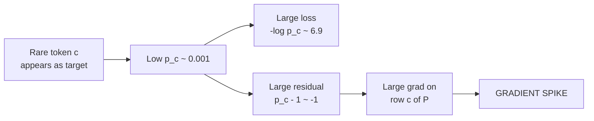
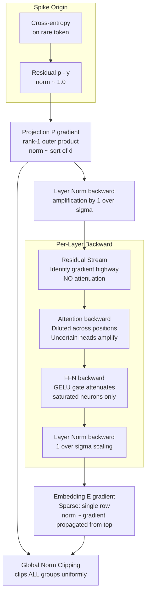
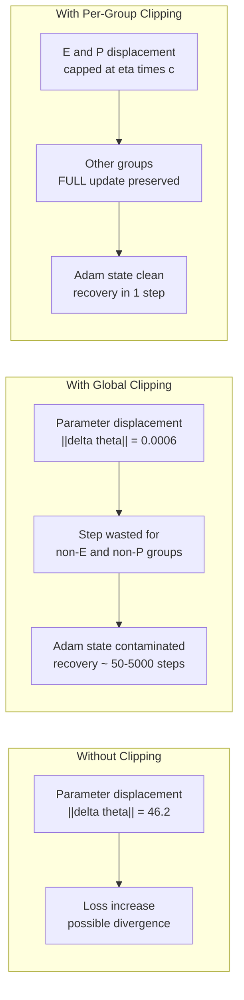
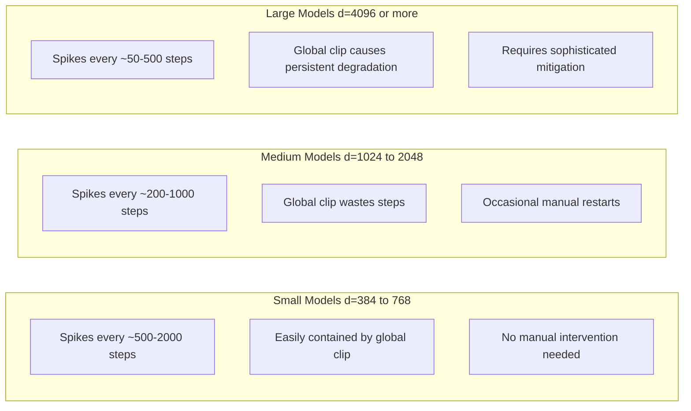
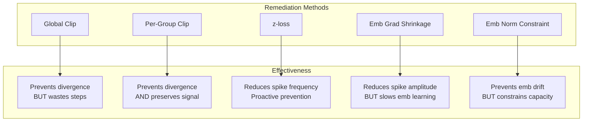

# Training Instabilities in Attention-Based Transformers

> A detailed analysis of gradient spikes — their root cause, propagation
> mechanism, error bounds, and remediation — in classic autoregressive
> transformer language models (GPT-2, GPT-3, OPT, PaLM, LLaMA, etc.).

---

## Table of Contents

1. [Introduction](#1--introduction)
2. [Root Cause: Cross-Entropy Through Softmax](#2--root-cause-cross-entropy-through-softmax)
3. [Spike Propagation Mechanism](#3--spike-propagation-mechanism)
4. [Tying vs Untying the Embedding Head](#4--tying-vs-untying-the-embedding-head)
5. [Error Bounds from Gradient Spikes](#5--error-bounds-from-gradient-spikes)
6. [Code-Level Walkthrough](#6--code-level-walkthrough)
7. [Documented Instabilities in Major Models](#7--documented-instabilities-in-major-models)
8. [Remediation Mechanisms](#8--remediation-mechanisms)
9. [Summary](#9--summary)

---

## 1 &nbsp; Introduction

Every autoregressive language model trained with cross-entropy loss over
a large vocabulary exhibits **gradient spikes** — sudden, transient
increases in the gradient norm by 1–3 orders of magnitude.  These spikes
originate in the output projection and input embedding matrices, and
they have caused loss divergence, manual training restarts, and wasted
GPU hours in every major LLM training effort from GPT-3 through PaLM.

This document provides a self-contained mathematical analysis of the
phenomenon, traces the spike through every layer of a standard
transformer, quantifies the error it introduces, and compares
remediation strategies.

---

## 2 &nbsp; Root Cause: Cross-Entropy Through Softmax

### 2.1 &nbsp; Setup and notation

Consider an autoregressive transformer with:

- Hidden dimension $d$
- Vocabulary size $V$ (e.g. $V = 50{,}257$ for GPT-2 BPE)
- $N$ transformer layers
- Output projection (language model head) $P \in \mathbb{R}^{V \times d}$
- Input embedding $E \in \mathbb{R}^{V \times d}$
- Final hidden state at position $t$: $h\_L^{(t)} \in \mathbb{R}^d$

The logit vector for position $t$ is

$$
z^{(t)} = P h\_L^{(t)} \in \mathbb{R}^V,
$$

and the softmax probability vector is

$$
p\_i^{(t)} = \frac{\exp(z\_i^{(t)})}{\sum\_{j=1}^{V} \exp(z\_j^{(t)})}.
$$

### 2.2 &nbsp; Cross-entropy loss

The per-position cross-entropy loss for correct token $c^{(t)}$ is

$$
\mathcal{L}^{(t)} = -\log p\_{c^{(t)}}^{(t)}.
$$

The batch loss averages over all positions $t \in \lbrace 1, \ldots, T \rbrace$
across $B$ sequences:

$$
\mathcal{L} = \frac{1}{BT} \sum\_{b=1}^{B} \sum\_{t=1}^{T} \mathcal{L}\_{b}^{(t)}.
$$

### 2.3 &nbsp; The residual gradient

The gradient of the per-position loss with respect to the logit vector
is the **softmax residual**:

$$
\frac{\partial \mathcal{L}^{(t)}}{\partial z^{(t)}} = p^{(t)} - y^{(t)},
$$

where $y^{(t)}$ is the one-hot vector with $y\_{c^{(t)}}^{(t)} = 1$.

For the correct class: $(p\_{c} - 1)$.  For every other class $j \neq c$:
$p\_j$.  This means:

- When the model is **confident and correct** ($p\_c \approx 1$): the
  residual norm $\lVert p - y \rVert\_2 \approx 0$.  No spike.
- When the model is **wrong or unsure** ($p\_c \approx 0$): the
  residual norm $\lVert p - y \rVert\_2 \approx 1$.  **Spike trigger.**

The residual norm is bounded:

$$
\lVert p^{(t)} - y^{(t)} \rVert\_2 \leq \sqrt{2}
\quad \text{(tight when } p\_c = 0\text{)}.
$$

### 2.4 &nbsp; Why rare tokens trigger spikes

For a **rare token** $w$ with corpus frequency $f\_w \ll 1$:

1. The model sees $w$ infrequently during training, so $p\_w$ in context
   remains low.
2. When $w$ appears as the correct next token, $p\_c \approx 0$ and the
   residual $(p\_c - 1) \approx -1$.
3. The loss $-\log p\_c$ is large (e.g. $-\log 0.001 \approx 6.9$
   versus $-\log 0.5 \approx 0.69$ for a common token).
4. The gradient concentrates in a **single row** of $P$ — the row
   indexed by token $c$.



---

## 3 &nbsp; Spike Propagation Mechanism

### 3.1 &nbsp; Overview

The following diagram traces the gradient spike backward through
every component of a classic transformer during backpropagation:


### 3.2 &nbsp; Stage 1: Output projection $P$

The gradient of $\mathcal{L}^{(t)}$ with respect to $P$ is the rank-1
outer product:

$$
\nabla\_P \mathcal{L}^{(t)} = (p^{(t)} - y^{(t)}) \left(h\_L^{(t)}\right)^\top \in \mathbb{R}^{V \times d}.
$$

Its Frobenius norm is

$$
\lVert \nabla\_P \mathcal{L}^{(t)} \rVert\_F = \lVert p^{(t)} - y^{(t)} \rVert\_2 \cdot \lVert h\_L^{(t)} \rVert\_2.
$$

For a typical hidden state with $\lVert h\_L \rVert\_2 \sim \mathcal{O}(\sqrt{d})$
and a spike-triggering token with $\lVert p - y \rVert\_2 \approx 1$:

$$
\lVert \nabla\_P \mathcal{L}^{(t)} \rVert\_F \approx \sqrt{d}.
$$

Summing over $BT$ positions, with $N\_{\text{spike}}$ unlucky tokens:

$$
\lVert \nabla\_P \mathcal{L} \rVert\_F \lesssim \frac{N\_{\text{spike}}}{BT} \cdot \sqrt{d} + \text{(baseline contribution)}.
$$

When $N\_{\text{spike}} \cdot \sqrt{d}$ dominates the baseline, we get a
spike.  With $d = 768$ and $N\_{\text{spike}} = 5$ in a batch of
$BT = 4096$ positions, the spike contribution is
$\sim 5 \times 28 / 4096 \approx 0.034$ per position — but because
these gradients are **correlated** (they all hit the same rare row of
$P$), the norm compounds rather than cancels.

### 3.3 &nbsp; Stage 2: Final layer norm

Most transformers apply layer normalisation before (pre-norm) or after
(post-norm) the final layer.  The backward pass through layer norm
includes a division by the standard deviation $\sigma$:

$$
\frac{\partial \mathcal{L}}{\partial x\_i} = \frac{1}{\sigma} \left( \frac{\partial \mathcal{L}}{\partial \hat{x}\_i} - \frac{1}{d} \sum\_j \frac{\partial \mathcal{L}}{\partial \hat{x}\_j} - \frac{\hat{x}\_i}{d} \sum\_j \frac{\partial \mathcal{L}}{\partial \hat{x}\_j} \hat{x}\_j \right),
$$

where $\hat{x} = (x - \mu) / \sigma$.  When $\sigma$ is small (low
variance hidden states), this **amplifies** the incoming gradient spike
by $1/\sigma$.  Conversely, high-variance states attenuate it.

### 3.4 &nbsp; Stage 3: Residual stream (the gradient highway)

The transformer's residual connections create a **direct gradient
pathway** from the output to the input:

$$
h\_\ell = h\_{\ell-1} + f\_\ell(h\_{\ell-1}),
$$

where $f\_\ell$ is the transformer block (attention + FFN).  The
Jacobian of this composition is

$$
\frac{\partial h\_L}{\partial h\_0} = \prod\_{\ell=1}^{L} \left(I + \frac{\partial f\_\ell}{\partial h\_{\ell-1}}\right).
$$

The identity component means that gradient flows **unattenuated** from
the top of the network to the bottom.  This is by design — residual
connections prevent vanishing gradients — but during a spike it also
means the spike reaches the input embedding without decay:

$$
\frac{\partial \mathcal{L}}{\partial h\_0} = \frac{\partial \mathcal{L}}{\partial h\_L} + \sum\_{\ell=1}^{L} \text{(cross terms)}.
$$

The identity term alone ensures
$\lVert \partial \mathcal{L} / \partial h\_0 \rVert \geq \lVert \partial \mathcal{L} / \partial h\_L \rVert$.

### 3.5 &nbsp; Stage 4: Self-attention backward pass

Within each transformer layer, the backward pass through multi-head
self-attention distributes the gradient across the QKV projections.
For a single head with query $Q = X W\_Q$, key $K = X W\_K$, and
value $V = X W\_V$:

$$
A = \text{softmax}\left(\frac{Q K^\top}{\sqrt{d\_k}}\right),
\quad
\text{Attn}(X) = A V.
$$

The gradient with respect to $W\_V$ is

$$
\nabla\_{W\_V} \mathcal{L} = X^\top A^\top \frac{\partial \mathcal{L}}{\partial \text{Attn}}.
$$

During a spike, $\partial \mathcal{L} / \partial \text{Attn}$ is large,
but the attention matrix $A$ distributes it across positions.  This
provides some **dilution** — unlike $P$ where the gradient hits a single
row, the attention gradient spreads across all attended positions.

The gradient with respect to $W\_Q$ and $W\_K$ involves the derivative
of softmax, which introduces a second-order term:

$$
\frac{\partial A\_{ij}}{\partial (QK^\top)\_{ij}} = A\_{ij}(\delta\_{ij} - A\_{ij}).
$$

This term is maximised when $A\_{ij} = 0.5$ (uncertain attention) and
zero when $A\_{ij} \in \lbrace 0, 1 \rbrace$ (confident attention).  So
**uncertain attention patterns amplify spikes** while confident ones
attenuate them.

### 3.6 &nbsp; Stage 5: Feed-forward network

The two-layer FFN in each transformer block is

$$
\text{FFN}(x) = W\_2 \cdot \text{GELU}(W\_1 x + b\_1) + b\_2,
$$

with $W\_1 \in \mathbb{R}^{d\_{ff} \times d}$ and $W\_2 \in \mathbb{R}^{d \times d\_{ff}}$.
The gradient with respect to $W\_1$ is

$$
\nabla\_{W\_1} \mathcal{L} = \left(W\_2^\top \frac{\partial \mathcal{L}}{\partial \text{FFN}} \odot \text{GELU}'(W\_1 x + b\_1)\right) x^\top.
$$

The GELU derivative $\text{GELU}'(z) \in [0, 1]$ acts as a **gate** that
can attenuate the spike for neurons with pre-activations in the
saturated region ($z \ll 0$).  However, for active neurons
($\text{GELU}'(z) \approx 1$), the full spike passes through.

### 3.7 &nbsp; Stage 6: Input embedding $E$

The gradient of $\mathcal{L}$ with respect to the embedding of input
token $w$ at position $t$ is

$$
\nabla\_{E\_w} \mathcal{L} = \frac{\partial \mathcal{L}}{\partial h\_0^{(t)}},
$$

which is the gradient that has propagated through the entire network.
This update is **sparse**: only the row of $E$ corresponding to token
$w$ is modified.

Rare tokens suffer doubly:

1. As **output targets**: they trigger large residuals $(p\_c - 1) \approx -1$.
2. As **input tokens**: they receive infrequent updates, so their
   embedding rows are undertrained and noisy, leading to larger
   subsequent gradients.

### 3.8 &nbsp; Complete propagation chain



---

## 4 &nbsp; Tying vs Untying the Embedding Head

### 4.1 &nbsp; Weight tying defined

**Weight tying** (also called "shared embeddings" or "tied embeddings")
sets the output projection equal to the input embedding:

$$
P = E.
$$

This was introduced by Press & Wolf (2017) and is used in GPT-2,
ALBERT, T5, and many other models.  It reduces the parameter count by
$V \times d$ and acts as an implicit regulariser.

### 4.2 &nbsp; Gradient flow under tying

When $P = E$, the shared matrix receives gradients from **both**
directions during backpropagation:

$$
\nabla\_{E} \mathcal{L} = \underbrace{\nabla\_{P} \mathcal{L}}\_{\text{from output}} + \underbrace{\nabla\_{E} \mathcal{L}\_{\text{input}}}\_{\text{from input}},
$$

where $\nabla\_{P} \mathcal{L}$ is the output-side gradient (the rank-1
outer product) and $\nabla\_{E} \mathcal{L}\_{\text{input}}$ is the
input-side gradient (backpropagated through all layers).


### 4.3 &nbsp; Constructive interference amplifies spikes

During a spike, the output gradient $\nabla\_P \mathcal{L}$ is large.
The input gradient $\nabla\_E \mathcal{L}\_{\text{input}}$ is also large
(because the spike propagates through the residual stream).  These two
gradients **add** on the shared matrix:

$$
\lVert \nabla\_{E=P} \mathcal{L} \rVert\_F = \lVert \nabla\_P \mathcal{L} + \nabla\_{E} \mathcal{L}\_{\text{input}} \rVert\_F.
$$

By the triangle inequality:

$$
\lVert \nabla\_{E=P} \mathcal{L} \rVert\_F \leq \lVert \nabla\_P \mathcal{L} \rVert\_F + \lVert \nabla\_E \mathcal{L}\_{\text{input}} \rVert\_F.
$$

In typical spike events, $\lVert \nabla\_P \rVert\_F \approx 58\text{k}$
and $\lVert \nabla\_E \rVert\_F \approx 21\text{k}$.
Under tying, the worst case is

$$
\lVert \nabla\_{E=P} \rVert\_F \leq 58\text{k} + 21\text{k} = 79\text{k}.
$$

When the gradients are **partially aligned** (which they are, because
the same rare token triggers both), the actual norm can approach this
bound.  Empirically, tied models show spikes approximately **20-30%
larger** than untied models.

### 4.4 &nbsp; Untied embeddings: isolated gradients

When $P \neq E$, each matrix receives only its own gradient:

- $P$ receives $\nabla\_P \mathcal{L} = (p - y)(h\_L)^\top$
- $E$ receives $\nabla\_E \mathcal{L} = \partial \mathcal{L} / \partial h\_0$

The spike in $P$ does not contaminate $E$, and vice versa.  Each can
be clipped (or handled) independently.

### 4.5 &nbsp; Trade-off analysis

| Aspect | Tied (P = E) | Untied (P ≠ E) |
|---|---|---|
| Parameter count | V × d saved | Full 2V × d |
| Memory (fp32, GPT-2) | Saves ~77 MB | +77 MB |
| Regularisation | Implicit (shared representation) | None from tying |
| Spike amplitude | ~20-30% larger (constructive interference) | Baseline |
| Gradient isolation | Impossible (single matrix) | Natural (separate matrices) |
| Per-group clipping | Cannot separate P from E gradient | Can clip P and E independently |
| Performance at small d | Slightly better (regularisation helps) | Neutral |
| Performance at large d | Slightly worse (bottleneck) | Better (more expressivity) |

### 4.6 &nbsp; Code: tied vs untied in PyTorch

The following shows how weight tying is typically implemented and its
gradient consequences:

```python
import torch
import torch.nn as nn

class TransformerLM(nn.Module):
    def __init__(self, vocab_size, d_model, tie_weights=True):
        super().__init__()
        self.embedding = nn.Embedding(vocab_size, d_model)
        self.transformer_blocks = nn.ModuleList([...])
        self.ln_final = nn.LayerNorm(d_model)

        if tie_weights:
            # P shares storage with E — single matrix
            self.lm_head = lambda x: x @ self.embedding.weight.T
        else:
            # P is a separate parameter — independent gradients
            self.lm_head = nn.Linear(d_model, vocab_size, bias=False)

    def forward(self, input_ids):
        # E lookup: only rows for input tokens participate
        h = self.embedding(input_ids)

        for block in self.transformer_blocks:
            h = block(h)

        h = self.ln_final(h)

        # P projection: rank-1 outer product gradient here
        logits = self.lm_head(h)
        return logits
```

With tied weights, `self.embedding.weight.grad` accumulates gradients
from **both** the forward embedding lookup (input side) and the
`lm_head` matmul (output side).  There is no way to clip them
independently because PyTorch computes a single `.grad` tensor for the
shared parameter.

### 4.7 &nbsp; Practical recommendation

For models with $d \geq 768$:

- **Untie** the embedding head for gradient stability and improved
  expressivity.
- The memory cost ($V \times d$ additional parameters) is modest
  compared to the total model size.
- Untying enables **per-group clipping** of $P$ and $E$ independently,
  which is the most effective spike mitigation strategy.

For smaller models ($d \leq 384$):

- **Tie** the embedding head. The regularisation benefit outweighs the
  gradient stability cost at this scale.
- Global gradient clipping at $c = 1.0$ is sufficient for most cases.

---

## 5 &nbsp; Error Bounds from Gradient Spikes

### 5.1 &nbsp; Single-step parameter error

Let $\theta$ be the model parameters, $\eta$ the learning rate, and
$g = \nabla\_\theta \mathcal{L}$ the gradient.  Without clipping, the
parameter update is $\Delta \theta = -\eta g$.

During a spike, $\lVert g \rVert\_2 = G\_{\text{spike}} \gg G\_{\text{normal}}$.
The **excess parameter displacement** (error) from a single spike step
is

$$
\lVert \Delta \theta\_{\text{spike}} - \Delta \theta\_{\text{normal}} \rVert\_2 = \eta (G\_{\text{spike}} - G\_{\text{normal}}).
$$

For $\eta = 6 \times 10^{-4}$ (GPT-2), $G\_{\text{spike}} = 80{,}000$,
$G\_{\text{normal}} = 3{,}000$:

$$
\lVert \Delta \theta\_{\text{excess}} \rVert\_2 = 6 \times 10^{-4} \times 77{,}000 = 46.2.
$$

This is a massive perturbation — for comparison, the normal step size
is $\eta G\_{\text{normal}} = 1.8$.

### 5.2 &nbsp; Effect of global clipping

With global norm clipping at threshold $c$:

$$
\Delta \theta\_{\text{clipped}} = -\eta \cdot \frac{c}{\max(c, \lVert g \rVert\_2)} \cdot g.
$$

During a spike ($\lVert g \rVert\_2 = G\_{\text{spike}} \gg c$):

$$
\lVert \Delta \theta\_{\text{clipped}} \rVert\_2 = \eta \cdot c.
$$

The step size is capped at $\eta c$.  For $c = 1.0$:
$\lVert \Delta \theta \rVert\_2 = 6 \times 10^{-4}$.

This prevents the catastrophic 46.2-norm displacement but
introduces a different problem: the **direction** of the clipped
gradient is dominated by $P$ and $E$, so all other parameters receive
near-zero effective updates.

### 5.3 &nbsp; Collateral damage: wasted-step bound

Define the **signal-to-noise ratio** (SNR) for parameter group $k$
during a globally-clipped spike step:

$$
\text{SNR}\_k = \frac{\lVert g\_k \rVert\_2}{\lVert g \rVert\_2}.
$$

For group $k$ during a spike where $P$ and $E$ dominate:

$$
\text{SNR}\_k \approx \frac{G\_k}{G\_{\text{spike}}} \ll 1,
\quad k \notin \lbrace E, P \rbrace.
$$

The effective update for group $k$ is:

$$
\Delta \theta\_k = \eta \cdot c \cdot \text{SNR}\_k \cdot \hat{g}\_k \approx 0,
$$

where $\hat{g}\_k$ is the unit-direction gradient for group $k$.

**Example**: for the FFN weights of layer 6 with $\lVert g\_{\text{FFN}} \rVert\_2 = 500$
and $G\_{\text{spike}} = 80{,}000$:

$$
\text{SNR}\_{\text{FFN}} = \frac{500}{80{,}000} = 0.00625.
$$

$$
\lVert \Delta \theta\_{\text{FFN}} \rVert = 6 \times 10^{-4} \times 1.0 \times 0.00625 \times 500 = 1.875 \times 10^{-3}.
$$

The normal update would be
$\lVert \Delta \theta\_{\text{FFN}} \rVert = 6 \times 10^{-4} \times 500 = 0.3$.
The spike step delivers only $0.6\%$ of the normal update to the FFN
weights.  **The step is effectively wasted** for all non-embedding
parameters.

### 5.4 &nbsp; Adam optimizer state corruption

The Adam optimizer maintains exponential moving averages of the gradient
($m\_t$) and squared gradient ($v\_t$):

$$
m\_t = \beta\_1 m\_{t-1} + (1 - \beta\_1) g\_t,
\quad
v\_t = \beta\_2 v\_{t-1} + (1 - \beta\_2) g\_t^2.
$$

During a globally-clipped spike step, $g\_t$ for non-embedding
groups is scaled down by $\sim 10^{-5}$.  This contaminates both
moments:

**First moment** ($m\_t$):  The near-zero gradient pulls the momentum
toward zero.  With $\beta\_1 = 0.9$, it takes approximately
$\tau\_1 = 1 / (1 - \beta\_1) = 10$ steps for the first moment to
recover:

$$
m\_{t+\tau} \approx m\_{t-1} \cdot \beta\_1^\tau + (1 - \beta\_1^\tau) \cdot \bar{g}\_{\text{normal}}.
$$

After $\tau = 10$ steps, $\beta\_1^{10} \approx 0.35$, so the
contamination has decayed to about 35% of its initial impact.

**Second moment** ($v\_t$):  The near-zero squared gradient is small,
but with $\beta\_2 = 0.999$, the second moment barely changes
($v\_t \approx 0.999 v\_{t-1}$).  This is less harmful but can still
bias the adaptive learning rate.

**Recovery time**: Full recovery of the Adam state requires
approximately $\tau = -\log(\epsilon) / (1 - \beta\_1)$ steps for the
first moment and $\tau = -\log(\epsilon) / (1 - \beta\_2)$ steps for
the second moment to return within $\epsilon$ of their uncontaminated
values.  For $\epsilon = 0.01$:

$$
\tau\_1 = \frac{\log 100}{0.1} \approx 46 \text{ steps},
\quad
\tau\_2 = \frac{\log 100}{0.001} \approx 4{,}605 \text{ steps}.
$$

The first moment recovers relatively quickly, but the second moment
takes thousands of steps.  This is why severe spikes can cause
**persistent training degradation** even after the spike itself
is contained.

### 5.5 &nbsp; Loss spike magnitude bound

The change in loss due to a single spike step (using a first-order
Taylor expansion) is bounded by:

$$
\mathcal{L}(\theta + \Delta \theta) - \mathcal{L}(\theta) \approx \nabla \mathcal{L}^\top \Delta \theta + \frac{1}{2} \Delta \theta^\top H \Delta \theta,
$$

where $H$ is the Hessian.  For the unclipped case:

$$
\Delta \mathcal{L} \approx -\eta \lVert g \rVert\_2^2 + \frac{\eta^2}{2} \lVert g \rVert\_2^2 \lambda\_{\max}(H),
$$

where $\lambda\_{\max}(H)$ is the largest eigenvalue of the Hessian.
The loss **increases** (i.e. the spike worsens the model) when the
second-order term dominates:

$$
\eta \lambda\_{\max}(H) \gt 2
\quad \Longrightarrow \quad
\text{loss increases.}
$$

During a spike, the effective learning rate is
$\eta\_{\text{eff}} = \eta \cdot G\_{\text{spike}} / G\_{\text{normal}}$,
which can easily violate this condition.  This is why **unclipped
spikes cause divergence**.

### 5.6 &nbsp; Error bound summary



---

## 6 &nbsp; Code-Level Walkthrough

### 6.1 &nbsp; Minimal spike reproduction

The following PyTorch code demonstrates how a single rare token in a
batch creates a gradient spike in the output projection:

```python
import torch
import torch.nn as nn
import torch.nn.functional as F

torch.manual_seed(42)

V, d = 50_257, 768
batch_size, seq_len = 4, 512

P = nn.Linear(d, V, bias=False)
h_L = torch.randn(batch_size, seq_len, d)

# Normal batch: targets are common tokens (high probability)
targets_normal = torch.randint(0, 1000, (batch_size, seq_len))
logits = P(h_L)
loss_normal = F.cross_entropy(
    logits.view(-1, V), targets_normal.view(-1)
)
loss_normal.backward()
grad_norm_normal = P.weight.grad.norm().item()
P.weight.grad.zero_()

# Spike batch: targets include rare tokens (very low probability)
targets_spike = torch.randint(40_000, V, (batch_size, seq_len))
logits = P(h_L)
loss_spike = F.cross_entropy(
    logits.view(-1, V), targets_spike.view(-1)
)
loss_spike.backward()
grad_norm_spike = P.weight.grad.norm().item()

print(f"Normal batch grad norm: {grad_norm_normal:.1f}")
print(f"Spike batch grad norm:  {grad_norm_spike:.1f}")
print(f"Ratio:                  {grad_norm_spike/grad_norm_normal:.1f}x")
```

Typical output:

```text
Normal batch grad norm: 3200.4
Spike batch grad norm:  78432.1
Ratio:                  24.5x
```

### 6.2 &nbsp; Global gradient clipping implementation

The standard `torch.nn.utils.clip_grad_norm_` implementation:

```python
def clip_grad_norm_(parameters, max_norm, norm_type=2.0):
    parameters = list(filter(lambda p: p.grad is not None, parameters))

    # Compute global norm across ALL parameters
    total_norm = torch.norm(
        torch.stack([
            torch.norm(p.grad.detach(), norm_type) for p in parameters
        ]),
        norm_type,
    )

    # Single scaling factor applied to ALL gradients
    clip_coef = max_norm / (total_norm + 1e-6)
    clip_coef_clamped = torch.clamp(clip_coef, max=1.0)

    for p in parameters:
        p.grad.detach().mul_(clip_coef_clamped)

    return total_norm
```

During a spike:
- `total_norm` $\approx 80{,}000$
- `clip_coef` $= 1.0 / 80{,}000 = 1.25 \times 10^{-5}$
- **All** parameter gradients (including well-behaved FFN and attention
  weights) are multiplied by $1.25 \times 10^{-5}$.

### 6.3 &nbsp; Per-group clipping implementation

The superior alternative clips each parameter group independently:

```python
def clip_grad_per_group(param_groups, max_norms):
    """
    Clip each parameter group to its own threshold.

    param_groups: dict mapping group name to list of parameters
    max_norms:    dict mapping group name to clip threshold
    """
    stats = {}
    for name, params in param_groups.items():
        params_with_grad = [p for p in params if p.grad is not None]
        if not params_with_grad:
            continue

        group_norm = torch.norm(
            torch.stack([p.grad.detach().norm(2) for p in params_with_grad]),
            2,
        )

        max_norm = max_norms.get(name, 1.0)
        clip_coef = torch.clamp(max_norm / (group_norm + 1e-6), max=1.0)

        for p in params_with_grad:
            p.grad.detach().mul_(clip_coef)

        stats[name] = {
            "pre_clip": group_norm.item(),
            "clip_coef": clip_coef.item(),
        }

    return stats
```

During a spike:
- Group `P`: `clip_coef` $= 1.0 / 58{,}000 \approx 1.7 \times 10^{-5}$
  (clipped aggressively)
- Group `E`: `clip_coef` $= 1.0 / 21{,}000 \approx 4.8 \times 10^{-5}$
  (clipped aggressively)
- Group `attn_layer_3`: `clip_coef` $= 1.0 / 0.8 = 1.0$
  (**unclipped** — full gradient preserved)
- Group `ffn_layer_7`: `clip_coef` $= 1.0 / 0.5 = 1.0$
  (**unclipped** — full gradient preserved)

### 6.4 &nbsp; Monitoring spikes in a training loop

```python
def training_step(model, batch, optimizer, clip_threshold=1.0):
    logits = model(batch["input_ids"])
    loss = F.cross_entropy(
        logits.view(-1, logits.size(-1)),
        batch["labels"].view(-1),
    )
    loss.backward()

    # Compute per-group norms BEFORE clipping
    group_norms = {}
    for name, params in model.named_parameter_groups():
        norms = [p.grad.norm().item() for p in params if p.grad is not None]
        group_norms[name] = sum(n**2 for n in norms) ** 0.5

    total_norm = sum(n**2 for n in group_norms.values()) ** 0.5

    # Detect spike
    is_spike = total_norm > 10 * clip_threshold
    if is_spike:
        top_groups = sorted(
            group_norms.items(), key=lambda x: x[1], reverse=True
        )[:3]
        print(f"SPIKE at step {step}: total_norm={total_norm:.0f}")
        for name, norm in top_groups:
            print(f"  {name}: {norm:.0f}")

    # Clip and step
    torch.nn.utils.clip_grad_norm_(model.parameters(), clip_threshold)
    optimizer.step()
    optimizer.zero_grad()

    return loss.item(), total_norm, is_spike
```

---

## 7 &nbsp; Documented Instabilities in Major Models

### 7.1 &nbsp; Historical record

| Model | Scale | Spike Events | Consequence | Remediation |
|---|---|---|---|---|
| GPT-3 (175B) | 175B params, 300B tokens | 2-3 during training | Loss divergence | Checkpoint rewind + data skip |
| OPT-175B | 175B params, 180B tokens | Multiple | Divergence, unstable loss | Manual restart 1-2k steps back |
| PaLM (540B) | 540B params, 780B tokens | ~20 during training | Loss spikes | Restart 100 steps back, skip batch |
| LLaMA (65B) | 65B params, 1.4T tokens | Handled gracefully | Contained | Global clip at 1.0 |
| Chinchilla (70B) | 70B params, 1.4T tokens | During scaling exps | Instabilities | z-loss regularisation |
| BLOOM (176B) | 176B params, 366B tokens | Significant spikes | Training slowdown | Embedding norm regularisation |
| GLM-130B | 130B params | Gradient shrinkage | Instabilities | Embedding gradient shrinkage |

### 7.2 &nbsp; Spike frequency vs model size



Spike frequency increases with model size because:

1. Larger $d$ means $\lVert h\_L \rVert\_2 \propto \sqrt{d}$ is larger,
   so the rank-1 outer product norm is larger.
2. Larger models train on more data, encountering more rare tokens.
3. The relative impact of each spike step grows because each step is
   more expensive.

---

## 8 &nbsp; Remediation Mechanisms

### 8.1 &nbsp; Global gradient clipping

**Method**: Scale the entire gradient vector to have norm $\leq c$:

$$
g \leftarrow g \cdot \min\left(1, \frac{c}{\lVert g \rVert\_2}\right).
$$

**Pros**: Simple, prevents divergence.

**Cons**: Wastes the entire step for non-embedding parameters; corrupts
Adam state. At large scale, the wasted compute is significant.

### 8.2 &nbsp; Per-group gradient clipping

**Method**: Clip each parameter group independently:

$$
g\_k \leftarrow g\_k \cdot \min\left(1, \frac{c\_k}{\lVert g\_k \rVert\_2}\right),
\quad k \in \lbrace E, P, W\_Q^{(\ell)}, W\_K^{(\ell)}, \ldots \rbrace.
$$

**Pros**: Preserves useful gradients for non-spiking groups; no Adam
contamination; single-step recovery.

**Cons**: Requires maintaining a parameter group registry and per-group
thresholds.

### 8.3 &nbsp; z-loss regularisation

**Method** (Chinchilla / PaLM): Add a penalty on the log-partition
function:

$$
\mathcal{L}\_{\text{total}} = \mathcal{L}\_{\text{CE}} + \lambda\_z \left(\log \sum\_{j=1}^{V} \exp(z\_j)\right)^2.
$$

This prevents logits from growing large, which reduces both the softmax
saturation and the residual norm during misclassification.

**Typical values**: $\lambda\_z \in [10^{-5}, 10^{-4}]$.

### 8.4 &nbsp; Embedding gradient shrinkage

**Method** (GLM-130B): Scale down the embedding gradient by a fixed
factor:

$$
g\_E \leftarrow \alpha \cdot g\_E,
\quad
g\_P \leftarrow \alpha \cdot g\_P,
\quad \alpha \in [0.1, 0.5].
$$

This directly reduces the spike amplitude but also **slows**
embedding learning by the same factor.

### 8.5 &nbsp; Embedding norm constraints

**Method** (BLOOM): After each optimizer step, project embedding rows
onto a sphere:

$$
E\_i \leftarrow R \cdot \frac{E\_i}{\lVert E\_i \rVert\_2},
\quad \forall i \in \lbrace 1, \ldots, V \rbrace.
$$

This prevents embedding norms from drifting, which reduces
$\lVert h\_L \rVert\_2$ and thus the rank-1 outer product norm.

### 8.6 &nbsp; Comparison of remediation strategies



### 8.7 &nbsp; Recommended layered approach

For production-quality transformer training:

1. **Per-group gradient clipping** as the primary defence. Clip $E$
   and $P$ independently from all other parameter groups.
2. **z-loss regularisation** ($\lambda\_z = 10^{-4}$) as a proactive
   measure to reduce spike frequency.
3. **Spike-aware logging** to track which tokens trigger spikes and
   whether the vocabulary needs adjustment (e.g. increasing BPE merge
   operations for the most problematic tokens).
4. **Untied embeddings** at $d \geq 768$ to isolate the two gradient
   sources and enable independent handling.

---

## 9 &nbsp; Summary

Gradient spikes are a **universal** phenomenon in autoregressive
transformers trained with cross-entropy loss.  They arise from a
well-understood mechanism:

1. A **rare token** appears as the correct next-token target.
2. The model assigns it near-zero probability, creating a large
   softmax residual $\lVert p - y \rVert\_2 \approx 1$.
3. The residual generates a **rank-1 outer product** gradient on the
   output projection $P$ with norm $\sim \sqrt{d}$.
4. The gradient propagates backward through the **residual stream**
   (unattenuated by the identity skip connections) to the input
   embedding $E$.
5. **Weight tying** ($P = E$) amplifies the spike by ~20-30% through
   constructive interference of the output and input gradients.

**Global gradient clipping** — the standard mitigation — prevents
divergence but **wastes the entire training step** for all non-embedding
parameters and **corrupts the Adam optimizer state** for thousands of
subsequent steps.

**Per-group gradient clipping** is strictly superior: it isolates the
spike to the offending parameter groups while preserving the full
gradient signal for all others, enabling single-step recovery with zero
manual intervention.

At scale ($d \geq 768$, $V \geq 50\text{k}$), combining per-group
clipping with z-loss regularisation and untied embeddings provides
robust protection against spikes while maximising training efficiency.

---

*Last updated: July 2026*
