# Encoder-Decoder with Scaled Dot-Product Attention — Architecture Guide

This document provides detailed UML class diagrams, sequence diagrams, and flowcharts for the toy encoder-decoder architecture implemented in the companion notebook (`encoder_decoder_with_attention_demo.ipynb`).

---

## Table of Contents

1. [High-Level Architecture Overview](#1--high-level-architecture-overview)
2. [Static Class Diagram](#2--static-class-diagram)
3. [Component Deep Dives](#3--component-deep-dives)
   - [Encoder](#31--encoder)
   - [Attention](#32--attention-module)
   - [Decoder](#33--decoder)
   - [Seq2SeqWithAttention](#34--seq2seqwithattention-orchestrator)
4. [Sequence Diagrams](#4--sequence-diagrams)
   - [Training Forward Pass](#41--training-forward-pass-single-batch)
   - [Greedy Decoding (Inference)](#42--greedy-decoding-inference)
5. [Flowcharts](#5--flowcharts)
   - [Scaled Dot-Product Attention](#51--scaled-dot-product-attention-computation)
   - [Single Decoder Step](#52--single-decoder-time-step)
   - [Training Loop](#53--training-loop)
   - [Dataset Generation](#54--dataset-generation)
6. [Tensor Shape Reference](#6--tensor-shape-reference)

---

## 1 — High-Level Architecture Overview

The system is a sequence-to-sequence model that reads a source sequence through an **Encoder** (GRU-based), computes **Attention** between the decoder state and all encoder hidden states using the scaled dot-product formula, and generates the output sequence one token at a time through a **Decoder** (also GRU-based).

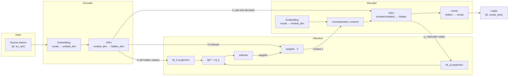

---

## 2 — Static Class Diagram

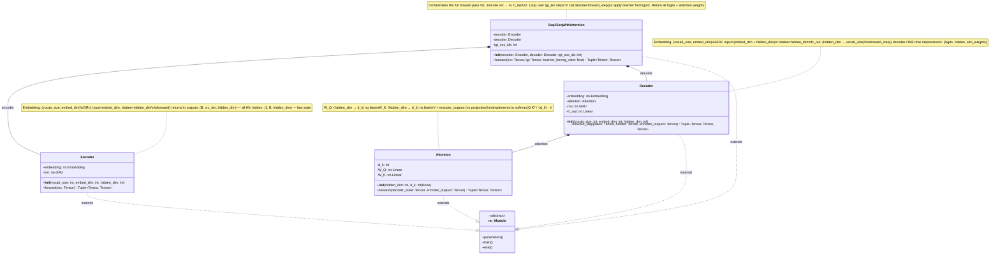

---

## 3 — Component Deep Dives

### 3.1 — Encoder

The Encoder converts a sequence of discrete token IDs into a sequence of continuous hidden-state vectors. It has two sub-layers:

| Sub-layer | Type | Input shape | Output shape | Role |
|-----------|------|-------------|--------------|------|
| `embedding` | `nn.Embedding(13, 32)` | `(B, src_len)` | `(B, src_len, 32)` | Maps each token ID to a learned 32-dim vector |
| `rnn` | `nn.GRU(32, 64)` | `(B, src_len, 32)` | outputs: `(B, src_len, 64)`, hidden: `(1, B, 64)` | Reads the embedded sequence left-to-right, producing a 64-dim hidden state at every position |

**Key outputs:**

- **`outputs` (H)** — the matrix of *all* hidden states across source positions. This becomes the **Key** and **Value** supply for the attention mechanism. Each column is a contextualized representation of one source token.
- **`hidden` (h_last)** — the final hidden state. Passed to the Decoder as its initial hidden state, giving it a compressed summary of the entire source.

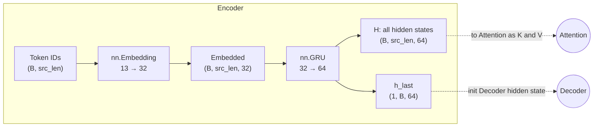

### 3.2 — Attention Module

The Attention module implements the scaled dot-product attention formula:

$$\text{Attention}(Q, K, V) = \text{softmax}\!\left(\frac{Q K^{\top}}{\sqrt{d_k}}\right) V$$

It sits **between** the Encoder and Decoder. At every decoder time step it receives the current decoder state and all encoder outputs, and produces a context vector — a weighted blend of encoder hidden states, where the weights indicate *which source positions the decoder should focus on*.

| Sub-layer | Type | Input → Output | Role |
|-----------|------|----------------|------|
| `W_Q` | `nn.Linear(64, 64, bias=False)` | `(B, 1, 64)` → `(B, 1, 64)` | Projects decoder state into **query** space |
| `W_K` | `nn.Linear(64, 64, bias=False)` | `(B, src_len, 64)` → `(B, src_len, 64)` | Projects encoder hidden states into **key** space |
| *(no W_V)* | — | — | Values are the raw encoder outputs (no projection) |

**Why separate projections?** The decoder hidden state and encoder hidden states are produced by different GRUs — they share the same dimensionality by design but may encode information in incompatible subspaces. The learned `W_Q` and `W_K` matrices rotate them into a shared space where dot products are meaningful.

**Design choice — no value projection:** The values `V` are the unmodified encoder outputs `H`. This keeps the context vector in the same space as the encoder hidden states, which is appropriate because it will be concatenated with the target embedding before being fed to the decoder GRU.

### 3.3 — Decoder

The Decoder generates the output sequence one token at a time. Its `forward_step` method processes a **single** time step:

| Step | Operation | Input | Output |
|------|-----------|-------|--------|
| 1 | `embedding(token)` | `(B, 1)` token ID | `(B, 1, 32)` embedded token |
| 2 | `attention(state, H)` | decoder hidden `(B, 1, 64)` + encoder H `(B, src_len, 64)` | context `(B, 1, 64)` + weights `(B, 1, src_len)` |
| 3 | `cat(embedded, context)` | `(B, 1, 32)` + `(B, 1, 64)` | `(B, 1, 96)` concatenated |
| 4 | `rnn(concat, hidden)` | `(B, 1, 96)` input + `(1, B, 64)` hidden | output `(B, 1, 64)` + new hidden `(1, B, 64)` |
| 5 | `fc_out(output)` | `(B, 64)` | `(B, 13)` logits over vocabulary |

**Why concatenate embedding and context before the GRU?** This gives the GRU simultaneous access to (a) what the previous predicted token was (the embedding) and (b) what part of the source the model should focus on now (the context). The GRU then integrates both signals with its recurrent memory to produce the next hidden state.

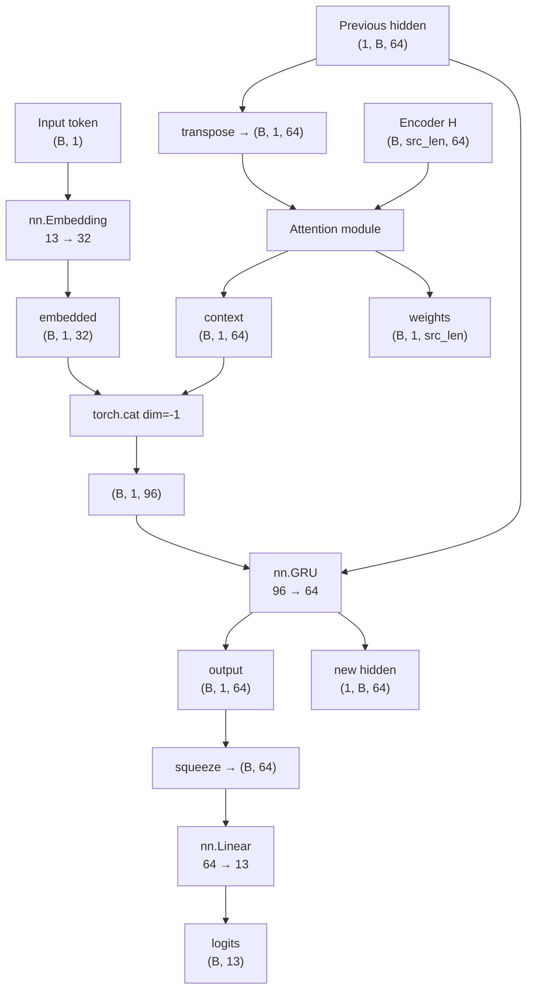

### 3.4 — Seq2SeqWithAttention Orchestrator

This top-level module wires everything together. It owns the Encoder and Decoder and manages the autoregressive decoding loop with optional teacher forcing.

**Teacher forcing** is a training technique where, with probability `teacher_forcing_ratio`, the ground-truth target token is fed as the next decoder input instead of the model's own prediction. This stabilizes early training (the model doesn't compound its own errors) but is annealed toward 0 for inference.

**What it does on `forward()`:**

1. Encode the full source sequence → `H` and `h_last`.
2. Initialize: first decoder token = `<SOS>`, decoder hidden = `h_last`.
3. For each target position `t`:
   - Call `decoder.forward_step(token, hidden, H)` → logits, new hidden, attention weights.
   - Store logits and weights.
   - Decide next input: ground-truth token (teacher forcing) or argmax of logits (free running).
4. Return the stacked logits `(B, tgt_len, vocab_size)` and attention weight matrix `(B, tgt_len, src_len)`.

---

## 4 — Sequence Diagrams

### 4.1 — Training Forward Pass (single batch)

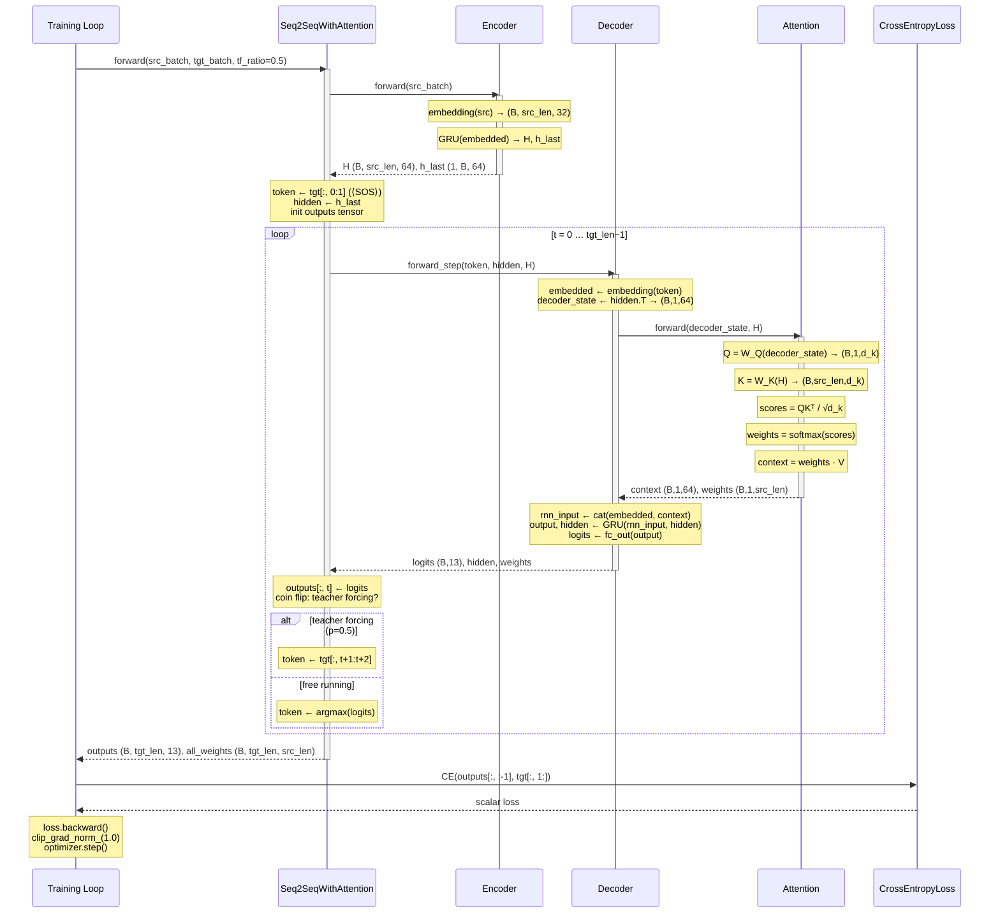

### 4.2 — Greedy Decoding (Inference)

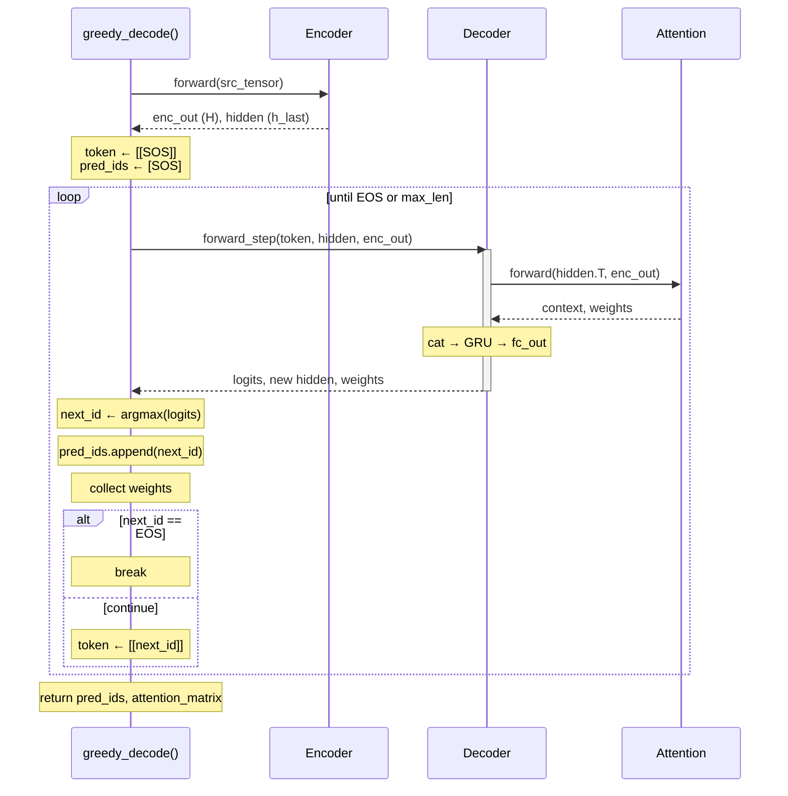

---

## 5 — Flowcharts

### 5.1 — Scaled Dot-Product Attention Computation

This flowchart traces every tensor operation inside `Attention.forward()`, with shapes annotated at each stage.

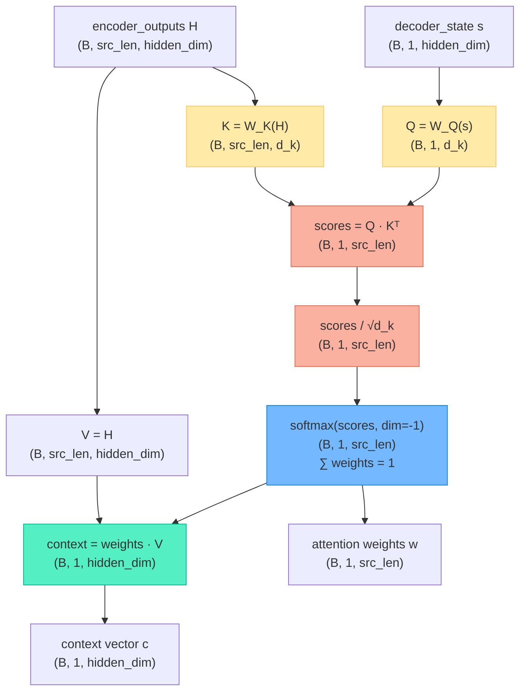

### 5.2 — Single Decoder Time Step

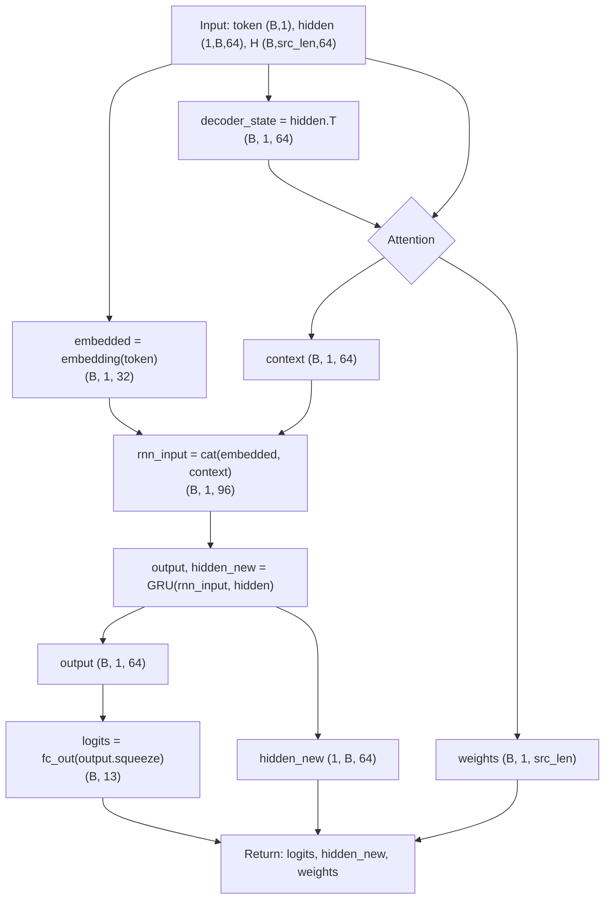

### 5.3 — Training Loop

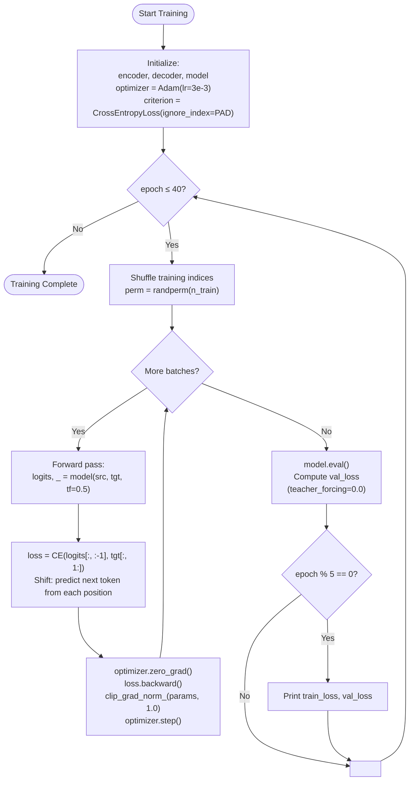

### 5.4 — Dataset Generation

The toy task is **digit-sequence reversal**: given a source sequence of random digits, the target is the same digits in reverse order.

```
Source: <s> 3 7 1 5 </s> _     Target: <s> 5 1 7 3 </s> _
```

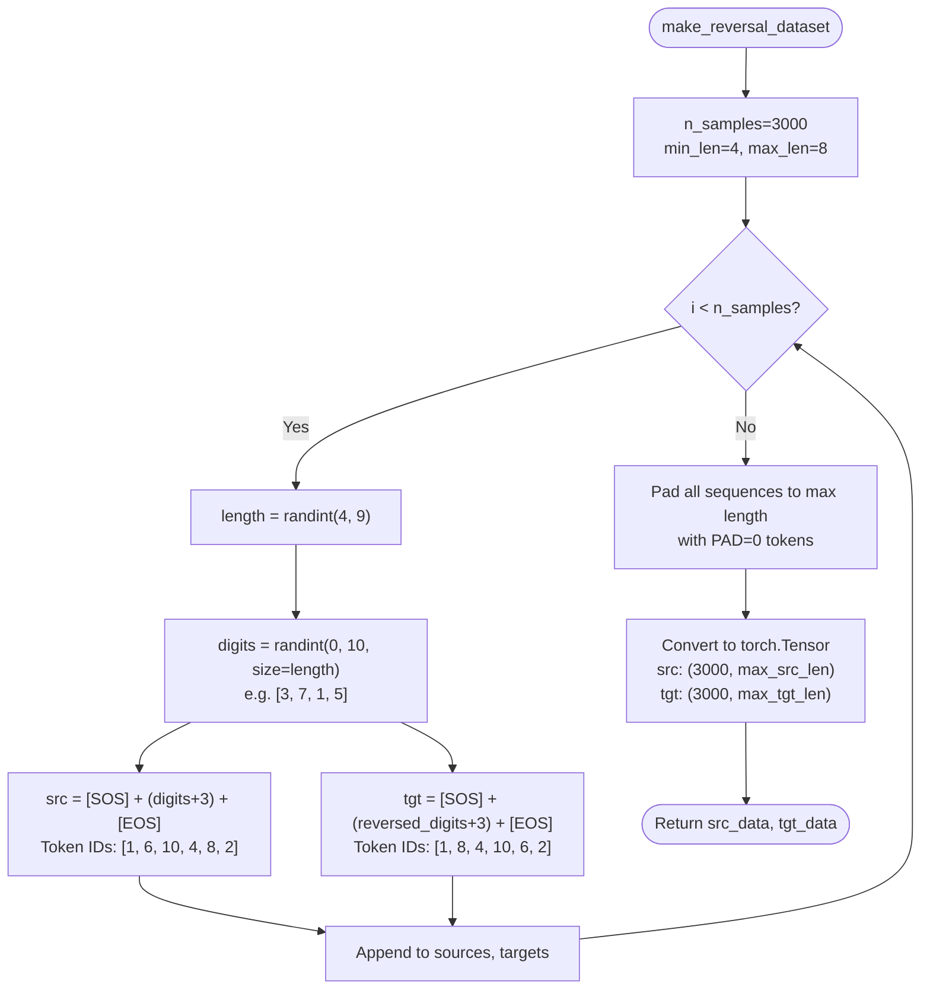

**Token vocabulary (13 tokens total):**

| Token ID | Meaning |
|----------|---------|
| 0 | `PAD` — padding |
| 1 | `SOS` — start of sequence |
| 2 | `EOS` — end of sequence |
| 3–12 | Digits 0–9 (offset by 3) |

---

## 6 — Tensor Shape Reference

End-to-end tensor flow for a single training step with the notebook's hyperparameters (`EMBED_DIM=32`, `HIDDEN_DIM=64`, `VOCAB_SIZE=13`).

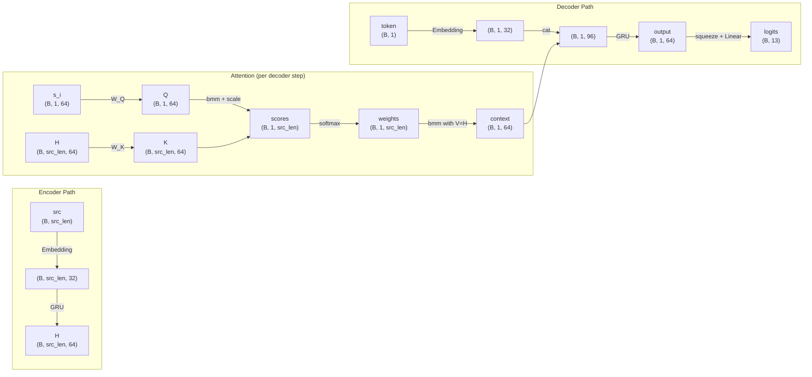

### Quick shape cheat-sheet

| Name | Shape | Notes |
|------|-------|-------|
| `src` | `(B, src_len)` | Integer token IDs, padded |
| `tgt` | `(B, tgt_len)` | Integer token IDs, padded |
| Encoder `embedded` | `(B, src_len, 32)` | After `nn.Embedding` |
| `H` (encoder outputs) | `(B, src_len, 64)` | All GRU hidden states |
| `h_last` | `(1, B, 64)` | Final encoder hidden state |
| `Q` (query) | `(B, 1, 64)` | `W_Q @ decoder_state` |
| `K` (keys) | `(B, src_len, 64)` | `W_K @ H` |
| `V` (values) | `(B, src_len, 64)` | `H` (no projection) |
| `scores` | `(B, 1, src_len)` | `Q · Kᵀ / √64` |
| `weights` | `(B, 1, src_len)` | `softmax(scores)` — sums to 1 |
| `context` | `(B, 1, 64)` | `weights · V` |
| Decoder `rnn_input` | `(B, 1, 96)` | `cat(embedded_token, context)` |
| Decoder `output` | `(B, 1, 64)` | GRU output |
| `logits` | `(B, 13)` | Unnormalized scores over vocabulary |
| `all_weights` | `(B, tgt_len, src_len)` | Full attention matrix for visualization |
