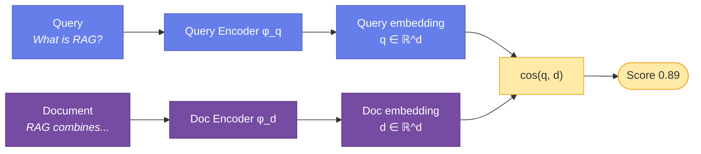
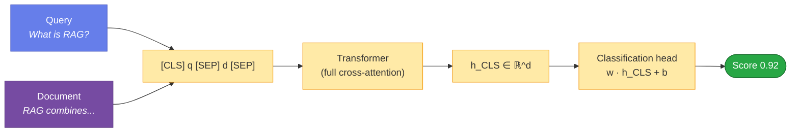
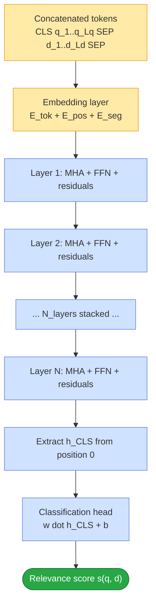
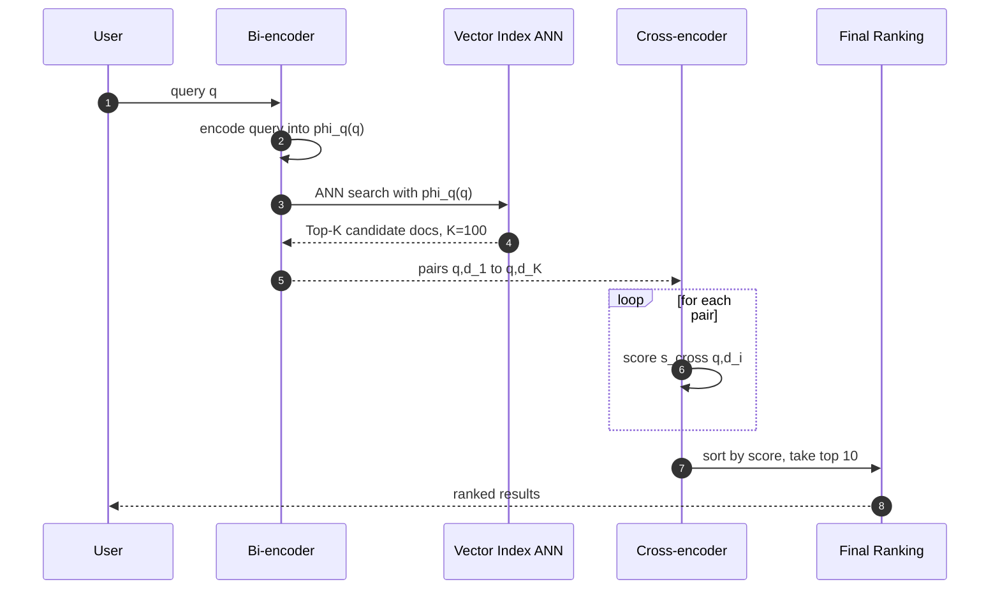
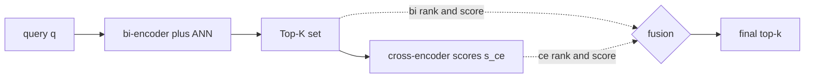
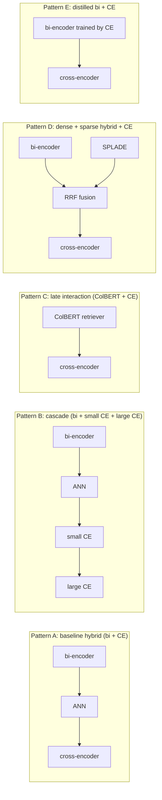
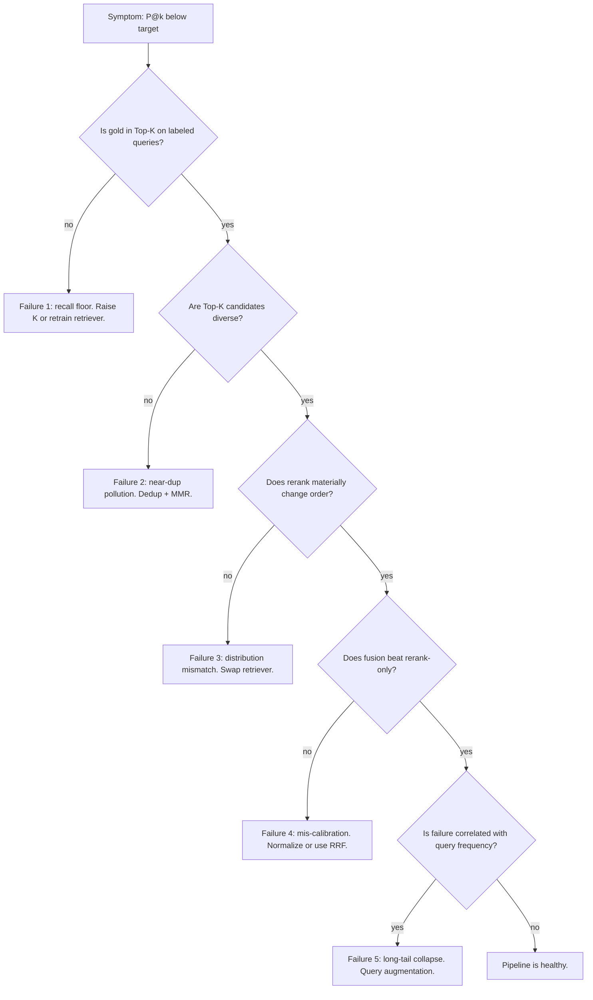
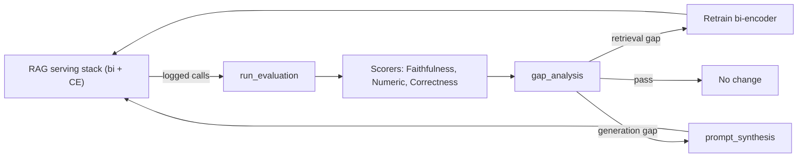
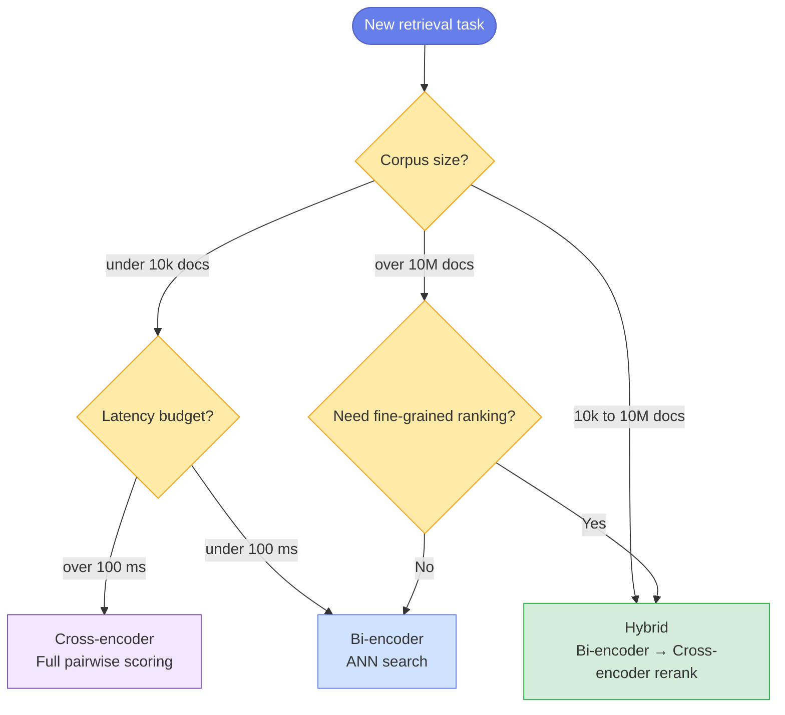

# Bi-Encoders vs Cross-Encoders

*Comprehensive architecture comparison & use cases*


> **TL;DR.** Bi-encoders embed query and document **independently** into a shared
> vector space and compare them with a cheap similarity function — fast,
> pre-computable, scales to billions. Cross-encoders embed query and document
> **jointly** through a single transformer with full cross-attention — more
> accurate, but every query–document pair must be re-encoded at inference time.
> Most production systems pair them in a *two-stage* pipeline: bi-encoder
> retrieves $K$ candidates, cross-encoder reranks them.

---

## Table of Contents

- [Notation used throughout](#notation-used-throughout)
- [1. Bi-Encoder Architecture](#1-bi-encoder-architecture)
  - [1.1 What it computes](#11-what-it-computes)
  - [1.2 Why it's fast](#12-why-its-fast)
  - [1.3 Schematic of the two-tower flow](#13-schematic-of-the-two-tower-flow)
  - [1.4 Training: contrastive objectives](#14-training-contrastive-objectives)
  - [1.5 Primary use cases](#15-primary-use-cases)
- [2. Cross-Encoder Architecture](#2-cross-encoder-architecture)
  - [2.1 What it computes](#21-what-it-computes)
  - [2.2 Why it's accurate](#22-why-its-accurate)
  - [2.3 Schematic of the joint-encoding flow](#23-schematic-of-the-joint-encoding-flow)
  - [2.4 Why it's slow](#24-why-its-slow)
  - [2.5 Training](#25-training)
  - [2.6 Primary use cases](#26-primary-use-cases)
  - [2.7 The Cross-Attention Mechanism: A Full Mathematical Treatment](#27-the-cross-attention-mechanism-a-full-mathematical-treatment)
- [3. Detailed Comparison](#3-detailed-comparison)
  - [3.1 Performance characteristics](#31-performance-characteristics)
  - [3.2 Asymptotic complexity, side by side](#32-asymptotic-complexity-side-by-side)
  - [3.3 Advantages and disadvantages](#33-advantages-and-disadvantages)
- [4. Hybrid Approach: Best of Both Worlds](#4-hybrid-approach-best-of-both-worlds)
  - [4.1 Why two stages?](#41-why-two-stages)
  - [4.2 End-to-end flow](#42-end-to-end-flow)
  - [4.3 Expected wall-clock numbers](#43-expected-wall-clock-numbers)
  - [4.4 When to use the hybrid](#44-when-to-use-the-hybrid)
  - [4.5 Code sketch](#45-code-sketch)
  - [4.6 Mathematical framing of the composition](#46-mathematical-framing-of-the-composition)
  - [4.7 The recall floor: an upper-bound theorem](#47-the-recall-floor-an-upper-bound-theorem)
  - [4.8 Tuning K: the elbow analysis](#48-tuning-k-the-elbow-analysis)
  - [4.9 Score fusion strategies](#49-score-fusion-strategies)
  - [4.10 Cascade reranking, ColBERT, SPLADE, and distillation](#410-cascade-reranking-colbert-splade-and-distillation)
  - [4.11 Failure modes and diagnostic playbook](#411-failure-modes-and-diagnostic-playbook)
  - [4.12 Extended reference implementation](#412-extended-reference-implementation)
  - [4.13 Integration into the RAG Eval Kit and Agentic KPI Kit](#413-integration-into-the-rag-eval-kit-and-agentic-kpi-kit)
- [5. Decision Framework](#5-decision-framework)
  - [5.1 Quick decision guide](#51-quick-decision-guide)
  - [5.2 Decision tree](#52-decision-tree)
  - [5.3 Industry applications](#53-industry-applications)
- [6. Theoretical perspective: why the gap is fundamental](#6-theoretical-perspective-why-the-gap-is-fundamental)
- [7. Conclusion](#7-conclusion)
- [References & Further Reading](#references--further-reading)

---

## Notation used throughout

Let $q$ denote a query, $d$ a document, and $\mathcal{D} = \{d_1, \ldots, d_N\}$
a corpus of $N$ documents. Let $L$ be the maximum sequence length per text and
$d_h$ the hidden dimension of the underlying transformer.

$\mathcal{X}$ denotes the **space of all tokenized text sequences**. For a
tokenizer with vocabulary $\mathcal{V}$ and maximum length $L$,
$\mathcal{X} = \bigcup_{l=1}^{L} \mathcal{V}^{l}$ (in practice, sequences are
padded or truncated to exactly $L$ tokens, so
$\mathcal{X} \cong \mathcal{V}^{L}$). The same domain applies to both queries
and documents — the distinction between "query text" and "document text" is a
runtime convention, not a type distinction.

We will refer to a scoring function
$s : \mathcal{X} \times \mathcal{X} \to \mathbb{R}$ whose value $s(q, d)$
should be large iff $d$ is relevant to $q$.

---

## 1. Bi-Encoder Architecture


### 1.1 What it computes

A bi-encoder is two encoder networks $\phi_q$ and $\phi_d$ (typically the
*same* transformer with shared weights) that map text to a fixed-dimensional
vector space:

$$
\phi_q : \mathcal{X} \to \mathbb{R}^{d_h}, \qquad \phi_d : \mathcal{X} \to \mathbb{R}^{d_h}.
$$

Relevance is the cosine similarity of those vectors:

$$
s_{\mathrm{bi}}(q, d) = \cos\left(\phi_q(q), \phi_d(d)\right) =
\frac{\phi_q(q)^\top \phi_d(d)}{\lVert \phi_q(q) \rVert \cdot \lVert \phi_d(d) \rVert}.
$$

Equivalently, after $\ell_2$-normalising both vectors, this collapses to a dot
product, which is what most vector indexes implement under the hood.

### 1.2 Why it's fast

The key property is **decomposability**: $\phi_d(d_i)$ does not depend on the
query, so all $N$ document embeddings can be computed *once* and stored in a
vector index. At query time, only $\phi_q(q)$ is computed, then the index is
queried in sub-linear time with approximate nearest-neighbour (ANN) algorithms:

$$
\text{Query cost} = \underbrace{O(L^2 d_h)}_{\text{encode } q} + \underbrace{O(\log N)}_{\text{ANN lookup}}.
$$

Compare this against the cross-encoder, which is $O(N \cdot L^2 d_h)$ — the
gap is enormous for production-scale corpora.

### 1.3 Schematic of the two-tower flow




### 1.4 Training: contrastive objectives

Bi-encoders are trained to *pull together* relevant pairs and *push apart*
irrelevant ones. Two losses dominate:

**InfoNCE / contrastive softmax** — treats each minibatch $\mathcal{B}$ of
queries and one positive document per query as an $|\mathcal{B}|$-way
classification problem:

$$
\mathcal{L}_{\mathrm{InfoNCE}}
= -\log\frac{\exp\left(s_{\mathrm{bi}}(q, d^+)/\tau\right)}
              {\sum_{d \in \mathcal{B}} \exp\left(s_{\mathrm{bi}}(q, d)/\tau\right)},
$$

where $\tau > 0$ is the temperature and other documents in the batch serve as
in-batch negatives.

**Triplet / margin loss** — with an explicit hard negative $d^-$:

$$
\mathcal{L}_{\mathrm{triplet}}
= \max\left(0,
   m + s_{\mathrm{bi}}(q, d^-) - s_{\mathrm{bi}}(q, d^+)\right),
$$

with margin $m > 0$. Bi-encoders are *negative-sample sensitive*: random
negatives saturate quickly, so mining of hard negatives (BM25 top-K minus the
gold doc, or a previous-generation retriever) is usually required.

### 1.5 Primary use cases

| Domain | Examples |
|---|---|
| **Semantic search** | Large-scale doc retrieval (millions+), real-time search engines, FAQ matching, similar-product discovery |
| **Clustering & classification** | Document clustering, topic modelling, near-duplicate detection, content recommendation |
| **First-stage retrieval** | Candidate generation for RAG, initial filtering in QA, broad retrieval from knowledge bases, multi-stage ranking pipelines |
| **Real-time applications** | Chatbot response retrieval, autocomplete suggestions, live content matching, streaming dedup |

> **Key insight.** The independence of encoding enables massive scalability —
> you only need to encode new queries at inference, while millions of document
> embeddings can be pre-computed and indexed offline.

---

## 2. Cross-Encoder Architecture


### 2.1 What it computes

A cross-encoder feeds the concatenated pair $[\mathrm{CLS}], q, [\mathrm{SEP}], d, [\mathrm{SEP}]$
through a *single* transformer, and reads off a scalar relevance score from
the $[\mathrm{CLS}]$ position:

$$
s_{\mathrm{cross}}(q, d) =
w^\top h_{[\mathrm{CLS}]}\left(\mathrm{Transformer}\left([\mathrm{CLS}], q, [\mathrm{SEP}], d, [\mathrm{SEP}]\right)\right) + b,
$$

where $h_{[\mathrm{CLS}]}(\cdot) \in \mathbb{R}^{d_h}$ is the contextualised
embedding of the $[\mathrm{CLS}]$ token and $w \in \mathbb{R}^{d_h}$, $b \in \mathbb{R}$
are the parameters of a tiny classification head.

### 2.2 Why it's accurate

Every transformer layer applies **scaled dot-product attention** across the
*combined* query+document token sequence:

$$
\mathrm{Attention}(Q, K, V) =
\mathrm{softmax}\left(\frac{Q K^\top}{\sqrt{d_k}}\right) V.
$$

When the input is the joint sequence $q \oplus d$, the attention map has
shape $(L_q + L_d) \times (L_q + L_d)$, and every token of $q$ can attend to
every token of $d$ (and vice versa). This gives the model access to
*token-level* interactions — "the word 'bank' in $q$ co-occurs with
'river' in $d$, so it's the geological sense" — which a bi-encoder, by
construction, cannot represent in its fixed-length pooled vector.

### 2.3 Schematic of the joint-encoding flow




### 2.4 Why it's slow

Because the score depends on *both* $q$ and $d$ being processed together,
$h_{[\mathrm{CLS}]}(q, d)$ cannot be cached. Ranking $N$ candidates therefore
costs

$$
\text{Cross-encoder query cost} =
N \cdot O\left((L_q + L_d)^2 \cdot d_h + (L_q + L_d) \cdot d_h^2\right).
$$

The quadratic-in-length attention term is the dominant cost; doubling
sequence length quadruples per-pair work. This is why cross-encoders typically
get applied to *at most* hundreds or low thousands of candidates per query.

### 2.5 Training

Cross-encoders are trained as either:

- **Pointwise binary classifiers** with sigmoid + BCE on labelled
  (query, document, relevant?) triples:
  $\mathcal{L}_{\mathrm{BCE}} = -\left[y \log \sigma(s) + (1-y) \log(1 - \sigma(s))\right]$.
- **Pairwise margin classifiers** that compare a positive and a negative
  pair for the same query:
  $\mathcal{L}_{\mathrm{pair}} = \max\left(0, m - s(q, d^+) + s(q, d^-)\right)$.

Negative sampling is much less critical than for bi-encoders because the joint
encoder can learn from softer signal — even subtle relevance gradations are
easy for the cross-attention layers to discriminate.

### 2.6 Primary use cases

| Domain | Examples |
|---|---|
| **Precision-critical ranking** | Legal document relevance, medical literature, academic paper matching, patent similarity |
| **Re-ranking** | Second-stage ranking in search, top-K result refinement, answer extraction in QA, passage ranking for RC |
| **Semantic similarity tasks** | Textual entailment, paraphrase detection, claim verification, NLI |
| **Zero-shot classification** | Intent classification without training, topic categorisation, sentiment analysis, content moderation |

> **Key insight.** Cross-encoders trade efficiency for representational
> richness. The full cross-attention pattern lets them model interactions
> that a bi-encoder's fixed-length pooled vector cannot — at the price of
> non-cacheability.


### 2.7 The Cross-Attention Mechanism: A Full Mathematical Treatment

Sections 2.1 and 2.2 introduced cross-attention informally. Here we give the full formal picture. The central observation — one worth stating up front — is that **cross-attention in a cross-encoder is not a distinct operator; it is the off-diagonal blocks of self-attention over a single concatenated query-document sequence**. This is fundamentally different from encoder-decoder architectures like T5 or BART, where cross-attention is a dedicated sub-layer connecting two separate token streams. The rest of this section makes that statement precise.

#### 2.7.1 Input construction and embeddings

Given a query $q$ tokenised as $(q_1, \ldots, q_{L_q})$ and a document $d$ tokenised as $(d_1, \ldots, d_{L_d})$, the input to the transformer is the concatenated sequence

$$
x = \left( [\mathrm{CLS}],\; q_1, \ldots, q_{L_q},\; [\mathrm{SEP}],\; d_1, \ldots, d_{L_d},\; [\mathrm{SEP}] \right)
$$

of total length $L = L_q + L_d + 3$. Each token $x_i$ is mapped to an initial hidden vector by summing three learned embeddings:

$$
h_i^{(0)} = E_{\mathrm{tok}}[x_i] + E_{\mathrm{pos}}[i] + E_{\mathrm{seg}}[s_i] \in \mathbb{R}^{d_h}
$$

where $E_{\mathrm{tok}}$ is the token embedding table, $E_{\mathrm{pos}}$ is the positional embedding (absolute in BERT, rotary or relative in newer models), and $E_{\mathrm{seg}}[s_i]$ is a **segment embedding** with $s_i \in \{A, B\}$ signalling whether token $i$ belongs to the query side ($A$) or the document side ($B$).

The segment embedding is not decorative — it is what makes the concatenated-sequence design work. It gives the model an inductive bias about which half of the sequence each token belongs to. Without it, the model would have to infer the boundary from the `[SEP]` token alone, and empirically this hurts convergence.

Stacking all $L$ token vectors as rows produces the initial hidden matrix:

$$
H^{(0)} = \begin{bmatrix} h_1^{(0)} \\ h_2^{(0)} \\ \vdots \\ h_L^{(0)} \end{bmatrix} \in \mathbb{R}^{L \times d_h}
$$

An overview of the full pipeline:



#### 2.7.2 One transformer layer, spelled out

Each of the $N_{\text{layers}}$ transformer layers applies two sub-layers with pre-norm residual connections:

$$
\tilde{H}^{(\ell)} = H^{(\ell-1)} + \mathrm{MHA}\left( \mathrm{LN}\left( H^{(\ell-1)} \right) \right)
$$

$$
H^{(\ell)} = \tilde{H}^{(\ell)} + \mathrm{FFN}\left( \mathrm{LN}\left( \tilde{H}^{(\ell)} \right) \right)
$$

where $\mathrm{MHA}$ is multi-head self-attention (spelled out in §2.7.3), $\mathrm{LN}$ is layer normalisation, and $\mathrm{FFN}$ is a two-layer position-wise feed-forward network. The **residual connections** are essential: they mean every layer *adds to* the running representation rather than overwriting it, so information from the tokenisation stage remains accessible arbitrarily deep in the network.

The MHA sub-layer is where query and document tokens mix. The FFN sub-layer is applied **position-wise** — each token is transformed independently by the same MLP — so it never introduces cross-token interaction on its own. All cross-attention effects flow through MHA.

#### 2.7.3 Multi-head self-attention over the concatenated sequence

For an input $H \in \mathbb{R}^{L \times d_h}$ and $h$ attention heads, multi-head attention is:

$$
\mathrm{MHA}(H) = \mathrm{Concat}\left( \mathrm{head}_1(H), \ldots, \mathrm{head}_h(H) \right) W_O
$$

where each head projects $H$ into query, key, and value subspaces of dimension $d_k = d_h / h$:

$$
Q_i = H W_Q^{(i)}, \qquad K_i = H W_K^{(i)}, \qquad V_i = H W_V^{(i)}
$$

and computes scaled dot-product attention:

$$
\mathrm{head}_i(H) = \mathrm{softmax}\left( \frac{Q_i K_i^\top}{\sqrt{d_k}} \right) V_i \in \mathbb{R}^{L \times d_k}
$$

The critical property for the cross-encoder story is that **the same input matrix $H$ is used to derive $Q$, $K$, and $V$**. This is what makes it *self*-attention: a query-side token can attend to a document-side token because they both project into the same key and value spaces.

#### 2.7.4 Block decomposition — where cross-attention actually lives

Here we make the central claim of this section precise. Partition the hidden matrix along the sequence axis into the query half and the document half (we absorb `[CLS]` and `[SEP]` tokens into $H_q$ for expositional clarity):

$$
H = \begin{bmatrix} H_q \\ H_d \end{bmatrix}, \qquad H_q \in \mathbb{R}^{L_q \times d_h}, \qquad H_d \in \mathbb{R}^{L_d \times d_h}
$$

The projections $Q, K, V$ inherit the same block structure (dropping the head index $i$ for readability):

$$
Q = \begin{bmatrix} Q_q \\ Q_d \end{bmatrix}, \qquad K = \begin{bmatrix} K_q \\ K_d \end{bmatrix}, \qquad V = \begin{bmatrix} V_q \\ V_d \end{bmatrix}
$$

Then the pre-softmax logits matrix decomposes into **four blocks**:

$$
\frac{Q K^\top}{\sqrt{d_k}} = \frac{1}{\sqrt{d_k}} \begin{bmatrix} Q_q K_q^\top & Q_q K_d^\top \\ Q_d K_q^\top & Q_d K_d^\top \end{bmatrix} = \begin{bmatrix} S_{qq} & S_{qd} \\ S_{dq} & S_{dd} \end{bmatrix}
$$

After the row-wise softmax and multiplication by $V$, the attention output preserves the block structure:

$$
A = \mathrm{softmax}\left( \frac{Q K^\top}{\sqrt{d_k}} \right) = \begin{bmatrix} A_{qq} & A_{qd} \\ A_{dq} & A_{dd} \end{bmatrix}
$$

Each block has a distinct semantic role:

| Block | Shape | What it computes |
|---|---|---|
| $A_{qq}$ | $L_q \times L_q$ | Query tokens attending to query tokens (self) |
| $A_{qd}$ | $L_q \times L_d$ | **Query tokens attending to document tokens — cross-attention $q \to d$** |
| $A_{dq}$ | $L_d \times L_q$ | **Document tokens attending to query tokens — cross-attention $d \to q$** |
| $A_{dd}$ | $L_d \times L_d$ | Document tokens attending to document tokens (self) |

The **cross-attention lives in the two off-diagonal blocks** $A_{qd}$ and $A_{dq}$. There is no separate cross-attention operator in the architecture; every self-attention layer computes all four blocks simultaneously as a natural byproduct of running self-attention over the concatenated sequence.

A 2 x 2 visualisation of the attention matrix:

| | Attends to $q$-tokens | Attends to $d$-tokens |
|---|---|---|
| **$q$-tokens attend from** | $A_{qq}$ *(self)* | $A_{qd}$ **(cross)** |
| **$d$-tokens attend from** | $A_{dq}$ **(cross)** | $A_{dd}$ *(self)* |

The block product that produces the layer's output can also be written out explicitly:

$$
A \cdot V = \begin{bmatrix} A_{qq} V_q + A_{qd} V_d \\ A_{dq} V_q + A_{dd} V_d \end{bmatrix}
$$

Reading this carefully: **each row of the top block is a convex combination of value vectors from *both* $V_q$ and $V_d$** — because softmax normalises across the whole row of $A$, the weights in $A_{qq}$ and $A_{qd}$ together sum to 1. In plain English: every query token's updated representation is a mixture of information from *all* query tokens *and* all document tokens, with mixing weights learned end-to-end. This is exactly the "$q$ has seen $d$" property that makes cross-encoders more expressive than any bi-encoder — the interaction is not a final scalar operation, it happens **every layer, in every attention head, in both directions**.

#### 2.7.5 Comparison with encoder-decoder cross-attention

In encoder-decoder architectures (T5, BART, the original Transformer paper), "cross-attention" is a *distinct* operator that connects two separate token streams: the decoder's hidden states attend to the encoder's frozen output. Explicitly:

$$
\mathrm{CrossAttn}_{\text{enc-dec}}(H_{\text{dec}}, H_{\text{enc}}) = \mathrm{softmax}\left( \frac{(H_{\text{dec}} W_Q)(H_{\text{enc}} W_K)^\top}{\sqrt{d_k}} \right) (H_{\text{enc}} W_V)
$$

Notice that $Q$ comes from the **decoder** and $K, V$ come from the **encoder**. The encoder side is fixed once computed — the decoder queries against it repeatedly during autoregressive generation.

The two flavours of cross-attention differ in several structural ways:

| Property | Encoder-decoder cross-attention | Cross-encoder (BERT-style) |
|---|---|---|
| Streams | Two separate: encoder + decoder | Single: concatenated sequence |
| $Q$ derived from | Decoder hidden states | Concatenated sequence |
| $K, V$ derived from | Encoder hidden states | Concatenated sequence |
| Directionality | One-way: decoder $\to$ encoder | Bidirectional: $q \leftrightarrow d$ |
| Where it lives | Dedicated sub-layer per decoder block | Off-diagonal blocks of every self-attention layer |
| Precomputability | Encoder output can be cached and reused across many decoder steps | Nothing can be cached: $Q, K, V$ all depend on both $q$ and $d$ |
| Typical use | Generation (translation, summarisation) | Ranking / classification (relevance scoring, NLI) |

The BERT-style pattern is **more expressive at cost**: bidirectionality and every-layer interaction give higher representational capacity, but the entire forward pass must be redone for every new $(q, d)$ pair. You cannot precompute an "encoder stream" once and reuse it across queries the way T5 can. This is the deep reason cross-encoders are inherently non-cacheable — it is not an implementation quirk, it is the direct consequence of how their cross-attention is realised.

#### 2.7.6 Depth: iterated cross-attention across layers

A cross-encoder is $N_{\text{layers}}$ stacked applications of the mechanism above. Let $\pi_\ell$ denote the operation of layer $\ell$ (which internally applies MHA, FFN, and residuals). Then:

$$
H^{(N_{\text{layers}})} = \pi_{N_{\text{layers}}} \circ \pi_{N_{\text{layers}}-1} \circ \cdots \circ \pi_1 \left( H^{(0)} \right)
$$

At layer $\ell = 1$, the off-diagonal blocks $A_{qd}^{(1)}$ and $A_{dq}^{(1)}$ operate on raw token embeddings — attention is essentially lexical (words attending to related words). At layer $\ell = N_{\text{layers}}$, the same blocks operate on hidden vectors that have already been mixed $N_{\text{layers}} - 1$ times — attention is now over abstract semantic features. This is why deep cross-encoders can model entailment, coreference, and pragmatics that shallow ones cannot.

The final relevance score is then read from the `[CLS]` position of the last layer:

$$
s_{\mathrm{cross}}(q, d) = w^\top h_{[\mathrm{CLS}]}^{(N_{\text{layers}})} + b
$$

The classification head $(w, b)$ is doing almost nothing on its own — all of the expressive work is done by the iterated cross-attention that produced $h_{[\mathrm{CLS}]}^{(N_{\text{layers}})}$ over $N_{\text{layers}}$ passes through the four-block attention pattern.

#### 2.7.7 Computational cost, revisited

Combining §2.7.4 and §2.7.6, the dominant cost of one full forward pass is the attention operation $Q K^\top$ at complexity $O(L^2 \cdot d_k)$ per head, replicated across $h$ heads and $N_{\text{layers}}$ layers:

$$
\text{Cost per } (q, d) \text{ pair} = O\left( N_{\text{layers}} \cdot L^2 \cdot d_h \right) = O\left( N_{\text{layers}} \cdot (L_q + L_d)^2 \cdot d_h \right)
$$

Because $Q$, $K$, and $V$ **all depend on both $q$ and $d$**, this cost cannot be amortised across queries or documents — the entire forward pass runs afresh for every candidate pair. That non-decomposability is precisely the mathematical property of $A_{qd}$ that makes cross-encoders slow: unlike a bi-encoder's $\phi_d(d)$, the block $A_{qd}$ depends jointly on both sides and cannot be pre-computed.

This is also the mathematical reason the two-stage hybrid in §4 works: the bi-encoder narrows $N$ candidates down to $K \ll N$ cheaply, and the cross-encoder pays its full $O(K \cdot L^2 \cdot d_h)$ cost only on the surviving candidates — the two-block-diagonal precomputation of the bi-encoder gets you to $K$, and the four-block full-attention of the cross-encoder handles the final $K$.

---

## 3. Detailed Comparison

### 3.1 Performance characteristics

| Aspect | Bi-Encoder | Cross-Encoder | Winner |
|---|---|---|---|
| **Speed (inference)** | ~1–5 ms / query with pre-computed embeddings | ~50–200 ms / query–document pair | Bi-Encoder |
| **Accuracy** | Good (~0.75–0.85 typical nDCG) | Excellent (~0.90–0.95 typical nDCG) | Cross-Encoder |
| **Scalability** | Millions–billions of docs | Thousands of docs (practical limit) | Bi-Encoder |
| **Memory usage** | High (store all embeddings) | Low (only model weights) | Cross-Encoder |
| **Pre-computation** | Yes (doc embeddings) | No (must process pairs at query time) | Bi-Encoder |
| **Training data sensitivity** | Needs careful negative sampling | Tolerates simple binary labels | Cross-Encoder |

### 3.2 Asymptotic complexity, side by side

Let $N$ be the corpus size, $L$ the per-text length, $d_h$ the model hidden
dimension, and $K$ the number of candidates retrieved by stage 1 of a hybrid
pipeline. Then:

| Operation | Bi-Encoder | Cross-Encoder | Hybrid (bi → cross) |
|---|---|---|---|
| **Index build** (one-off) | $O(N \cdot L^2 \cdot d_h)$ | none | $O(N \cdot L^2 \cdot d_h)$ |
| **Per-query inference** | $O(L^2 d_h) + O(\log N)$ | $O(N \cdot L^2 \cdot d_h)$ | $O(L^2 d_h) + O(\log N) + O(K \cdot L^2 d_h)$ |
| **Per-query memory** | $O(L \cdot d_h)$ | $O(N \cdot L \cdot d_h)$ | $O(K \cdot L \cdot d_h)$ |

For realistic $N \approx 10^7$ and $K \approx 100$, the hybrid pipeline is
roughly $N/K = 10^5\times$ cheaper than running the cross-encoder over the
full corpus, while keeping the cross-encoder's accuracy on the surviving
candidates.

### 3.3 Advantages and disadvantages

**Bi-Encoder**

| Pros | Cons |
|---|---|
| Lightning-fast inference with cached embeddings | Lower accuracy than cross-encoders |
| Scales to millions/billions of documents | Cannot capture fine-grained token interactions |
| Enables real-time search | Requires large storage for embeddings |
| Works with ANN algorithms (HNSW, IVF, ScaNN, etc.) | Fixed pooled vector loses nuance |
| Can use different models for queries and documents | Training needs careful negative mining |

**Cross-Encoder**

| Pros | Cons |
|---|---|
| Superior accuracy and relevance scoring | Computationally expensive at inference |
| Captures nuanced semantic interactions | Cannot scale to large document collections |
| Excellent for precision-critical tasks | No pre-computation possible |
| Simpler training setup | Not suitable for real-time at scale |
| Lower memory footprint (no stored embeddings) | Must process every (q, d) pair |

---

## 4. Hybrid Approach: Best of Both Worlds


### 4.1 Why two stages?

A bi-encoder is *recall-optimal* for cheap: it can sweep a corpus of $10^7$
documents and surface the top-$K$ candidates in milliseconds, but it sometimes
ranks a "good enough" candidate above the true best one because its pooled
vector loses fine-grained signal. A cross-encoder is *precision-optimal* but
too slow to apply to the whole corpus.

The fix is to **compose** them. Let $K \ll N$. Then:

$$
\mathrm{Top\text{-}10}(q) = \mathop{\mathrm{arg\ top\text{-}10}}_{d \in \mathrm{Top\text{-}K}_{\phi}(q)} s_{\mathrm{cross}}(q, d),
$$

where the bi-encoder pre-filter is

$$
\mathrm{Top\text{-}K}_{\phi}(q) = \mathop{\mathrm{arg\ top\text{-}}K}_{d \in \mathcal{D}} \cos\left(\phi_q(q), \phi_d(d)\right).
$$

The bi-encoder filters $N \to K$ at cost $O(\log N)$, and the cross-encoder
ranks $K$ candidates at cost $O(K \cdot L^2 d_h)$. Typically $K \in [50, 500]$.

### 4.2 End-to-end flow



### 4.3 Expected wall-clock numbers

For a typical sub-second product search backed by a 5M-document index:

| Stage | Latency | Notes |
|---|---|---|
| Query encoding (bi) | ~3 ms | Once per query |
| ANN lookup | ~2 ms | HNSW / IVF / ScaNN over 5M docs |
| Cross-encoder rerank | ~45 ms | 100 candidates × ~0.45 ms / pair on a small reranker |
| **Total** | **~50 ms** | vs. several seconds for full cross-encoder over the corpus |

### 4.4 When to use the hybrid

| Use case | Why it fits |
|---|---|
| **E-commerce search** | Fast retrieval over catalog + accurate ranking of top products |
| **Question answering** | Retrieve relevant passages + precise answer extraction |
| **Enterprise search** | Scale to large internal corpus + high-precision results |
| **Legal / medical IR** | Comprehensive retrieval + accuracy for high-stakes decisions |

### 4.5 Code sketch

```python
from sentence_transformers import SentenceTransformer, CrossEncoder
import faiss
import numpy as np

# --- Offline: build the vector index ----------------------------------------
bi_encoder = SentenceTransformer("sentence-transformers/all-MiniLM-L6-v2")
cross_encoder = CrossEncoder("cross-encoder/ms-marco-MiniLM-L-6-v2")

corpus: list[str] = load_corpus()                    # N documents
doc_embeddings = bi_encoder.encode(
    corpus, normalize_embeddings=True, show_progress_bar=True
)
index = faiss.IndexFlatIP(doc_embeddings.shape[1])   # inner-product == cosine after norm
index.add(doc_embeddings.astype(np.float32))

# --- Online: serve a query --------------------------------------------------
def search(query: str, top_k: int = 100, top_n: int = 10) -> list[tuple[str, float]]:
    # Stage 1: cheap retrieval
    q_emb = bi_encoder.encode([query], normalize_embeddings=True).astype(np.float32)
    _, candidate_idx = index.search(q_emb, top_k)
    candidates = [corpus[i] for i in candidate_idx[0]]

    # Stage 2: precise reranking
    pairs = [[query, doc] for doc in candidates]
    scores = cross_encoder.predict(pairs)            # shape (top_k,)

    ranked = sorted(zip(candidates, scores), key=lambda x: x[1], reverse=True)
    return ranked[:top_n]
```

### 4.6 Mathematical framing of the composition

Sections 4.1–4.5 gave the sketch. The rest of section 4 is a deep dive: the math that
governs the composition, the failure modes that can silently defeat it, and the
production patterns that extend it.

**Notation.**

- $\mathcal{D}$: corpus, $|\mathcal{D}| = N$ (e.g., $N = 5 \times 10^{6}$).
- $\mathcal{R}(q) \subseteq \mathcal{D}$: the *relevant* set for query $q$ (gold labels).
- $\phi_q, \phi_d$: the two towers of the bi-encoder, each producing a $d$-dim vector.
- $s_{\text{bi}}(q, d) = \cos\bigl(\phi_q(q), \phi_d(d)\bigr)$.
- $s_{ce}(q, d)$: cross-encoder score (logit or sigmoid probability).
- $T_K(q) \subseteq \mathcal{D}$: the top-$K$ set returned by bi-encoder ANN.
- $R_k^{\text{hybrid}}(q)$: the top-$k$ set emitted by the composed pipeline.

**The composition.**

$$
R_k^{\text{hybrid}}(q) = \mathrm{top}_k \{ s_{ce}(q, d) : d \in T_K(q) \}
$$

The bi-encoder narrows $\mathcal{D} \to T_K(q)$ (from $N$ to $K$ docs) and the
cross-encoder narrows $T_K(q) \to R_k^{\text{hybrid}}(q)$ (from $K$ to $k$ docs).

**Recall at K** (retrieval quality of the first stage):

$$
R@K(q) = \frac{|T_K(q) \cap \mathcal{R}(q)|}{|\mathcal{R}(q)|}
$$

**Precision at k** on the composed output (per query):

$$
P@k^{\text{hybrid}}(q) = \frac{|R_k^{\text{hybrid}}(q) \cap \mathcal{R}(q)|}{k}
$$

Aggregate over a test set $\mathcal{Q}$ by simple averaging.

**Latency (per query).**

$$
t_{\text{hybrid}}(N, K) = t_{\text{enc}}(q) + t_{\text{ANN}}(N, K) + K \cdot t_{ce}
$$

- $t_{\text{enc}}(q) = O(L_q^{2} d_h)$: one forward pass through the query tower.
- $t_{\text{ANN}}(N, K) = O(\log N + K)$ for HNSW-style graph traversal.
- $K \cdot t_{ce}$: $K$ cross-encoder forward passes (batched on GPU).

Compared to the naive baseline of running the cross-encoder over the full corpus:

$$
t_{\text{full-CE}}(N) = N \cdot t_{ce}
$$

the speed-up is

$$
\text{speedup}(N, K) = \frac{t_{\text{full-CE}}}{t_{\text{hybrid}}} \approx \frac{N}{K}
$$

For $N = 5 \times 10^{6}$ and $K = 100$, this is roughly a 50,000-fold speed-up
while usually recovering more than 95% of the full cross-encoder's precision.

### 4.7 The recall floor: an upper-bound theorem

The single most important property of the two-stage pipeline is that
**the retriever's recall is a hard ceiling on the composed precision.**

**Theorem (recall floor).** For any $k \le K$ and any query $q$,

$$
P@k^{\text{hybrid}}(q) \le \frac{|T_K(q) \cap \mathcal{R}(q)|}{k}
$$

**Proof.** $R_k^{\text{hybrid}}(q) \subseteq T_K(q)$ by construction, hence
$R_k^{\text{hybrid}}(q) \cap \mathcal{R}(q) \subseteq T_K(q) \cap \mathcal{R}(q)$.
Dividing both sides by $k$ gives the bound. $\blacksquare$

**Corollary.** If the top-$K$ contains at least $k$ gold docs, the cross-encoder
*could* reach $P@k = 1$. If the top-$K$ contains fewer than $k$ gold docs, the
composed pipeline **cannot** — no matter how good the cross-encoder is.

**Practical restatement.**

> A cross-encoder can only reorder what the bi-encoder gives it.
> Nothing that is missed in stage 1 can be recovered in stage 2.

This has two immediate design consequences:

1. **Retrieval is recall-optimized.** Its job is to make the top-$K$ set as
   *inclusive* as possible: broad, tolerant, low-precision, high-recall.
2. **Reranking is precision-optimized.** Its job is to make the top-$k$ set as
   *discerning* as possible from among what stage 1 supplied.

Pushing $K$ down to save latency directly caps the achievable precision. Pushing
$K$ up buys precision headroom at the cost of $K \cdot t_{ce}$ ms per query.
Section 4.8 is about picking the right $K$ empirically.

### 4.8 Tuning K: the elbow analysis

$K$ is the single most important knob in the pipeline. Its selection is a
constrained optimization problem:

$$
K^{\star} = \arg\min_{K} t_{\text{hybrid}}(K) \quad \text{subject to} \quad R@K \ge \rho
$$

where $\rho$ is a **recall floor** (typical values 0.90, 0.95, 0.99).

**Shape of the trade-off.**

- $t_{\text{hybrid}}(K)$ is essentially linear in $K$ (constant per-pair cost, ANN is negligible).
- $R@K$ is concave and monotonically non-decreasing — steep rise for small $K$, then diminishing returns.

Their combination has a clear elbow.

**Empirical sweep procedure.**

1. Sample 100–500 held-out queries with known gold docs.
2. Sweep $K \in \{10, 20, 50, 100, 200, 500, 1000\}$.
3. For each $K$, measure mean $R@K$ and mean $t_{\text{hybrid}}(K)$ on real hardware (not simulated).
4. Plot $R@K$ vs. $K$ on log-$K$ axes. Locate the elbow: the smallest $K$ within $\varepsilon$ of $R@\infty$.
5. Choose $K^{\star}$ at the elbow subject to the latency budget.

**Illustrative sweep** (representative numbers for a 5M-document index, MS-MARCO domain, single MiniLM cross-encoder on a T4 GPU):

| $K$ | $R@K$ | Total latency (ms) | Marginal $\Delta R@K$ per +10 ms |
|---:|---:|---:|---|
| 1    | 0.18  | 4   | — |
| 10   | 0.62  | 5   | very large |
| 50   | 0.88  | 9   | large |
| 100  | 0.94  | 14  | moderate |
| 200  | 0.97  | 24  | small |
| 500  | 0.99  | 55  | negligible |
| 1000 | 0.995 | 105 | wasteful |

At $\rho = 0.95$, the elbow is between $K^{\star} = 100$ (barely meets the floor)
and $K^{\star} = 200$ (comfortable margin, small latency cost). $K \ge 500$ is
almost always wasteful: the extra latency is not visible to users, and the
precision at $k = 10$ is dominated by cross-encoder capacity, not by having
seen 5 more marginal candidates.

**Rule of thumb.** For most enterprise workloads, $K \in [100, 200]$ is the
sweet spot. For high-stakes retrieval (medical, legal), push to $K = 500$ and
budget the extra latency.

### 4.9 Score fusion strategies

At the end of stage 2 you have *two* orthogonal signals per candidate:
$s_{\text{bi}}$ (topical similarity) and $s_{ce}$ (fine-grained relevance),
plus their ranks. Choosing how to combine them is a design decision.

**Option A. Rerank-only (default).**

Discard $s_{\text{bi}}$; final rank is by $s_{ce}$ alone. Bi-encoder was a pure filter.

$$
s_{\text{final}}(q, d) = s_{ce}(q, d)
$$

- Pros: no calibration needed, simplest deployment.
- Cons: discards useful lexical/topical signal that could break ties on hard queries.

**Option B. Reciprocal Rank Fusion (RRF).**

$$
s_{\text{RRF}}(d) = \sum_{i \in \{\text{bi}, ce\}} \frac{1}{k_{\text{RRF}} + \mathrm{rank}_i(d)}
$$

with $k_{\text{RRF}} = 60$ (Cormack et al., 2009). Ranks — not raw scores — are
combined, so calibration is *not* required.

- Pros: robust across arbitrarily different score distributions, easy to extend to sparse (BM25) as a third channel.
- Cons: coarse; loses magnitude information.

**Option C. Weighted score fusion (with z-score normalization).**

Normalize each stage's scores within a query to zero mean, unit variance:

$$
z_i(s) = \frac{s - \mu_i(q)}{\sigma_i(q)}
$$

then linear-combine:

$$
s_{\text{fused}}(q, d) = \alpha \cdot z_{\text{bi}}\bigl(s_{\text{bi}}(q, d)\bigr) + (1 - \alpha) \cdot z_{ce}\bigl(s_{ce}(q, d)\bigr)
$$

$\alpha \in [0, 1]$ tuned on a dev set (typical value $\alpha \in [0.2, 0.4]$).

- Pros: uses full signal, interpretable, tunable.
- Cons: requires per-query calibration; sensitive to top-$K$ distribution shape.

**Option D. Learned linear (or shallow MLP) head.**

$$
s_{\text{learned}}(q, d) = w_1 s_{\text{bi}} + w_2 s_{ce} + w_3 \mathrm{rank}_{\text{bi}} + w_4 \mathrm{rank}_{ce} + w_5 f_{\text{lex}}(q, d) + b
$$

where $f_{\text{lex}}$ is a lexical feature (BM25, token overlap). Train with
cross-entropy on preference pairs, or hinge loss on triplets.

- Pros: highest ceiling; absorbs dense + sparse + lexical + rank signals; can be fine-tuned per domain.
- Cons: needs labeled preferences; more deploy complexity; drifts if signal distributions change.

**Choice matrix.**

| Need | Recommend |
|---|---|
| Simplest deployment, no calibration budget | Rerank-only (A) |
| Already have BM25 + dense channels | RRF (B) |
| Calibrated stage-2 scores, tunable weight | Weighted fusion (C) |
| Labeled preference data available | Learned head (D) |

**Fusion topology.**



### 4.10 Cascade reranking, ColBERT, SPLADE, and distillation

The baseline hybrid (bi + CE) is a *starting point*. Four production-grade
extensions cover the remaining trade-offs.

**Cascade reranking.**

When the latency budget is tight but you want CE-level precision, insert a
**middle stage**: a small distilled cross-encoder between the bi-encoder and
the big cross-encoder. Three-stage composition:

$$
\mathcal{D} \xrightarrow{\text{bi-encoder}} T_{K_1}(q) \xrightarrow{s_{ce}^{\text{small}}} T_{K_2}(q) \xrightarrow{s_{ce}^{\text{large}}} R_k(q)
$$

Typical sizing: $K_1 = 500$, $K_2 = 50$, $k = 10$.

Latency:

$$
t_{\text{cascade}}(N) = t_{\text{ANN}} + K_1 \cdot t_{ce}^{\text{small}} + K_2 \cdot t_{ce}^{\text{large}}
$$

The middle CE is distilled from the big CE (typically 3–5× smaller — e.g.,
MiniLM-L-6 in the middle, DeBERTa-v3-base at the top). It handles the coarse
filtering, freeing the big CE to spend its budget on only $K_2$ candidates —
the ones that matter most.


**ColBERT (late interaction) — the middle ground between bi and CE.**

ColBERT keeps per-token embeddings for both query and document, then scores via
a MaxSim over query tokens:

$$
s_{\text{ColBERT}}(q, d) = \sum_{i = 1}^{L_q} \max_{j \in \{1, \dots, L_d\}} \phi(q_i)^{\top} \phi(d_j)
$$

- Retrieval side: precompute all document token vectors (build a per-token index).
- Query side: encode the query into $L_q$ vectors, run MaxSim against candidates.

Position in the pipeline: **replaces the bi-encoder** for higher-quality first-stage retrieval — approaches cross-encoder quality at bi-encoder throughput.

- Pros: token-level interaction, high recall, still parallelizable.
- Cons: index size 30–100× larger than a plain bi-encoder index (per-token, not per-doc).

**SPLADE (learned sparse) — orthogonal signal for hybrid retrieval.**

SPLADE produces vocabulary-sized *sparse* vectors per document:

$$
w_j(d) = \log\bigl( 1 + \mathrm{ReLU}(\mathrm{MLM}(d)_j) \bigr)
$$

Each dimension $j$ is a vocabulary token. Retrieval uses inverted indexes
(same infrastructure as BM25) — sub-millisecond over billions of docs.

SPLADE and dense bi-encoders are **complementary**: sparse catches lexical
matches (rare terms, exact phrases), dense catches paraphrases. In practice,
run both, fuse ranks with RRF, then rerank.

**Cross-encoder → bi-encoder distillation.**

The cross-encoder acts as a *teacher*, the bi-encoder as a *student*. On
preference triples $(q, d^{+}, d^{-})$:

$$
\Delta s_{\text{bi}}(q, d^{+}, d^{-}) = s_{\text{bi}}(q, d^{+}) - s_{\text{bi}}(q, d^{-})
$$

$$
\Delta s_{ce}(q, d^{+}, d^{-}) = s_{ce}(q, d^{+}) - s_{ce}(q, d^{-})
$$

MSE distillation:

$$
\mathcal{L}_{\text{MSE}} = \bigl( \Delta s_{\text{bi}} - \Delta s_{ce} \bigr)^{2}
$$

KL distillation (over a candidate list of size $C$, softmax with temperature $\tau$):

$$
\mathcal{L}_{\text{KL}} = \mathrm{KL}\bigl( \sigma_{\tau}(s_{ce}) \parallel \sigma_{\tau}(s_{\text{bi}}) \bigr)
$$

Effect: the bi-encoder absorbs some of the cross-encoder's reasoning at
bi-encoder inference cost. In practice, this **raises $R@K$** for the same $K$,
which lets you shrink $K$ (save latency) without losing precision — or keep
$K$ and gain precision.

**Pattern comparison.**



### 4.11 Failure modes and diagnostic playbook

A pipeline can look healthy in unit tests and still fail in production. The
five canonical failure modes:

| # | Failure mode | Symptom | Root cause | Fix |
|---:|---|---|---|---|
| 1 | Recall floor | $P@k$ plateaus below target | Gold doc missing from $T_K(q)$ | Increase $K$; retrain retriever; add sparse channel |
| 2 | Near-dup pollution | Top-$k$ dominated by variants of the same doc | Bi-encoder over-clusters | Deduplicate before rerank; add diversity term (MMR) |
| 3 | Distribution mismatch | Rerank barely changes ordering | Symmetric STS retriever used for asymmetric retrieval | Swap in an asymmetric bi-encoder (msmarco family) |
| 4 | Score mis-calibration | Fusion is worse than rerank-only | Raw scores in different scales | Z-normalize per query, or switch to RRF |
| 5 | Long-tail collapse | Rare queries perform badly | Retriever recall drops sharply on tail | Query augmentation; hybrid dense + sparse |

**Diagnostic tree** (run in order — each step assumes prior ones passed).



**Per-query telemetry to log for post-mortem.**

- $\mathrm{rank}_{\text{bi}}(d^{\star})$: rank of the gold doc in the bi-encoder output.
- $\mathrm{rank}_{ce}(d^{\star})$ within top-$K$: rank of the gold after CE rerank.
- $|T_K(q) \cap \mathcal{R}(q)|$: how many gold docs survived stage 1.
- $s_{\text{bi}}$ and $s_{ce}$ distributions over top-$K$ (means, variances).
- Latency per stage (encode, ANN, CE).

These fields turn every production query into a debugging opportunity when
things go wrong.

### 4.12 Extended reference implementation

The § 4.5 sketch is enough to build a demo. The version below is enough to run
a controlled experiment: it builds an ANN index, runs the two-stage pipeline,
sweeps $K$ for recall, times each stage, and optionally applies RRF fusion.
The output feeds directly into an MLflow run.

```python
"""
Two-stage retrieve-and-rerank with measurements.
Requires: sentence-transformers, faiss-cpu, numpy, pandas, mlflow.
"""

import time
import numpy as np
import pandas as pd
import mlflow
import faiss
from sentence_transformers import SentenceTransformer, CrossEncoder

BI_MODEL = "sentence-transformers/all-MiniLM-L6-v2"
CE_MODEL = "cross-encoder/ms-marco-MiniLM-L-6-v2"

bi = SentenceTransformer(BI_MODEL)
ce = CrossEncoder(CE_MODEL)

corpus, queries, gold = load_dataset()   # user-supplied
N = len(corpus)

# --- offline: build ANN index ---------------------------------------------
doc_emb = bi.encode(
    corpus,
    normalize_embeddings=True,
    convert_to_numpy=True,
    show_progress_bar=True,
    batch_size=64,
).astype(np.float32)

index = faiss.IndexFlatIP(doc_emb.shape[1])   # cosine == inner-product on normalized vectors
index.add(doc_emb)

# --- online: two-stage retrieve -------------------------------------------
def retrieve_and_rerank(
    query: str,
    top_k: int = 100,
    top_n: int = 10,
    fusion: str = "rerank_only",   # or "rrf"
    k_rrf: int = 60,
):
    t0 = time.perf_counter()
    q_emb = bi.encode(
        [query], normalize_embeddings=True, convert_to_numpy=True
    ).astype(np.float32)
    t_enc = time.perf_counter() - t0

    t1 = time.perf_counter()
    bi_scores, cand_idx = index.search(q_emb, top_k)
    bi_scores, cand_idx = bi_scores[0], cand_idx[0]
    t_ann = time.perf_counter() - t1

    t2 = time.perf_counter()
    pairs = [[query, corpus[i]] for i in cand_idx]
    ce_scores = ce.predict(pairs, batch_size=32)
    t_ce = time.perf_counter() - t2

    if fusion == "rerank_only":
        order = np.argsort(-ce_scores)
    elif fusion == "rrf":
        bi_rank = np.argsort(-bi_scores).argsort()
        ce_rank = np.argsort(-ce_scores).argsort()
        rrf = 1.0 / (k_rrf + bi_rank + 1) + 1.0 / (k_rrf + ce_rank + 1)
        order = np.argsort(-rrf)
    else:
        raise ValueError(f"unknown fusion policy: {fusion}")

    ranked = [
        (int(cand_idx[i]), float(ce_scores[i]), float(bi_scores[i]))
        for i in order[:top_n]
    ]

    return {
        "ranked": ranked,
        "timings": {
            "encode_ms": t_enc * 1000,
            "ann_ms": t_ann * 1000,
            "ce_ms": t_ce * 1000,
            "total_ms": (t_enc + t_ann + t_ce) * 1000,
        },
    }

# --- Recall@K sweep --------------------------------------------------------
def recall_at_k(query: str, top_k: int) -> float:
    q_emb = bi.encode(
        [query], normalize_embeddings=True, convert_to_numpy=True
    ).astype(np.float32)
    _, cand_idx = index.search(q_emb, top_k)
    hits = set(gold[query]).intersection(cand_idx[0].tolist())
    return len(hits) / max(1, len(gold[query]))

def sweep_K(K_values=(10, 20, 50, 100, 200, 500)):
    rows = []
    for K in K_values:
        recalls = [recall_at_k(q, K) for q in queries]
        latencies = [
            retrieve_and_rerank(q, top_k=K)["timings"]["total_ms"]
            for q in queries
        ]
        rows.append({
            "K": K,
            "recall_at_k": float(np.mean(recalls)),
            "latency_ms_p50": float(np.percentile(latencies, 50)),
            "latency_ms_p95": float(np.percentile(latencies, 95)),
        })
    return pd.DataFrame(rows)

# --- MLflow logging --------------------------------------------------------
with mlflow.start_run(run_name="two-stage-retrieval"):
    mlflow.log_param("bi_model", BI_MODEL)
    mlflow.log_param("ce_model", CE_MODEL)
    mlflow.log_param("N_docs", N)

    df = sweep_K()
    for _, row in df.iterrows():
        mlflow.log_metric(f"recall_at_K_{int(row['K'])}", row["recall_at_k"])
        mlflow.log_metric(f"latency_p50_K_{int(row['K'])}", row["latency_ms_p50"])
        mlflow.log_metric(f"latency_p95_K_{int(row['K'])}", row["latency_ms_p95"])

    mlflow.log_table(data=df, artifact_file="k_sweep.json")

    threshold = 0.95
    elbow = df[df["recall_at_k"] >= threshold]["K"].min()
    mlflow.log_metric("K_star", float(elbow))
```

**What to inspect in the MLflow run.**

- `recall_at_K_*` curve: the retriever's ceiling. Flat past $K = 200$ → done raising $K$.
- `latency_p50_K_*` curve: grows linearly. Slope = per-pair CE cost. This is the price of one unit of $K$.
- `K_star`: the smallest $K$ that satisfies the recall floor ($\rho = 0.95$ here).
- Compare `fusion="rerank_only"` vs. `fusion="rrf"` on the same $K$: RRF often wins on long-tail queries and loses (marginally) on head queries — choose per workload.

**Extension hooks** (for the exercise):

1. Add a `NumericFaithfulness` cross-encoder as a third scoring channel (see the sibling notebook).
2. Replace the FAISS `IndexFlatIP` with `IndexHNSWFlat` at $N \ge 10^6$ for sub-linear ANN.
3. Swap in a fine-tuned bi-encoder (asymmetric MNRL, see the fine-tuning report) and re-sweep $K$ — you should see the whole $R@K$ curve shift up.
4. Add a cascade stage: `ce_small = CrossEncoder("cross-encoder/ms-marco-TinyBERT-L-2-v2")` between bi and the big CE, benchmark against pattern A.

### 4.13 Integration into the RAG Eval Kit and Agentic KPI Kit

The two-stage pattern shows up **twice** in a mature RAG stack, and both places are addressable by the RAG Eval Kit in `src/rag_eval/`:

1. **Serving path** (agent runtime):
   $\text{retrieve}(q) \to T_K(q) \to \text{rerank}(q, T_K) \to R_k \to \text{LLM}$.
   This is what the end user sees.

2. **Scoring path** (evaluation time):
   the served $R_k$ becomes `retrieved_contexts` in the `run_evaluation` suite. Cross-encoder scorers (Faithfulness, Numeric Entailment) rerun a *scoring-time* cross-encoder over `(claim, context)` pairs — literally a stage-2 model applied at eval time.

**Concrete hooks in `src/rag_eval/`:**

- `run_evaluation/config.py :: AgentEvalConfig` — points at the retriever + reranker used in serving.
- `run_evaluation/scorers.py :: NLIFaithfulness` — the eval-time NLI cross-encoder for `(claim, context)` scoring. Same architecture family as the serving reranker; often fine-tuned separately (see `llm_fine_tuning/docs/fine-tuning_sentence_transformers_for_custom_eval_metrics_impl.md`).
- `gap_analysis/analyzer.py` — the diagnostic layer that maps failure modes 1–5 of § 4.11 to the four root-cause categories (`pass`, `retrieval_gap`, `generation_gap`, `both`).

**Fine-tuning implications** (cross-reference with the sibling fine-tuning doc):

- Fine-tuning the *serving-time bi-encoder* (asymmetric MNRL) → raises $R@K$ → raises the pipeline's precision ceiling.
- Fine-tuning the *serving-time cross-encoder* (MS-MARCO style) → sharper precision within top-$K$.
- Fine-tuning the *eval-time cross-encoder* (NLI or numeric entailment) → higher-quality faithfulness scores.
- These **three fine-tunes are independent** — they can be trained in parallel, and each targets a different failure mode from § 4.11.

**End-to-end feedback loop.**



The two-stage retrieval pipeline is not a static design choice. It is a *lever*
the RAG Eval Kit was built to help you tune: measure, diagnose, retrain,
redeploy, repeat.

---

## 5. Decision Framework

### 5.1 Quick decision guide

**Choose Bi-Encoder when:**
- You have millions of documents to search.
- Real-time latency is critical (< 10 ms).
- You need to pre-compute and cache representations.
- Approximate results are acceptable.
- You're building the first stage of a pipeline.

**Choose Cross-Encoder when:**
- Accuracy matters more than speed.
- You have a small candidate set (< 1000).
- You need fine-grained semantic understanding.
- You're reranking or doing pairwise classification.
- Zero-shot performance is required.

**Choose Hybrid when:**
- You need *both* scale and accuracy.
- You can afford 50–100 ms latency.
- You're building production search.
- Cost-efficiency matters.

### 5.2 Decision tree



### 5.3 Industry applications

| Industry | Use case | Recommended approach | Why |
|---|---|---|---|
| **E-commerce** | Product search | Hybrid | Scale for catalog + relevance for conversion |
| **Legal** | Case-law research | Cross-encoder | Precision critical for legal decisions |
| **Healthcare** | Medical literature | Hybrid | Large corpus + accuracy requirements |
| **Support** | FAQ matching | Bi-encoder | Speed + scale with good-enough accuracy |
| **Media** | Content recommendation | Bi-encoder | Real-time + millions of items |
| **Finance** | Document compliance | Cross-encoder | Regulatory accuracy requirements |

---

## 6. Theoretical perspective: why the gap is fundamental

There is a small but important formal result behind the bi-encoder /
cross-encoder distinction. A bi-encoder factorises the relevance score as:

$$
s_{\mathrm{bi}}(q, d) = f\left(\phi_q(q), \phi_d(d)\right),
$$

where $f$ is a fixed, *low-capacity* function (cosine, dot product). This is
a **separable** scoring function: information about $q$ and $d$ is mixed
*only* in the final scalar operation. By contrast, a cross-encoder computes:

$$
s_{\mathrm{cross}}(q, d) = g\left([q; d]\right),
$$

where $g$ is a high-capacity transformer that mixes $q$- and $d$-tokens at
every layer. This is **non-separable** and strictly more expressive: any
$s_{\mathrm{bi}}$ can be expressed as some $s_{\mathrm{cross}}$, but the
converse fails — there exist relevance signals that a fixed-dimensional
pooled vector cannot encode (intuition: any inner-product space has only
$d_h$ orthogonal directions to spend on encoding distinctions).

Late-interaction models like **ColBERT** sit in between: they pre-compute
*per-token* embeddings (so retrieval stays vectorised) but apply a
non-separable "MaxSim" aggregation at query time:

$$
s_{\mathrm{ColBERT}}(q, d) =
\sum_{i = 1}^{L_q}
\max_{j = 1, \ldots, L_d}
\phi_q(q)_i^\top \phi_d(d)_j.
$$

Late-interaction recovers most of the cross-encoder's accuracy at a fraction
of the cost, which is why ColBERTv2 and PLAID-X have become attractive for
modern RAG. They sit on the same spectrum we have been describing.

---

## 7. Conclusion

The choice between bi-encoders and cross-encoders represents a fundamental
trade-off in information retrieval:

- **Bi-encoders** excel at *scale* and *speed* through independent encoding
  and pre-computation. Their separable scoring function $f(\phi_q(q), \phi_d(d))$
  is what enables ANN search.
- **Cross-encoders** achieve *superior accuracy* through joint encoding and
  full cross-attention. Their non-separable scoring function $g([q; d])$ is
  strictly more expressive, but defeats pre-computation.
- **Hybrid approaches** compose the two: a bi-encoder narrows $N \to K$
  cheaply; a cross-encoder ranks the surviving $K$ candidates with high
  precision.

> **Key takeaway.** Modern production systems use bi-encoders for *retrieval*
> and cross-encoders for *reranking*, getting both scale and accuracy. The
> next frontier is **late-interaction** models (ColBERT family) and **learned
> routing** between approaches based on query complexity and available
> compute.

---

## References & Further Reading

- Reimers, N. & Gurevych, I. (2019). *Sentence-BERT: Sentence Embeddings
  using Siamese BERT-Networks.* EMNLP.
- Karpukhin, V. et al. (2020). *Dense Passage Retrieval for Open-Domain
  Question Answering.* EMNLP.
- Khattab, O. & Zaharia, M. (2020). *ColBERT: Efficient and Effective
  Passage Search via Contextualized Late Interaction over BERT.* SIGIR.
- Santhanam, K. et al. (2022). *ColBERTv2: Effective and Efficient
  Retrieval via Lightweight Late Interaction.* NAACL.
- Nogueira, R. & Cho, K. (2019). *Passage Re-ranking with BERT.* arXiv:1901.04085.
- Lin, J., Nogueira, R. & Yates, A. (2021). *Pretrained Transformers for
  Text Ranking: BERT and Beyond.* Synthesis Lectures on Human Language
  Technologies.
- Cormack, G. V., Clarke, C. L. A. & Büttcher, S. (2009). *Reciprocal Rank
  Fusion outperforms Condorcet and individual Rank Learning Methods.* SIGIR.
- Formal, T., Piwowarski, B. & Clinchant, S. (2021). *SPLADE: Sparse
  Lexical and Expansion Model for First Stage Ranking.* SIGIR.
- Hofstätter, S. et al. (2021). *Efficiently Teaching an Effective Dense
  Retriever with Balanced Topic Aware Sampling.* SIGIR (cross-encoder to
  bi-encoder distillation, TAS-B recipe).
- Malkov, Y. A. & Yashunin, D. A. (2020). *Efficient and Robust
  Approximate Nearest Neighbor Search using Hierarchical Navigable Small
  World Graphs.* IEEE TPAMI (HNSW, the ANN backbone).
- Sentence-Transformers documentation: <https://www.sbert.net/>.
